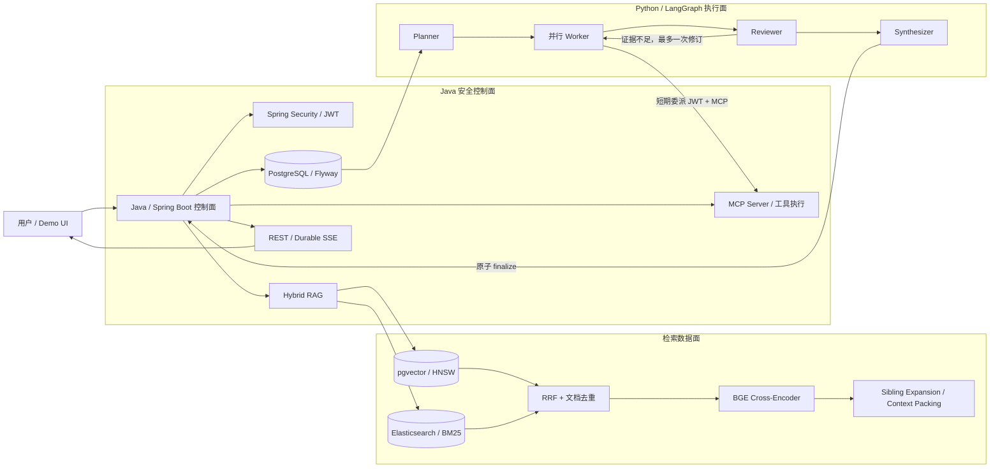

# DeepResearch

一个面向企业内部知识检索与复杂问题研究的 **RAG + Multi-Agent 工程原型**。

项目采用“**Java / Spring Boot 安全控制面 + Python / LangGraph 可恢复执行面**”：Java 负责公网 API、认证授权、知识库、MCP 工具执行和持久化；Python 负责任务规划、并行取证、证据审阅与答案合成。回答只使用检索证据，并返回可核验引用。

> 本仓库用于工程学习、架构验证和作品展示，不是可直接上线的商用平台。

## 项目解决什么问题

- 单纯向量检索容易漏掉编号、配置项和错误码；
- 单个 chunk 命中后可能缺少相邻上下文；
- Agent 可能重复调用工具、无限循环或在证据不足时强行回答；
- Worker 崩溃、SSE 断连和旧实例回写可能破坏运行状态；
- 只看最终答案，无法判断检索、工具、引用和事实是否可靠。

DeepResearch 对应实现了：

- TXT、Markdown、文本型 PDF 的解析、结构化切分、版本化入库；
- pgvector 语义召回 + Elasticsearch BM25 关键词召回；
- RRF 融合、文档级去重、BGE Cross-Encoder 精排与故障降级；
- Sibling Expansion 与 Context Packing；
- Spring AI 原生结构化 Tool Calling 和标准 MCP 工具发现/调用；
- LangGraph Planner → 并行 Worker → Reviewer → Synthesizer 工作流；
- 幂等请求、持久事件、SSE 重放、lease / heartbeat / claim fencing；
- token、时间、工具次数和估算费用预算；
- 检索评测与 Agent Harness 证据级回归。

## 架构



Java 是唯一公网入口。Python Worker 不持有用户原始 Bearer Token，也不直接访问业务数据库；它只能使用绑定 `run / task / scope` 的短期凭证调用获准工具。

## 技术栈

| 层次 | 技术 |
|---|---|
| Java 控制面 | Java 17、Spring Boot 3.5、Spring AI 1.0、Spring Security、Flyway、Micrometer |
| Agent 执行面 | Python 3.12、FastAPI、LangGraph、LangChain、Pydantic |
| 模型与检索 | DeepSeek API、智谱 embedding、pgvector、Elasticsearch BM25、BAAI/bge-reranker-base |
| 工具协议 | Spring AI MCP Server/Client、Python MCP SDK、SSE transport |
| 工程基础设施 | PostgreSQL 16、Docker Compose、Testcontainers、GitHub Actions |
| 测试 | JUnit 5、Mockito、pytest、Ruff、Gitleaks |

DeepSeek 负责规划与生成，不直接查询数据库或执行工具；智谱负责 embedding，pgvector/Elasticsearch 负责初召回，BGE 负责候选精排，Java 工具层负责真正的受权执行。

## MCP 闭环

Java 通过 Spring AI MCP Server 暴露 `kb_search`、`web_search` 和 `calculator`。客户端按标准流程完成：

```text
initialize → capabilities negotiation → tools/list
→ 读取名称、描述和输入 Schema → tools/call → 结构化结果
```

Python sidecar 使用官方 MCP SDK 通过 SSE 调用同一服务，并携带任务级 delegation JWT、run/task 标识与确定性 `Idempotency-Key`。Java 在执行点再次校验权限、claim 和请求指纹。当前只实现 MCP `tools` capability，不宣称已实现 `resources`、`prompts` 或独立外部生产 MCP 服务。

## 快速复现

### 1. 环境要求

- Docker Desktop / Docker Compose；
- DeepSeek 与智谱 API Key；
- Tavily API Key（仅 `web_search` 需要）；
- 若在本机运行测试：JDK 21、Maven、Python 3.12。

### 2. 准备配置

```bash
cp .env.example .env

# 分别执行四次，将四个不同结果写入 .env
openssl rand -hex 32
```

编辑 `.env`，填入 provider key、三类 JWT secret 和 `WORKFLOW_DB_PASSWORD`。完整工作流演示还需启用：

```dotenv
DEEPRESEARCH_WORKFLOW_ENABLED=true
DEEPRESEARCH_DEV_TOKEN_ENABLED=true
DEEPRESEARCH_DEV_TOKEN_ALLOW_ADMIN=true
```

四个安全值必须互不相同；不要提交 `.env`。

### 3. 启动完整栈

```bash
docker compose up -d --build
docker compose ps

curl -fsS http://localhost:8080/actuator/health
curl -fsS http://localhost:9201/_cluster/health
curl -fsS http://localhost:9002/health
```

首次启动 reranker 会下载固定 revision 的 BGE 模型，可能需要数分钟。演示页面：<http://localhost:8080/demo.html>。

### 4. 导入合成演示知识库

先在演示页面签发 USER Token；再调用 `/api/auth/dev-token` 签发 ADMIN Token，并执行：

```bash
export DEEPRESEARCH_ADMIN_TOKEN="替换为 ADMIN Bearer Token"
./scripts/reset-demo-kb.sh
```

然后可在页面选择 Single Agent 或 Durable Workflow，观察阶段进度、工具调用、引用、预算和 SSE 断线续传。

## 如何验证

2026-08-28 公开快照的离线验证基线：

| 测试层 | 结果 | 命令 |
|---|---:|---|
| Java 单元测试 | 168 passed | `mvn test` |
| Java Testcontainers 集成测试 | 17 passed | `mvn -Pintegration verify` |
| Python workflow 单元测试 | 111 passed | `make workflow-test` |
| Python workflow PostgreSQL 集成测试 | 6 passed | 见 `workflow-service/README.md` |
| reranker / 训练工具测试 | 21 passed | `make reranker-test` |

完整本地门禁：

```bash
./scripts/verify-engineering-baseline.sh
```

默认测试使用 Mock/Stub，不调用付费模型。GitHub Actions 还会执行 Compose 配置校验、公开文件边界检查和 Gitleaks 秘密扫描。

### 检索评测快照

历史 full SciFact 实验使用 5,183 篇文档和 300 条 query：

| Route | 命中 | Legacy HitRate@10 | MRR |
|---|---:|---:|---:|
| doc-level RRF | 244 / 300 | 81.33% | 0.5906 |
| Cross-Encoder doc rerank | 251 / 300 | 83.67% | 0.6423 |

这里的 `Legacy HitRate@10` 表示“一条 query 至少命中一个相关文档”，不是标准 Recall@10，更不是最终答案准确率。新评测器已分别实现 HitRate、Recall、MRR 与 NDCG；同口径结果需在固定数据、索引和模型快照上重跑后再发布。

## 安全与已知边界

- 仓库中的员工制度和企业知识均为虚构合成测试数据；
- `.env`、本地配置、模型权重、训练产物、SciFact 原始语料与 embedding cache 均不发布；
- Docker Compose 默认口令和关闭认证的 Elasticsearch 仅限本机，禁止直接暴露公网；
- 知识库 corpus 与索引仍是共享数据面，尚未实现文档级 tenant ACL；
- 工具链选择 at-most-once 安全，不宣称 exactly-once；
- 真实 provider kill/restart 与 SSE 全链路故障注入仍待上线前验收；
- Agent Harness 在线结果和 reranker 正式 LoRA 收益尚未完成，因此不预填通过率或收益数字。

## 目录与文档

```text
src/                  Java 控制面、RAG、MCP 与 API
workflow-service/     Python / LangGraph durable workflow
reranker-service/     BGE reranker 与训练评测工具
testdata/             合成演示知识库与确定性评测集
scripts/              导入、benchmark 与工程验证
docs/                 架构、评测和公开边界文档
```

- [Durable Workflow 设计](workflow-service/README.md)
- [架构与可靠性说明](docs/kb-project/README.md)
- [Agent 评测口径](docs/evaluation/AGENT_EVALUATION_REPORT.md)
- [安全策略](SECURITY.md)
- [公开发布边界](docs/PUBLIC_RELEASE.md)

## License

原创代码使用 [MIT License](LICENSE)。模型、数据集和外部服务适用各自许可证与使用条款，详见 [THIRD_PARTY_NOTICES.md](THIRD_PARTY_NOTICES.md)。
