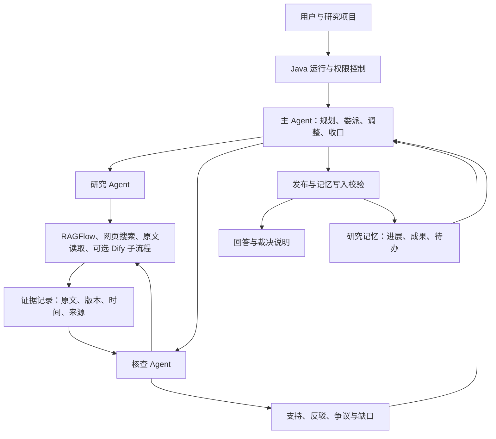

# DeepResearch Agent 升级实施方案

日期：2026-09-29  
状态：待实施方案；本次仅制定计划。  
审阅基线：`60e0290c0670ad3f2f8da303b0b1513e056670c8`。  
项目用途：学习、作品展示、GitHub 开源。  
用户已选择的记忆重点：①跨会话继续研究；③在新问题中复用过去的研究成果。

## 2026-10-03 进展：第 1 轮真实补测已授权，后续轮次待审

本日用户授权独立批次 `round1-retest-20261003`：最多 5 次新研究、0 次自动研究重跑，依次为网页、混合、版本/条件、矛盾资料、证据不足。每例必须先完成运行回执与独立语义审核才可继续；首次失败立即停止后续付费工作。共同后端基线为 `62e29a77130f727413558140a6c8872410a0b731`，包含已主审的来源详情及只读证据接口。候选须先通过完整离线检查及同 SHA 远端 CI，再用于隔离环境。

此前 6 次真实研究、2 次已消耗的定向重跑、旧停止原因及未知用量全部保留在原账本；本次用新的授权记录、历史字节哈希和原子预留追加独立额度，不清账、不扩大旧 8 次额度或单次预算。实际研究模型沿用 `deepseek-openai-compatible/deepseek-v4-flash`；开发模型选择不改变运行模型。本段记录授权与执行安排，不预告真实场景通过，结果见 [本轮运行报告](agent/LIVE_RETEST_RUNTIME_2026-10-03.md)。

**长期研究记忆和多 Agent 协作尚未启动。** 只有第 1 轮真实补测经主审通过后，才派发第 2 轮跨会话继续研究与旧成果复用，再推进第 3 轮协作。原方案及旧报告保留作为历史设计与验收记录。

## 1. 产品目标与验收主线

目标：构建一个能持续研究、根据证据调整计划、保留研究进展，并由研究与核查角色协作的研究 Agent。

用四个可观察行为判断升级是否成立：

1. **自主研究**：第一次检索失败或出现冲突时，系统能自己选择下一步、修改查询、追查原文，并在证据不足时停止。
2. **跨会话延续**：创建新会话，甚至重启服务后，仍能接着指定研究项目的待办推进。
3. **成果复用**：新问题能找出相关旧研究，核对适用版本和有效期后复用，并展示出处。
4. **协作纠错**：核查 Agent 提出带证据的异议，研究 Agent 补充调查，主 Agent 更新结论或保留争议。

单个 Agent 具备动态决定步骤和工具的能力，就已经可以构成 Agent 系统；长期记忆、多 Agent 协作是进一步增强的能力。Agent 内部仍可使用固定流程完成边界清楚的子任务。这符合 [Anthropic 对 Agent 与 workflow 的定义](https://www.anthropic.com/engineering/building-effective-agents)。

## 2. 现状核查：已有基础与实际缺口

| 能力 | 当前实现 | 升级缺口 |
| --- | --- | --- |
| 执行控制 | Java 保存运行、权限、工具回执、取消、SSE；已有 Python 持久化执行基础 | 新的动态动作、子任务、预算、暂停与恢复需要接入同一套控制 |
| 规划 | Dify Planner → 检索 → Reviewer → 有限补检索 → 生成与核查 | 每次观察后可修改任务树、调整策略和结束条件 |
| 证据 | 已有来源绑定、引用片段检查、回答支持度检查 | 原文阅读、版本与时间对齐、反证检索、来源冲突裁决 |
| 长期记忆 | PostgreSQL `user_memory`；按用户读取，关键词筛选；有手动创建接口 | 自动保存研究过程、项目维度、语义检索、版本与证据失效传播 |
| 当前 Dify 上下文 | Java 快照保存摘要、近期对话和记忆；Dify 只接收摘要 | 补齐上下文传递和消费证明，避免“数据库里有，模型没用到” |
| 协作 | 多个模型角色、工具 Worker | 独立任务状态、局部行动循环、结构化异议与处理记录 |

### 2.1 为什么目前记忆体验弱

代码核查结果：

- `AgentContextService.prepare()` 会读取摘要、近期消息和筛选出的记忆。
- `WorkflowService.boundedContext()` 把三者都保存到运行快照。
- `DifyWorkflowAdapter.run()` 只取 `sessionSummary`，传入 `session_summary`；`recentConversation` 和 `memories` 没有传给 Dify。
- `MemorySelectionService` 从最近 100 条用户记忆做关键词匹配，默认选 5 条；无相关项时还会回退取少量记忆。中文长句的词项切分也比较粗。
- 当前长期记忆写入入口是 `AgentController → AgentStateService.createMemory()`；未找到把研究成果自动整理写入长期记忆的链路。
- 摘要压缩器默认在消息数超过 12 时触发。Workflow 的完成路径直接写会话消息，已检查的路径没有触发该压缩器；升级时应统一完成事件后的摘要维护。
- `QueryRewriteService` 默认关闭。即使开启，查询改写也只解决部分上下文指代问题。

对应代码：[上下文组装](../src/main/java/com/deepresearch/service/AgentContextService.java)、[记忆筛选](../src/main/java/com/deepresearch/service/MemorySelectionService.java)、[运行快照](../src/main/java/com/deepresearch/workflow/WorkflowService.java)、[Dify 输入](../src/main/java/com/deepresearch/workflow/DifyWorkflowAdapter.java)、[完成消息写入](../src/main/java/com/deepresearch/workflow/WorkflowRepository.java)、[摘要维护](../src/main/java/com/deepresearch/service/ConversationCompressionCoordinator.java)。

### 2.2 当前证据保障的边界

“来源存在”“引用与原文一致”“原文支持回答”“原文本身符合事实”是不同层次。

目前 Tavily 使用搜索摘要，`include_raw_content=false`，因此不能把搜索结果中的摘要当成已阅读全文。现有引用校验可以防止一部分错引和无根据扩写；错误文档仍可能被准确引用。

来源：[Tavily 请求配置](../src/main/java/com/deepresearch/tool/TavilySearchClient.java)、[Dify 引用校验](../src/main/java/com/deepresearch/workflow/DifyCitationValidator.java)、[回答支持检查](../integrations/dify/claim_support.py)。

## 3. 架构选择

### 3.1 推荐分工

| 组件 | 目标职责 |
| --- | --- |
| Java | 身份与项目权限、运行和子任务管理、工具授权、统一预算、证据与记忆 API、最终发布和 SSE |
| LangGraph Agent Runtime | 主 Agent 的动态决策循环、研究/核查 Agent 的局部循环、检查点和恢复 |
| RAGFlow | 知识库文档解析、检索和分片读取 |
| 网页搜索与原文工具 | 找到候选来源，随后读取需要核验的正文 |
| PostgreSQL | 研究项目、任务、证据、裁决、记忆及其依赖关系；按需使用已有 pgvector 能力 |
| Dify | 保留现有流程作为质量对照；逐步提供有明确输入输出的研究或核查子流程 |
| 前端 | 研究项目、动态计划、证据争议、记忆使用、Agent 协作和耗时成本 |

主 Agent 建议复用仓库已有 Python/LangGraph 和 PostgreSQL 检查点基础。现有 Python 图本身仍是固定研究流程，需要新增决策循环，不能只切换配置就宣称升级完成。

### 3.2 Dify 也能实现 Agent

Dify 官方的经典 Agent 节点支持动态调用工具、Function Calling/ReAct 和迭代次数控制。因此，使用 Dify 与实现 Agent 可以同时成立。[Dify Agent 文档](https://docs.dify.ai/en/cloud/use-dify/nodes/agent)

本项目的架构选择：

| 路线 | 适用情况 | 本项目判断 |
| --- | --- | --- |
| Dify Agent 节点承担主循环 | 优先快速制作可视化原型 | 可行备选；外部记忆、子任务恢复和统一预算仍需自行接线 |
| 代码管理主循环，Dify 提供子流程 | 需要展示状态设计、可测试的自主行为、长期记忆和协作协议 | 推荐；已有 LangGraph 基础可以复用 |

首轮用本机安装版本做最小兼容验证。当前在线文档含新版能力，不能直接假定本机版本全部支持。实现以本仓库锁定依赖和本机可用 API 为准。

Dify 子流程接入是一个明确的后续适配任务：需要子任务 ID、有限工具授权、父级预算扣减，以及返回结构化证据。当前整套 Dify 流程不能直接嵌套调用而绕过这些约束。第一版 Agent 可直接调用现有 Java 工具接口，Dify 基线继续用于比较。

## 4. 自主规划如何实现

### 4.1 决策循环

每轮输入：研究目标、当前计划、已验证发现、争议、失败信息、相关记忆、剩余预算。

主 Agent 输出一个受约束的下一步动作：

- `search`：发起知识库或网页检索；
- `read_source`：读取原文和必要上下文；
- `delegate`：把有验收条件的子问题交给研究/核查 Agent；
- `revise_plan`：新增、取消或重排任务；
- `request_input`：存在会改变结论的范围歧义时请求用户信息；
- `finish`：提交带证据的结果；
- `stop_with_gaps`：保留部分结果，说明仍缺什么。

执行器校验动作、工具权限和预算后执行；结果进入结构化观察记录，再交给下一轮决策。模型负责提出下一步，代码负责执行边界。

### 4.2 计划必须能被检查

每个任务保存：目标、依赖、负责人、状态、完成标准、证据 ID、失败原因和计划版本。

任务状态建议为 `pending / running / blocked / done / cancelled`。显示给用户的是行动与简短依据，例如“两个来源使用不同版本，补查版本说明”，以及任务状态变化。

需要覆盖的动态行为：

1. 查询没有结果 → 改写查询或更换已授权来源。
2. 摘要缺少限定条件 → 打开原文查上下文。
3. 资料冲突 → 增加“核对版本/寻找反证”任务。
4. 新发现改变假设 → 修订后续计划并记录原因。
5. 连续调查没有增加有效证据 → 停止并报告缺口。

重写查询必须同时记录原问题、改写结果和使用的上下文，防止改写偷偷改变研究目标。

### 4.3 预算与恢复

建议先用以下实验上限校准，最终值由第 0 轮实测确定：主 Agent 决策最多 8 轮；全运行模型调用最多 16 次；外部检索/原文工具调用合计最多 16 次；同时运行最多 2 个子 Agent；委派深度 1；同一争议补查最多 2 轮；运行最长 180 秒。输入、输出 token 另设全局预算，所有角色共同消耗。

这些是拟议上限，不代表已经实现或实测最优值。简单问题可以提前结束。预算在发起调用前预留，完成后按真实用量结算；并行分支、重试和 Dify 子流程都计入。用量缺失要明确标记，不能显示虚假的精确成本。

读取工具的瞬时失败允许有界重试；每次计入预算，复用已有成功回执。取消、超时、恢复不能重复发布答案或重复写入记忆。检查点与跨会话记忆分开：前者恢复一次执行，后者提供跨研究的知识和进展。[LangGraph 持久化文档](https://docs.langchain.com/oss/python/langgraph/persistence)

## 5. 错误资料与相互矛盾的来源如何处理

### 5.1 采用的研究思路

- **Corrective RAG**：对检索质量进行评估，必要时更换或扩展检索。借鉴“评估后补查”的机制；检索相关性评分不能直接充当事实正确率。[CRAG 原论文](https://arxiv.org/abs/2401.15884)
- **Self-RAG**：按需检索，并检查检索内容和生成内容。原论文涉及训练与反思 token；本项目先实现应用层的检查和反馈机制，属于借鉴其设计。[Self-RAG 原论文](https://arxiv.org/abs/2310.11511)
- **独立核验**：把待核实说法拆成问题，再独立调查，减少草稿结论对核查的影响。本项目进一步给核查角色提供原文读取和反证检索工具。[CoVe 原论文](https://arxiv.org/abs/2309.11495)

### 5.2 一条结论的核查流程

1. **拆成可核查的说法。** 记录主体、关系/数值、单位、适用条件、时间与版本；建议和推断另行标注。
2. **读取原始资料。** 搜索结果用于发现来源；重要结论、争议结论需要读取正文。保存标题、网址或文档 ID、原文片段、段落位置、抓取时间、内容哈希。发布日期无法确认时标为未知。
3. **对齐范围。** 先判断两个来源是否在谈同一主体、同一时期、同一版本、同一条件。版本变化或定义不同可以使两句话同时成立。
4. **建立证据关系。** 每段证据标记为支持、反驳或信息不足；模型可以提出关系判断，原文定位和来源绑定由代码检查。
5. **检查来源独立性。** 同一文章的转载、镜像、转述归入同一来源组；无法确认独立性时保留未知。三个转载不会自动算成三份独立证明。
6. **针对冲突补查。** 核查 Agent 寻找原始规范、适用版本、变更记录或独立反例。能用确定性计算或隔离测试验证的技术说法，可在后续接入受控验证工具。
7. **形成裁决记录。** 记录采信与未采信的证据、范围、理由和剩余不确定性。主 Agent 只能在这些证据基础上收口。

新增原文读取工具需把检索分数、来源类型和抓取结果分开保存。相关性分数只帮助挑选阅读顺序，不能混成“真相分”。搜索排序、回答使用顺序、证据可信程度分别展示；引用编号继续按正文第一次使用排序。

### 5.3 证据优先级按问题确定

| 问题类型 | 优先查证材料 | 需要注意 |
| --- | --- | --- |
| 本项目实际怎么运行 | 当前版本代码、配置、运行回执、对应版本测试 | 旧知识库说明可能落后于实现 |
| 协议要求或库的行为 | 适用版本的官方规范、官方文档、变更记录 | 官方旧版文档也可能不适用于当前问题 |
| 某项研究声称什么 | 原论文、实验设置、原始数据、后续修正 | 论文结论有任务和样本限制 |
| 当前事件或外部事实 | 可核验的一手发布、时间信息、独立材料 | 单一来源可能有错误，发布时间新也不能保证准确 |

知识库和网页是获取渠道。裁决依据是材料本身的范围、可核验程度、时效和独立性；不设“知识库永远优先”或“多数网页优先”的固定规则。权威来源是查证重点，也需要检查内部矛盾和适用范围。

### 5.4 裁决结果

| 状态 | 回答方式 | 记忆写入 |
| --- | --- | --- |
| `supported` 有证据支持 | 给出限定范围内的结论和证据 | 可存为可复用成果，附证据与有效范围 |
| `refuted` 被证据反驳 | 说明错误说法及反证 | 可存为纠错经验，错误说法不能按事实检索 |
| `contested` 仍有争议 | 分列观点、证据和缺口 | 保存争议状态，不能自动当成已定论 |
| `insufficient` 信息不足 | 给出已知部分和待核实问题 | 保存研究进展与待办，不生成已核实事实 |

时效单独用 `fresh / needs_recheck / expired / superseded` 表示，避免把“过时”和“被反驳”混为一类。

**示例，以下资料为验收夹具设定：** 知识库文档 A 写“功能 X 在 v1 默认开启”，网页 B 写“功能 X 在 v2 默认关闭”，用户问 v2。系统应查到版本差异，按 v2 资料回答，并保留 A 的历史适用范围。若 A 明确写的是 v2，且与适用版本的官方说明和可重复测试相反，则把 A 的这条说法标为被反驳，记录反证。若缺少足够证据，则保留争议。

### 5.5 检索到的文档本身错误时

对已证明错误的片段降低后续使用优先级，建立问题记录并关联反证；不要把一处错误扩展成整份文档全部无效。受管理知识库可在确认修订后重新索引，保留旧版本和裁决历史。

建立 `来源 → 证据片段 → 结论 → 记忆` 的依赖关系。来源修订、删除或被证实错误后，相关记忆进入重新核验状态，后续回答不再无提示地复用。历史报告保留原发布版本，并显示更正提示。

该机制可以发现和纠正部分错误。若可获取材料都重复同一个错误，系统仍可能误判；目标是增加发现错误的机会、记录判断依据，并允许不下定论。

## 6. 长期记忆：先做用户选择的两种体验

### 6.1 三层数据

| 层次 | 内容 | 保存位置与作用 |
| --- | --- | --- |
| 当前执行状态 | 当前步骤、工具回执、临时观察、剩余预算 | 持久化检查点；恢复当前运行 |
| 研究项目记忆 | 目标、计划、进展、已排除方向、争议、待办 | PostgreSQL；跨会话继续研究 |
| 可复用成果记忆 | 经过核查的条件性结论、证据、方法、失败经验 | PostgreSQL 与语义索引；新问题复用过去成果 |

这种区分参考跨会话记忆与会话状态的划分；存储字段、写入规则和界面体验需要本项目自己实现。[LangChain 记忆概念](https://docs.langchain.com/oss/python/concepts/memory)

### 6.2 跨会话继续研究

增加显式 `research_project_id`。一个研究项目可以包含多个会话和多次运行，用户可在新会话中选择继续某个项目。

例如：昨天的项目比较了三种检索策略，尚未完成成本测量。今天说“继续昨天的研究”，系统应展示已完成事项和“成本测量待做”，读取必要证据，然后制定后续计划。若有多个可能项目，先展示候选让用户选择。

验收必须新建 `session_id`，并包含服务重启后测试；只在同一会话重复问题不能证明跨会话记忆。

### 6.3 新问题复用旧成果

新问题先按当前用户及其可访问项目筛选，再进行关键词与语义召回、相关性筛选、版本/时间检查。每条候选返回内容、来源、适用范围、状态和“为何相关”。

复用不是直接复制旧答案：

1. 新问题与旧结论适用范围一致，证据仍有效 → 引用旧研究并链接原始证据。
2. 版本变化、超过复查期限或证据不可用 → 把旧成果当调查线索，重新查证。
3. 记忆处于争议或被反驳状态 → 作为风险提示或纠错经验使用。
4. 没有相关项 → 返回空结果，避免当前“无匹配也取最近记忆”的干扰。

来自旧报告的同一原始资料仍只算一份证据。系统不能靠重复记住同一句话制造“多来源支持”。

### 6.4 自动写入与治理

写入流程：运行完成/暂停 → 提取研究进展与候选成果 → 校验来源、范围和状态 → 去重/合并/版本处理 → 统一服务提交。

研究进展可以保存“失败过什么”和“仍待验证什么”；复用成果必须携带对应裁决。模型提出记忆候选，校验服务决定能否进入可复用成果集合。

首版复用已有 PostgreSQL；语义检索可使用现有 pgvector 基础，经检查维度、模型和权限后接入。暂不需要增加独立记忆平台。

必要能力：

- 按用户、项目隔离；Agent 使用受控 API，不能自由读写其他项目。
- 版本更新与依赖失效；稳定知识和时效性事实采用不同复查规则。
- 用户查看、修正、删除记忆；删除后清理索引、检索缓存，并阻止旧检查点恢复时重新注入。
- 区分“删除会话”和“删除研究记忆”；界面说明各自影响。
- 自动写入使用幂等键；记忆入库失败在界面显示，可重试，避免错误提示已记住。
- 文档和记忆中的指令都作为待分析数据，不能覆盖系统权限与执行规则。

### 6.5 必须能看见的记忆体验

回答旁显示：本次使用的记忆、来自哪次研究、为何相关、是否重新核验，以及本次新增/修改的研究记录。用户能打开原研究和来源，也能更正或删除。

## 7. 多 Agent 协作协议

首版采用三种角色：

| 角色 | 可自主决定的内容 | 输出 |
| --- | --- | --- |
| 主 Agent | 分解问题、选择任务、委派、修改计划、停止 | 计划版本、任务、最终研究报告 |
| 研究 Agent | 局部查询、选取来源、阅读、补查 | 发现、证据、限制、未完成问题 |
| 核查 Agent | 核查问题、反证查询、冲突调查、复查要求 | 按结论整理的支持/反驳/争议和缺口 |

每个 Agent 有独立任务状态与有限上下文，可以进行局部工具循环。第一版一般运行主 Agent、一个研究 Agent、一个核查 Agent；有确实可独立研究的分支时再扩展研究实例。简单任务由主 Agent 完成，复杂任务才委派。

主 Agent 委派研究子任务是一种已公开使用的研究系统架构；分开的上下文适合调查不同方向，同时会增加协调与用量成本。[Anthropic 多 Agent 研究系统](https://www.anthropic.com/engineering/multi-agent-research-system)

### 7.1 协商过程

1. 主 Agent 发任务：问题、范围、允许工具、预算、完成标准、已有证据 ID。
2. 研究 Agent 返回 `ResearchPacket`：候选结论、证据 ID、限制和待查问题。
3. 核查 Agent 独立调查关键说法，再查看研究结果差异，返回结构化 `Challenge`。
4. 研究 Agent 回应异议：新证据、修正结论、接受反证或标记无法解决。
5. 主 Agent 根据证据关系和规则形成 `DecisionRecord`；未解决的争议保留到报告。

核查起始上下文提供中性的核查问题和必要原文，减少研究 Agent 的说服性草稿对核查的影响。角色可以使用同一模型，但这不能保证独立判断；试验时可比较不同模型组合。

争议最多补查两轮。新增轮次必须补充有价值的证据或明确验证动作。模型互相赞同不增加事实证明力度。

### 7.2 状态共享

共享研究任务、证据和裁决记录；各 Agent 的完整上下文独立。用任务版本和幂等键合并结果，防止并行覆盖。只有主 Agent 可提交最终报告，只有统一记忆服务可提交长期记忆。

## 8. 数据与接口契约：先冻结，再并行开发

首轮确定以下结构；名称可调整，语义需要一致：

| 对象 | 最小字段 |
| --- | --- |
| `ResearchProject` | project_id、owner_id、目标、范围、状态、未解决问题 |
| `Task` | task_id、parent_task_id、agent_id、目标、依赖、状态、预算、完成标准、版本 |
| `Evidence` | evidence_id、来源类型、定位、原文快照/哈希、抓取与发布时间、适用版本、来源组、receipt_id |
| `Claim` | claim_id、说法、条件、时间、版本、支持/反驳证据 ID、裁决状态 |
| `Challenge` | challenge_id、claim_id、异议类型、证据 ID、请求的补查动作 |
| `DecisionRecord` | decision_id、claim_id、裁决、依据、未解决问题、策略版本 |
| `MemoryItem` | memory_id、owner_id、project_id、类型、内容、claim/evidence/run 引用、状态、版本、复查时间 |
| `AgentEvent` | run_id、task_id、agent_id、事件类型、前后状态、简短依据、用量 |

建议新增事件：`PLAN_CREATED`、`PLAN_REVISED`、`TASK_DELEGATED`、`SOURCE_READ`、`CONFLICT_FOUND`、`DECISION_RECORDED`、`MEMORY_USED`、`MEMORY_COMMITTED`、`MEMORY_RECHECK_REQUIRED`。

同一套接口支持初期单 Agent 和后续多 Agent；多 Agent 的结果也必须通过现有授权、工具回执、引用绑定和最终发布校验。现有校验中的 Dify 专用部分需要提取为可供两条路径使用的公共实现，避免新路径漏掉既有保障。

## 9. 分五轮交付

| 轮次 | 交付内容 | 可演示的验收场景 | 依赖 |
| --- | --- | --- | --- |
| 0：契约与基线 | 固定数据结构、事件、预算语义；记录现有路径指标；验证本机运行时能力；补齐当前上下文传递设计 | 同一问题可重放，能看到实际输入了哪些记忆；决定运行时接入方式 | 起点 |
| 1：自主研究与证据裁决 | 单主 Agent 循环；动态计划；原文读取；结论级证据关系；有界冲突补查；统一发布校验 | 故意提供错误/过时来源，看到 Agent 改计划、查反证并修正或保留争议 | 契约完成后两条开发线并行 |
| 2：研究记忆 | 研究项目、跨会话继续、旧成果召回、自动写入、修订/删除、失效传播、记忆展示 | 新会话和重启后继续研究；新问题复用旧成果；错误旧结论不再被默默沿用 | 依赖第 1 轮证据状态 |
| 3：多 Agent 协作 | 主/研究/核查角色；任务协议；有界异议回应；统一预算；子任务取消恢复 | 研究 Agent 提出结论，核查 Agent 找到反证，形成可见修正记录 | 单 Agent 与证据/记忆接口稳定 |
| 4：评估与开源展示 | 对照评估、失败案例、成本和延迟、复现脚本、演示、架构决策文档 | 演示自主改计划、跨会话记忆、争议裁决，并能复现记录 | 全部能力接通 |

### 9.1 两个开发对话如何分工

**先共同完成第 0 轮，再让两个对话并行；每轮合并验收后再推进。**

| 开发线 | 对应现有对话 | 负责范围 |
| --- | --- | --- |
| A：执行与协作 | Dify 替换 DeepResearch 编排 | Agent Runtime、计划、子任务、全局预算、恢复、Dify 适配；研究项目入口与运行事件 UI |
| B：证据与记忆 | RAGFlow 替换 DeepResearch 检索 | 原文读取、证据与裁决服务、记忆存取/检索/失效；来源与记忆 UI |

第 1 轮 A 做自主循环、B 做证据裁决；第 2 轮 A 做继续研究入口与上下文消费、B 做记忆服务；第 3 轮 A 做协作调度、B 做核查角色与裁决反馈。

共享 DTO、数据库迁移编号、Java 运行状态、前端公共入口先指定一个编辑负责人。证据/记忆采用独立服务与模块，避免双方同时修改同一核心文件。主对话负责接口裁决和集成验收。每轮使用明确的共同基线和独立分支，保留仍在使用的工作目录。

未来派发技术任务时，按用户偏好使用 GPT-6-sol / xhigh；单纯说明整理等简单任务可用 GPT-6-luna / xhigh。本次仅形成可派发计划。

## 10. 验证它是一轮有效升级

### 10.1 对照设置

保留现有 16 个回归场景，再建立 36 个新场景。建议 12 个开发用例、24 个独立验收用例；按类别分层，不用同一批验收失败样例无限调提示再宣布泛化成功。对已暴露案例进行修复后，后续版本补充新的验收材料。

| 类别 | 数量 | 重点 |
| --- | --- | --- |
| 错误来源与冲突 | 18 | 单一错误资料、版本冲突、真正未解决冲突、转载重复、没有充分证据 |
| 记忆 | 8 | 跨会话/重启延续、跨问题复用、纠正、删除、用户隔离 |
| 自主规划 | 6 | 空结果改查、反证触发调整、没有新增证据时停止 |
| 运行可靠性 | 4 | 中断恢复、取消、来源指令注入、预算耗尽 |

对固定流程、单 Agent、多 Agent 做比较：一组保持相同模型、资料快照、工具和总预算上限，另一组报告各自默认运行成本。动态网页试验单独报告时间与网页变化，避免混淆架构差异。间歇性问题按预先确定的次数重复测试并记录所有结果。

### 10.2 指标与完成条件

- **证据质量**：每条最终结论的证据支持、反驳处理、版本范围是否正确；裁决对照人工核验的材料。
- **错误处理**：被注入的错误说法是否仍进入最终答案；应保留争议的场景是否被强行裁定；信息不足时是否恰当停止。
- **任务完成**：覆盖用户问题的比例，以及正确停止/补查的比例。不能靠大量拒答来提高表面支持率。
- **记忆**：新会话续接成功、相关成果召回、过时成果误用、纠正/删除生效、用户隔离。
- **自主性**：中间证据是否真正改变了后续动作；固定模板换措辞不能算重新规划。
- **协作收益**：在同等预算下，多 Agent 是否提高关键任务完成率或减少错误；保留单 Agent 适用的简单问题路径。
- **成本与可靠性**：总模型调用、工具调用、输入/输出 token、延迟中位数/P95、失败、恢复和重复写入。

模型评分仅作辅助。质量评估采用原文、适用范围和已核验标签；权限隔离、预算、幂等和删除生效用确定性测试。所有必须场景通过后，报告样本数、分母、失败项和局限，不把小样本通过率等同于真实世界正确率。细粒度诊断可以参考 [RAGChecker](https://arxiv.org/abs/2408.08067)。

公开成果包括：架构图、关键决策记录、脱敏的任务/裁决/记忆轨迹、可重复运行的固定夹具、真实网页案例和失败分析。保存所需引用片段与哈希，遵守来源许可；公开仓库不包含用户密钥和私人研究记忆。

## 11. 下一步最小行动包

下一轮先完成第 0 轮，随后派发第 1 轮：

1. 冻结 `Evidence / Claim / DecisionRecord / MemoryItem / Task` 契约和事件格式。
2. 固定 Dify 基线与新的 Agent 入口切换方式，验证本机依赖。
3. 建立 4 个最小验收夹具：检索为空、资料错误、版本差异、冲突无法解决。
4. A 线实现单 Agent 动态计划与工具循环；B 线实现原文读取与证据裁决。
5. 集成后演示一次“错误资料 → 新任务 → 补查 → 修正/保留争议”的完整过程。

第一轮成功后，再把可核验的研究进展和成果接入长期记忆；之后增加多 Agent 协商。每轮都产生可运行、可解释、可复现的增量。
