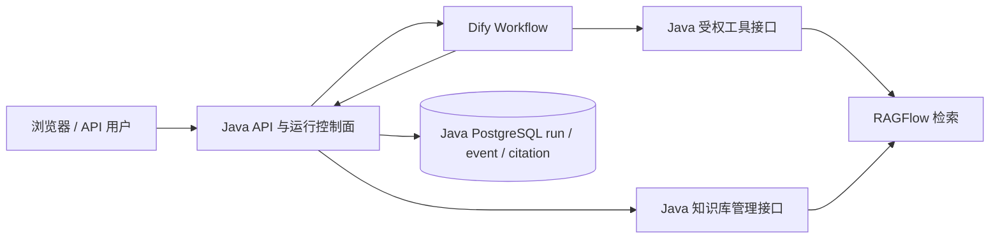

# DeepResearch：RAGFlow + Dify 改造实施方案

> 制定日期：2026-09-22；进度更新：2026-09-26。实施主仓库为 `deepresearch-github`。本文记录开发契约、验收门槛和当前进度。

## 1. 决策与边界

**建议两条开发线并行，最终联调和切流按顺序进行。** 先固定 Java 对外的证据契约；任务 A 把现有知识库的入库和检索数据面迁到 RAGFlow，任务 B 把 Planner → Worker → Reviewer → Synthesizer 的执行编排迁到 Dify。B 用固定证据样本开发，不等 A 上线。两条线合并后，按“RAGFlow 检索验证 → Dify 端到端验证 → 切换默认路径”的顺序验收。

切换后的职责：

| 层 | 职责 |
|---|---|
| Java / Spring Boot | 唯一对外 API；认证授权、run 与幂等记录、工具权限、证据规范化、引用校验、可恢复的 SSE、最终结果保存。 |
| RAGFlow | 文档解析、切分、索引和检索。Java 按允许的 dataset 调用其 API，不把 RAGFlow API Key 给浏览器或 Dify。 |
| Dify Workflow | 规划、并行取证、审阅、一次以内修订、答案合成；通过 Java 的受限工具接口取得证据。 |



**不能直接把两个现成服务相连后宣布替换完成。** 现有 Python LangGraph sidecar 实现了同步 checkpoint、租约和 fencing、工具 receipt、预算和事件重放；Dify 的工作流 API 可运行、查询和停止任务，但这些可靠性语义不会因换了编排器自动继承。迁移门禁见第 5 节。旧链路在新链路达标前保留为开关可选路径，历史 run 和引用不重写。

## 2. 已核实的现状

| 项目 | 证据与影响 |
|---|---|
| RAGFlow | 本机容器 `ragflow-stable-ragflow-1` 运行，镜像为 `v0.27.2-arm64-local`；`GET http://127.0.0.1:9380/api/v1/system/healthz` 返回 HTTP 200，db、redis、doc_engine、storage 均为 `ok`。本机源码 `/Users/zwy/Documents/ragflow-v0.27.2` 为 `v0.27.2` 后一个提交。健康只证明服务可用，不证明已有数据集、API Key、模型配置及检索质量。 |
| Dify | 本机源码 `/Users/zwy/Claude/Projects/dify` 为 `1.17.0`；服务现已运行在宿主机 `8081/8444`，生产候选 Workflow 已导入、发布并通过真实 DeepSeek + 隔离证据服务的完整流程。Java 真工具回调与 RAGFlow 联调仍待验收。 |
| 旧 RAG | [`KnowledgeBaseService`](../src/main/java/com/deepresearch/service/KnowledgeBaseService.java) 管入库和 `pgvector + Elasticsearch` 双写；[`HybridRetrievalOrchestrator`](../src/main/java/com/deepresearch/service/HybridRetrievalOrchestrator.java) 管双路召回；[`HybridRagService`](../src/main/java/com/deepresearch/service/HybridRagService.java) 继续做 RRF、rerank、邻接扩展、上下文装配。`ContextExpansionService` 直接读 `vector_store`，因此仅替换召回函数还不算迁移完成。 |
| 旧编排 | [`workflow-service/README.md`](../workflow-service/README.md) 描述 LangGraph 执行面；Java 的 [`WorkflowController`](../src/main/java/com/deepresearch/web/WorkflowController.java) 和 [`WorkflowService`](../src/main/java/com/deepresearch/workflow/WorkflowService.java) 保存 run、幂等键、取消、引用校验和可重放事件。 |
| Dify 分支成果 | `main` 上的 `ca4a5e5` 已实现可选 Dify 执行路径、专用工具接口、运行映射与 DSL。`DifyKbToolGateway` 仍为不可用占位；需要接到任务 A 的 RAGFlow gateway。旧 `DifyRetrievalService` 仍读 legacy HybridRagService，联调时需按 provider 映射证据。 |
| 端口 | RAGFlow 占宿主机 `80/443/9380/9000/9001` 等端口；Dify Compose 默认占 `80/443`；DeepResearch reranker 默认占宿主机 `9000`。三套栈不能按默认端口一起启动。 |

RAGFlow `v0.27.2` 的本地 API 文档列出 `POST /api/v1/retrieval`，文档上传 `POST /api/v1/datasets/{dataset_id}/documents`，内置切分启动 `POST /api/v1/datasets/{dataset_id}/chunks`，文档状态查询 `GET /api/v1/datasets/{dataset_id}/documents`。若数据集使用 ingestion pipeline，应改调 `POST /api/v1/documents/ingest`。具体响应须以本机实例的契约测试为准。Dify 本地服务 API 列出 `POST /workflows/run`、`GET /workflows/run/{workflow_run_id}`、`POST /workflows/tasks/{task_id}/stop` 和工作流事件流；停止接口要求 streaming 模式。参考官方源码：[RAGFlow HTTP API](https://github.com/infiniflow/ragflow/blob/main/docs/references/http_api_reference.md)、[Dify Workflow API 实现](https://github.com/langgenius/dify/blob/main/api/controllers/service_api/app/workflow.py)。

## 3. 先冻结的跨任务契约

两条任务共享 **`Evidence v1`**。Java 负责把 RAGFlow 原始响应转成该格式，Dify 只消费规范化证据。沿用现有公开引用语法：答案中的 `[来源N]` 指向本次结果 `citations` 数组的第 N 项；Java 在发布前验证编号、顺序和来源集合。

| 字段 | 规则 |
|---|---|
| `sourceId` / `citation` | 本次响应内依次为 `来源1` / `[来源1]` 等，只用于展示和模型定位，不能当持久主键。 |
| `chunkKey` | 稳定值 `ragflow:<datasetId>:<documentId>:<chunkId>`；持久引用由现有 `CitationSourceSupport.safeKnowledgeChunk` 变成 `kb:ragflow:...`。注意不要重复加 `kb:`。 |
| `datasetId`, `docId`, `chunkId` | 来自 RAGFlow 的真实 ID。Java 的旧 `docId` 通过映射表关联，不能假装两者相等。 |
| `title`, `content`, `pageNumber`, `sectionPath` | 仅填 RAGFlow 确实提供或可从文档映射可靠取得的值；缺失用空值，不编造页码或章节。内容先限长、去敏、转义模型引用标记，并显式标为不可信。 |
| `score`, `route` | `score` 对应 RAGFlow `similarity`；`route` 固定为 `ragflow`。旧 `rrfScore`、`rerankScore` 不用相似度冒充，可设空并在新 diagnostics 中标明 provider。 |
| 空结果 | `evidences=[]`；Dify 输出 `INSUFFICIENT_EVIDENCE`，不能生成带来源的肯定答案。 |

建议接口：Java 内部 `POST /api/integrations/dify/retrieve` 保留现有请求 `{question, topK, history}`；响应先维持当前 `DifyRetrievalResponse` 外形，在其证据项中补充 `datasetId` 和 `score` 并明确兼容版本。任务 A 在自己的分支提供同字段的内部 `RetrievedEvidence`，任务 B 拥有当前工作区未提交的 Dify DTO 和 facade，并用本节固定 JSON 样本开发。合并时把 facade 接到任务 A 的 gateway。完成时补一份机器可校验的 JSON Schema 或契约测试样本。

示例证据，ID 均为示意值：

```json
{
  "sourceId": "来源1",
  "citation": "[来源1]",
  "chunkKey": "ragflow:dataset-1:document-1:chunk-1",
  "datasetId": "dataset-1",
  "docId": "document-1",
  "chunkId": "chunk-1",
  "title": "研发规范",
  "content": "<已裁剪且标记为不可信的证据>",
  "score": 0.83,
  "route": "ragflow",
  "untrusted": true
}
```

Dify 工作流的输入以 `question`、Java `runId`、允许工具列表、限制参数和必要的会话摘要为准；不传用户原始 Bearer、RAGFlow Key、内部 JWT 秘钥。Dify 输出固定为 `{status, answer, citations, usage}`：`citations` 是有序且去重的稳定 `kb:ragflow:...` ID 列表，答案 `[来源N]` 对应该列表第 N 项。Java 按 run 保存每次工具检索得到的来源白名单，只允许 Dify 引用白名单中的来源；`usage` 缺失时记录未知值，不伪造 0。Java 只接受 `SUCCEEDED`、`INSUFFICIENT_EVIDENCE`、`FAILED` 等受控状态，并做最终引用校验。Dify 中的 `user` 字段用 Java 生成的稳定内部标识，不能由浏览器任意指定。

## 4. 开发任务

### A. RAGFlow 替换旧 RAG 数据面

**交付目标：** Java 的知识库管理、普通 RAG 问答和 `kb_search` MCP 工具都从同一个 RAGFlow adapter 获取证据，并暴露可供 Dify facade 使用的 gateway；旧 `pgvector + Elasticsearch + RRF + BGE` 只在回滚模式运行。

1. 实现 `RagflowClient` 和配置项：base URL、API Key、dataset 白名单、连接/读超时、最大结果数；启动时检测配置，运行时检查 HTTP 状态及 RAGFlow 响应体 `code == 0`，限制响应体大小。Key 只在服务端环境变量或本地忽略文件中。Java 容器访问 RAGFlow 用可达的宿主机地址或共用网络地址，不使用容器内的 `localhost:9380`。
2. 实现 `KnowledgeRetrievalGateway` 抽象与 `legacy | ragflow` 开关。RAGFlow 路径请求 `/api/v1/retrieval`，显式设置 dataset IDs、`page_size`、`knn_top_k`、阈值和超时；把原始 chunk 转成 `Evidence v1`，统一去重、截断、去敏和引用编号。旧的 `ContextExpansionService` 不能继续读本地 `vector_store`；若需要邻片段，用 RAGFlow chunk API 补取并计入预算，或在首次版本停用邻片段扩展并在评测中单列影响。
3. 入库迁移：从 `kb_document.raw_content` 或原始上传文件读取源文档，按内容哈希去重后上传到指定 RAGFlow dataset，启动解析，轮询到 `DONE/FAIL`。新增 Java 映射表保存 `legacyDocId ↔ datasetId/documentId`、版本、哈希和同步状态；更新、删除、重建在两端明确对应。远程上传与本地数据库更新之间采用持久任务状态和对账，不在数据库事务中包住网络请求。`/api/kb` 仍由 Java 做 ADMIN 鉴权，异步解析时返回任务状态，前端按状态轮询。
4. 将 `/api/research/hybrid`、`kb_search` 接至 gateway，并提供供 Dify facade 调用的统一证据入口；Dify facade 的实际接线留到两分支合并。`/api/research/hybrid/debug` 的诊断字段改为真实 RAGFlow 数据，旧 RRF/rerank 数值不再伪填；`/api/kb/reindex-keyword` 只保留 legacy 模式语义。检查普通 `/api/research/vector` 等历史入口是否需要路由到新数据面并补兼容测试。
5. 用同一份文档和固定查询做新旧链路配对评测：文档解析完成率、正例 top-k 命中、HitRate/Recall/MRR/NDCG、引用可回查率和 p95 延迟。项目 Gold 的四道安全拒答题允许检索到支持拒答的边界事实，按**答案级安全拒答**验收；独立合成的纯无依据问题仍要求零可引用证据。切换门槛：25 条项目知识正例中最多比旧链路新增 1 条未命中；关键编号/错误码查询不得新增未命中；所有展示引用必须能反查到真实 dataset/document/chunk。性能阈值先测旧链路同机基线，再将新路径 p95 上限设为旧值的 1.5 倍，并记录测试条件。Gold 锚点和完整答题所需事实需人工审定；不能只用单一锚点命中冒充可回答率。

**任务 A 可修改：** `src/main/java/com/deepresearch/service/*Ragflow*`、检索 gateway、`KnowledgeBaseService` 及相关管理 API、`KnowledgeBaseSearchTool`、RAGFlow 配置、Flyway 映射表、相应测试与检索评测。**不要修改：** 当前工作区未提交的 `DifyRetrievalService`/DTO、Dify workflow DSL、Dify 运行客户端、Java workflow run/SSE 语义。

### B. Dify 替换 LangGraph 编排执行面

**交付目标：** 发布一份可导入的 Dify Workflow DSL；Java 经 Dify service API 启动、观察、取消运行并收集结果，保持 Java 对外 `POST/GET/cancel/events /api/research/workflows` 的语义。

1. 启动本机 Dify `1.17.0`，配置 DeepSeek 等所需模型、工作流 App Key 和可达的 Java 内部工具 URL；导出 DSL 至 `integrations/dify/`，连同导入说明和版本固定。先用假证据 fixture 跑通，无需等待任务 A。
2. DSL 实现 Start → Planner（结构化任务）→ 最多 4 个只读 Worker（并发上限 2）→ Reviewer → 最多一次修订 → Synthesizer → End/证据不足。Worker 只能通过 Java 受权接口调用 `kb_search`、`web_search`、`calculator`；不要把 RAGFlow Key 放入 Dify。针对空证据、工具失败、模型结构化输出失败设置明确终态。
3. Java 增加 `DifyWorkflowClient`/运行适配器：使用 `POST /workflows/run` 的 streaming 模式取得 task/run ID，持久化 `javaRunId ↔ difyWorkflowRunId/taskId`，把安全阶段事件写入 Java 原有 event 表供 SSE 重放；用详情 API 对账终态；取消时调用 Dify stop 并在 Java 侧封禁后续结果。回答和 citations 必须经过 `WorkflowService` 或等价的 Java 最终校验再落库。
4. Java 保留对创建请求的 `Idempotency-Key` 和所有权检查。Dify 当前 workflow 入口没有在本机源码中发现幂等键处理；若派发超时且未拿到 Dify run ID，记录 `DISPATCH_UNKNOWN` 并做人工或后台对账，**不能盲目再次 POST**。外部 trace ID 只作关联，不当幂等保证。Dify 回调或工具请求必须以专用服务身份认证，Java 依据自己的 run/tenant/tool scope 重新授权；用户原始 token 不进 Dify 工作流输入或日志。
5. 与旧 sidecar 做行为对照：取消、断线续传、Java/Dify 重启、超时和重复派发、工具重复执行、预算边界、引用编号、无证据拒答。若 Dify 原生能力不能复现某项旧保证，由 Java adapter 实现等价约束；达不到门禁时维持 `langgraph` 可选路径，不把差异写成已完成。

**任务 B 可修改：** `integrations/dify/`、现有未提交的 `DifyRetrievalService`/DTO、新 Dify 客户端和运行适配器、`WorkflowController`/`WorkflowService` 必要的路由扩展、运行映射和事件持久化、Dify 服务认证、相应测试。**不要修改：** `KnowledgeBaseService`、RAGFlow adapter、检索排序和入库实现。现有未提交 Dify 草稿在主工作区，任务 B 负责审阅并接续；接入任务 A gateway 的最后一步留给联合联调。

## 5. 合并、验收与切流

| 阶段 | 可并行性 | 完成条件 |
|---|---|---|
| 0. 契约冻结 | 两边先共读本文件 | `Evidence v1` JSON 样本、Dify 输入输出、Java 引用规则一致；两任务各自建分支/工作区。 |
| 1. 独立开发 | **并行** | A 的 RAGFlow 假服务/本机服务测试通过；B 的假证据 DSL 与 Dify API adapter 测试通过。 |
| 2. 联合联调 | **顺序** | A 合并后 B 接入真实检索；按 `旧检索+旧编排`、`新检索+旧编排`、`旧检索+Dify`、`新检索+Dify` 四格对照，确定问题属于哪一层。 |
| 3. 故障门禁 | **顺序** | Dify 不在线、RAGFlow 不在线、网络超时、重复请求、取消竞态、SSE 断线、引用污染和无证据场景均有可解释的终态；至少一次真实 provider 的端到端烟测及一次进程重启验证有记录。 |
| 4. 切流 | **最后** | 默认配置改为 `ragflow + dify`，旧路线仍可回退；保存评测报告、运行 ID、配置版本及回滚步骤。 |

**粗略排期：** 契约与环境准备 0.5 天；A 约 2–3 天、B 约 2–4 天并行；合并和真实故障验收约 1–2 天。时间主要取决于 Dify 本机启动、模型配置和恢复语义验证，不能用“DSL 能跑通一次”替代最终验收。

**本机端口方案：** RAGFlow 使用宿主机 `9380` 和已有 `80/443`；Dify 当前使用 `8081/8444`；DeepResearch 的 reranker 宿主机端口由 `9000:9000` 改为 `9002:9000`，Java 容器仍访问 `http://reranker:9000`。若两个开发工作区同时启动 DeepResearch，第二套 Java/PostgreSQL 还需独立宿主机端口和 Compose project 名；可分时运行完整栈来减少本机约 7.75 GiB Docker 内存的竞争。**不要运行 `docker compose down -v`，旧数据卷和历史 run 是回滚材料。**

**回滚触发：** 检索命中或引用回查跌破上述门槛；Dify 出现无法对账的重复派发、错租户证据、取消后仍发布结果，或故障恢复不满足现有 API 语义。回滚只切 Java 的 `retrieval.provider=legacy` 与 `workflow.engine=langgraph`，不删 RAGFlow 数据，也不改历史 run。

## 6. 给两个新对话的任务说明

**对话 A：RAGFlow**

> 请按 `/Users/zwy/Claude/Projects/deepresearch-github/docs/RAGFLOW_DIFY_MIGRATION_PLAN.md` 的任务 A 实施。主仓库是 `/Users/zwy/Claude/Projects/deepresearch-github`。请从 `main` 建独立 worktree，不覆盖主工作区未提交的 Dify 草稿；只改任务 A 的文件。先交付 RAGFlow client、统一证据契约、入库映射和检索/引用测试，再做同口径评测。完成后给出变更、测试与联调说明，不要直接切默认配置。

**对话 B：Dify**

> 请按 `/Users/zwy/Claude/Projects/deepresearch-github/docs/RAGFLOW_DIFY_MIGRATION_PLAN.md` 的任务 B 实施。请在 `/Users/zwy/Claude/Projects/deepresearch-github` 当前工作区接续已有未提交的 Dify 草稿，避免覆盖其他未提交改动；只改任务 B 的文件。先用文档中的固定证据契约建立 Dify DSL、Java client 和运行映射，再验证幂等、取消、SSE、引用与安全门禁。不要修改 RAGFlow 检索和入库文件，也不要直接切默认配置。

两边完成后由一个集成对话统一合并与运行第 5 节的四格验证。**开发并行，切流串行**；这是当前能最快推进且最容易定位问题的安排。

## 7. 2026-09-26 下一轮升级

- RAGFlow 分支 `feat/ragflow-data-plane` 当前 `6bd5e53`，真实项目知识配对评测为 25/25 正例锚点命中（legacy 22/25）、78/78 来源可回查，项目样本 p95 为 1456 ms（legacy 1274 ms）。合成样本 p95 为 1197 ms（legacy 304 ms），仍未过原定 1.5 倍门槛。第 019 题的完整事实在两路 top 5 均缺失；第 020 题排序有一次交换。详见 `integrations/ragflow/` 中两份配对报告。
- Dify `ca4a5e5` 已完成 opt-in 控制面、专用工具接口和本机发布；使用隔离 Evidence v1 服务跑通完整 Dify 流程，默认仍为 LangGraph。真实 Java run → Dify → RAGFlow 尚未跑通，取消、重启、断线和重复派发仍需验证。
- 先让任务 A 在独立 worktree 上基于当前 `main` 处理集成冲突：主仓库已有 Dify 的 Flyway V12，RAGFlow 分支的 V12/V13 要顺延并用干净数据库复验；`application.yml` 也需合并。任务 B 同时补 Dify 对账与故障测试。A 交付稳定 commit 后由 B 完成 gateway 接线与真链验收。
- 当前知识库是共享项目语料，没有文档级 tenant ACL。Dify 工具仍须按 Java run 和调用者权限授权；本次联调不应宣称已经有租户级文档隔离。若未来需要多租户，须新增 tenant→dataset/文档映射和越权测试。
