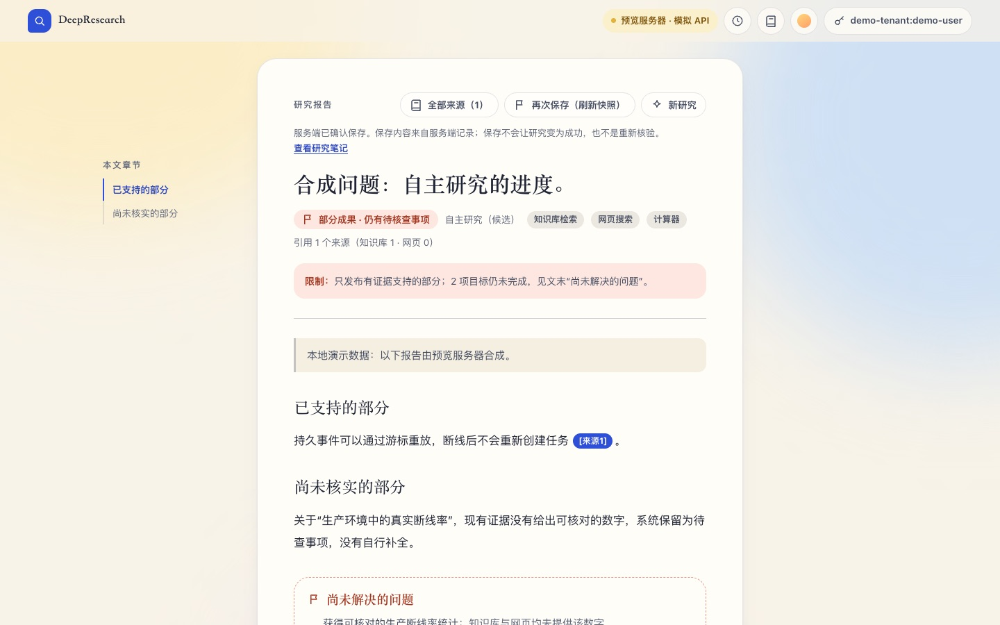
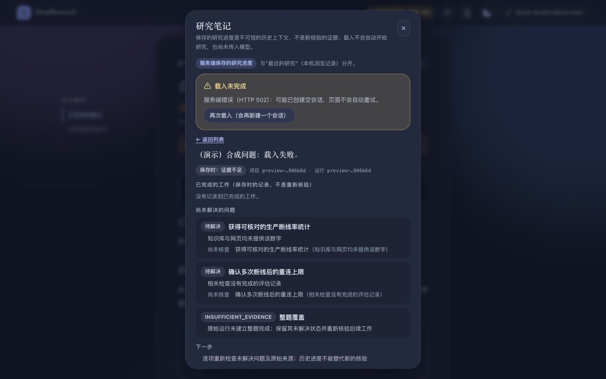
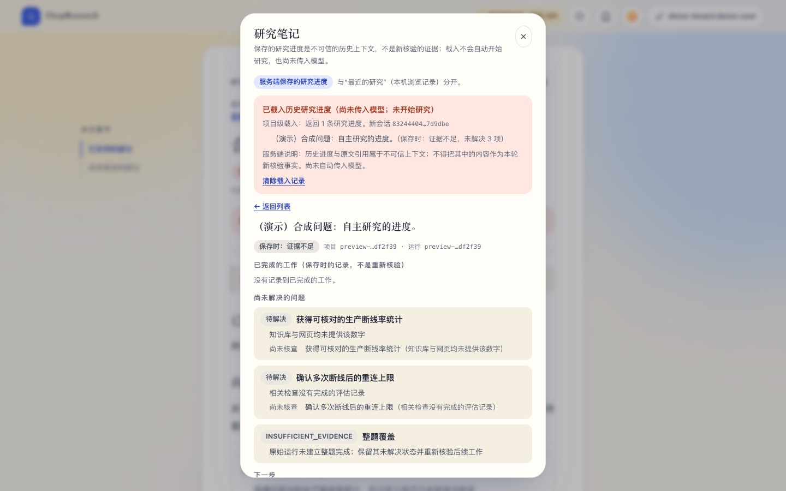
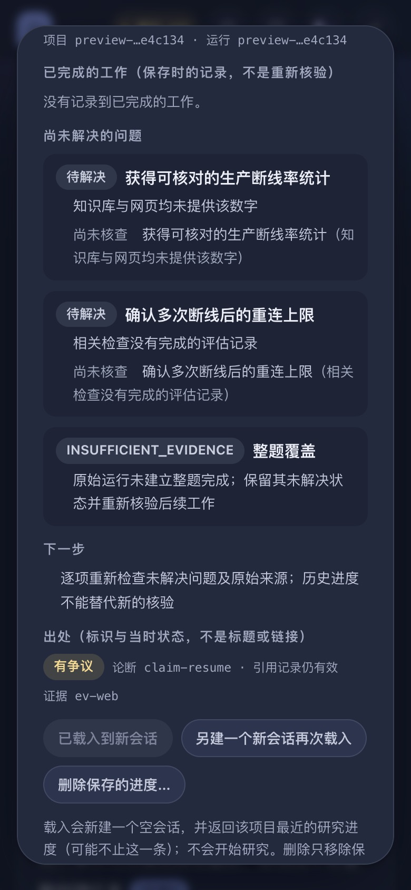
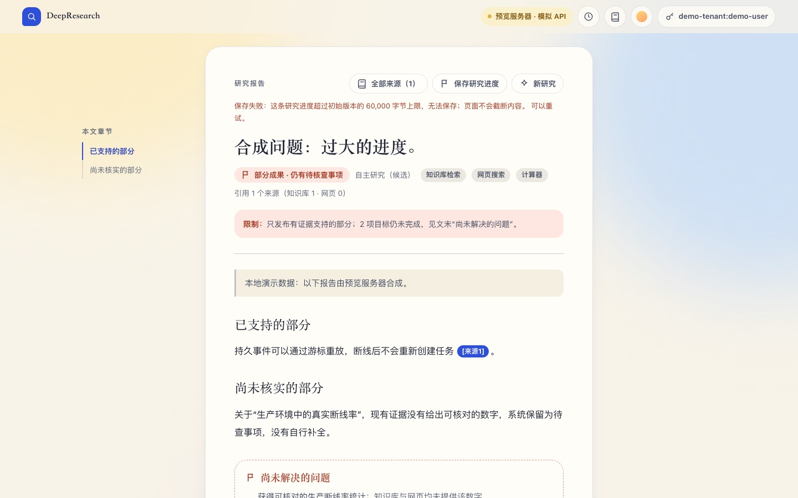
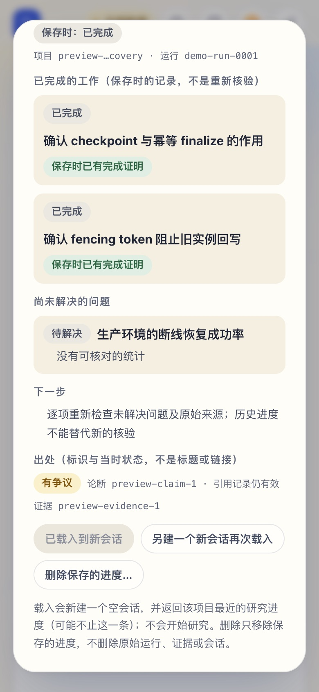

# 研究笔记接入研究进度记忆接口

日期：2026-10-05。前端分支 `claude/deepresearch-frontend-react`，基于 `39ddfef`。只修改了 `frontend/`、`scripts/frontend-preview/` 与 `docs/frontend/`；视觉体系与两种主题保持不变。

**契约来源**：后端交接 `RESEARCH_PROGRESS_FRONTEND_HANDOFF_2026-10-05.md`，分支 `feat/research-progress-memory-mvp-20261005`，提交 `8d941e8`。它取代了 [R1_R2_2026-10-05.md](R1_R2_2026-10-05.md) 中关于记忆接口的阻塞项；该文档列出的其他依赖不受影响。

> 2026-10-06 更新：研究笔记对话框已由“研究档案”视图取代（同样的接口与行为），见 [RHINELAB_REDESIGN_2026-10-05.md](RHINELAB_REDESIGN_2026-10-05.md)。

## 状态

| 项目 | 状态 |
|---|---|
| 前端实现 | 完成 |
| 契约级验证 | 单元测试使用后端在真实 HTTP/JWT 环境下录制的合成示例（`frontend/src/api/__fixtures__/research-progress/`） |
| 浏览器验证 | **仅针对模拟 API**（8090 预览服务器，经 Vite 代理） |
| **真实后端验收** | **待完成**：本机没有运行包含该分支与迁移 `V23__research_progress_memory.sql` 的 Java 服务；8080 无响应。模拟验证不能关闭此项 |

## 接口与界面对应

| 动作 | 接口 | 界面 |
|---|---|---|
| 判断能否保存 | `GET /api/research/agents/{runId}/progress-project` | 报告工具栏的“保存研究进度”。只有自主研究运行会请求；404 显示“这个运行不支持保存研究进度”；工作流与 Single Agent 直接说明不支持，不发请求。客户端不生成项目 ID |
| 保存 / 刷新 | `PUT …/projects/{projectId}/progress/runs/{runId}` | 状态依次为“正在保存，等待服务端确认…”→“服务端已确认保存”；之后可“再次保存（刷新快照）”。保存成功不代表研究成功，也不是重新核验 |
| 浏览 | `GET /api/research/progress` | 只在打开研究笔记时请求；最多 20 条候选；空列表说明“这不代表没有更早的记录”。不显示保存时间（契约没有公开该字段） |
| 查看 | 列表项中的快照 | 原始问题、保存时的运行状态、已完成工作（带“保存时已有完成证明”）、未解决问题（状态、缺口、标准，保留 camelCase 字段）、下一步、论断与证据标识及当时状态（有争议 / 未核查等原样保留） |
| 载入到新会话 | `POST …/projects/{projectId}/resume-context` | 只在点击时发起；进行中按钮禁用；同一项目载入后主按钮变为“已载入到新会话”，另提供“另建一个新会话再次载入”。显示“已载入历史研究进度（尚未传入模型；未开始研究）”、项目级返回条数、每条目标、新会话 ID 与服务端说明。不会自动提交输入框，也不会向创建研究的请求添加字段 |
| 恢复 | `GET …/resume-context?sessionId=` | 返回的会话 ID 按身份作用域保存在当前浏览会话中；刷新后只用 GET 恢复，绝不再次 POST |
| 删除 | `DELETE …/progress/runs/{runId}` | 两步确认；`deleted: true` 与 `false` 都会从笔记中移除该条，并从已载入的副本中移除。不删除原始运行、证据、会话或本机“最近的研究” |

**错误处理**只看 HTTP 状态，不解析中文原因，也能处理非 JSON 响应体：
- 401：重新连接身份。
- 404：不存在、无权访问、不支持，或出处已失效。
- 400：不自动重试。
- 413：超过 60,000 字节上限，无法保存，也不会截断。
- 5xx / 网络中断：保存可以手动重试；载入会提示“可能已创建空会话”，不自动重试，只提供明确的再次载入。

**身份隔离**：列表、项目发现、保存状态与已载入内容都按身份作用域分区。切换身份后，旧身份载入的内容不再显示，存储的会话 ID 也不会用于新身份。

**示例模式**：研究笔记仍是明确选择的合成预览（标注“预览 · 示例数据，不联网”），已改为与真实契约相同的数据形状，并去掉了虚构的保存时间。真实模式不再显示预览。

## 已验证（2026-10-05，本机 Chrome + Playwright）

- `oxlint`、`tsc -b`、生产构建通过；`vitest` 49 项通过。其中新增 7 项针对研究进度：
  - 录制示例的解析（失败运行、争议论断、运行级缺口没有 `task_id`）。
  - 拒绝未知 schema 与 `trusted_as_evidence=true`。
  - 记录标识。
  - 各路由的方法、编码后的路径、无请求体、Bearer 头。
  - POST 只发一次，恢复用 GET。
  - 载入失败不重试。
  - 按状态码给出的说明，含非 JSON 的 413。
- `check-notebook.mjs` 36/36（**模拟 API**），在晴空桌面、雾夜手机两组上分别验证：
  - 工作流结果不可保存且不发请求。
  - 先发现项目再保存，只发一次 PUT。
  - 列表只在打开时请求。
  - 双击只产生一次 POST，载入不创建研究运行。
  - 刷新后用带 `sessionId` 的 GET 恢复，不再 POST。
  - 删除同步更新列表与已载入内容。
  - 切换身份后旧内容消失。
  - 无横向溢出、无控制台错误。
  - 此外还覆盖：413、载入 502 不自动重试、示例模式不发请求（减少动态效果）。
- 回归：`check-r1r2.mjs` 63/63，M2 旅程 `journey-react-live.mjs` 31/31。

## 真实后端验收清单（待 Codex 提供包含本分支的 Java 服务后执行）

```bash
DEEPRESEARCH_API_PROXY=http://<已确认的 Java 服务 origin> npm --prefix frontend run dev
```

1. 用 USER 身份完成或打开一个自主研究运行；报告中“保存研究进度”可用，工作流运行显示不支持。
2. 保存后列表出现该记录；未改变时再次保存不产生新条目。
3. 详情中的失败 / 争议 / 未核查状态与服务端记录一致。
4. 载入：只产生一个新会话；返回的条数与服务端一致；没有创建研究运行。刷新后通过 GET 恢复。
5. 删除：记录消失；再次删除仍可移除（`deleted:false`）。
6. 换另一个用户：看不到前一个用户的记录与载入内容；对其运行的发现返回 404。

## 仍在本次范围之外

论断到报告引用的映射、报告引用的日期、Spring `/app/` 打包与 CI、模型使用已载入的上下文、自动续研、语义召回与多 Agent 协作。

## 截图（模拟 API 或示例数据）

| 晴空 · 桌面 | 雾夜 · 桌面 / 手机 |
|---|---|
|  |  |
|  |  |
|  |  |
