# 前端迭代：研究可见性与研究进度笔记（R1 + R2）

日期：2026-10-05。分支 `claude/deepresearch-frontend-react`，基于 M2 提交 `3edb36e`。本迭代只修改 `frontend/`、`scripts/frontend-preview/` 与 `docs/frontend/`；视觉体系（配色、字体、圆角、间距、两种主题）保持不变。

## 1. 能力与字段对照

依据后端分支 `fix/planner-applicability-instruction-20261005` 的提交 `cdbb89b`。其中已合并 `FRONTEND_SOURCE_CONTRACT_2026-10-03.md` 与 `FRONTEND_EVIDENCE_READ_API_2026-10-03.md` 两份契约。研究进度记忆尚未提交，只在独立工作树中有未跟踪源码。

| 能力 | 公开字段 / 接口 | 前端状态 |
|---|---|---|
| 来源元数据（LangGraph、原生 Single Agent） | `finalResponse.citationDetails[]`：`kind`、`title`、`url`、`excerpt`、`metadataStatus`、`unavailableReason` | **本次接入**：逐项显示 `MISSING_SNAPSHOT` / `AMBIGUOUS_SNAPSHOT` / `SNAPSHOT_LIMIT` 的含义；`AVAILABLE` 只表示出处可信，不表示内容正确 |
| 来源元数据（Dify / 自主研究） | 既有形状：无可用性字段；Dify 有 `retrievedAt`；自主研究的知识库 `url` 可能是 `""` | **本次接入**：未标可用性的条目显示为“按引擎既有格式”，不伪造 `AVAILABLE`；`retrievedAt` 只作为检索时间 |
| 读取方式 | 由 `kind` 推断：搜索摘要 / 发布证明内的原页引文 / 知识库片段 | **本次接入**：检查面板显示“读取方式”，搜索摘要标注“非原页阅读” |
| 发布 / 更新 / 适用日期（报告引用） | 无 | 一律显示“未知” |
| 论断与证据关系、记录的分歧 | `GET /api/research/workflows/{runId}/evidence`（`evidence-view/1`），仅自主研究运行 | **本次接入**：报告末尾的“证据记录”，以及独立的“记录的分歧”视图 |
| 证据记录与报告引用的对应 | 证据记录的 `sourceId` 是内部来源标识，**不保证**等于 `citations` 中的公开 ID | **不做连接**：`[来源N]` 保持引用级；论断只在证据记录中展示 |
| 研究计划 | 自主研究事件 `AGENT_PLAN_UPDATED` / `AGENT_PLAN_REVISED`（任务、标准、证据数） | **本次接入**：运行中的“研究计划”面板；自主研究不再显示固定阶段条 |
| 中断状态 | `CANCELLED`、`BUDGET_EXCEEDED`、失败码、`AGENT_STOPPED_WITH_GAPS` | **本次细化**：预算终止单独呈现，说明“这是执行限制，不是证据结论”；停止时记录的待查事项单独列出；没有公开部分结果时明确说明，不重建 |
| 研究进度记忆 | 草稿：`PUT/GET/DELETE /api/research/projects/{projectId}/progress/runs/{runId}`、`GET …/resume-context?sessionId=`；未提交、无文档示例、无列表接口 | **只做预览**：真实模式不可用并说明原因；预览为内存数据、不联网、全程标注 |

已有的 M2 行为全部保留并复测：每次显式提交只创建一次，重连或重挂载不创建，身份变化时缓存与 SSE 隔离，服务端取消，刷新恢复。

## 2. 主要改动

- **检查面板**：读取方式、来源元数据状态与原因、检索时间，与其他日期分开显示。
- **证据记录**（`features/evidence/EvidenceRecord.tsx`）：可用性状态、发布状态、论断及其决定状态、证据链接（关系 / 处置 / 引文）、记录的分歧、缺口码、服务端的局限说明。503（`EVIDENCE_VIEW_DISABLED`）、409（`EVIDENCE_VIEW_INTEGRITY_INVALID`）与 `BOUNDED_OUT` 各有专门说明；“没有记录分歧”明确表述为“不证明不存在分歧”。
- **记录的分歧**（`RecordedDisagreementView.tsx`）：与用户自选的“来源比较”分开，标签不同；比较视图本身也说明“不是后端记录的分歧”。示例中旧的“未来契约示例”已由符合 `evidence-view/1` 形状的示例数据替代。
- **运行中**：自主研究的计划面板；当前动作淡入切换；过程记录只让新到的条目入场，不重放整条时间线。
- **报告**：预算终止的单独呈现；没有部分结果时的说明；停止时记录的待查事项。
- **研究笔记**（`features/memory/Notebook.tsx`、`demo/memoryPreview.ts`）：顶栏入口与报告中的“保存研究进度”。真实模式下按钮不可用，并显示“后端接口尚未交付”。示例模式下：保存（经过“保存中”，确认后才显示成功；`?memoryFail` 展示可恢复的失败）、浏览、详情、载入（只确认载入内容，不开始研究）、两步删除。笔记与本机“最近的研究”分开。从运行保存时，来源状态记为“未逐条核查”，不会因保存而升级。
- **手机顶栏**：新增笔记入口后，连接标签在窄屏改用同义短标签（完整说明保留在标题中），避免身份按钮被遮挡。

## 3. 动效

参考了 [GSAP Showcase](https://gsap.com/showcase/) 中两个站点，借用的是交互原则，不是视觉风格：

1. **Revelatio Studio**（revelatio.studio）：加载时居中的一行说明 “Branding, Product Design & Code”，在页面就绪后作为固定的主标题继续存在，而不是被新内容替换。→ **研究阶段的连续性**：提交后，问题从输入框的位置移动到运行摘要的位置（约 420ms，仅用 transform / opacity）。
2. **A24（Ravi Klaassens）**（a24.raviklaassens.com）：“Index”面板从触发它的底部导航中长出，背景变暗但不移动，当前条目以反色块保持选中。→ **引用检查**：检查面板从被点击引用所在的高度展开（transform-origin 随引用位置变化）；被选中的引用短暂放大并保持环形标记；报告正文不移动。

实现只使用已安装的 Motion，没有引入 GSAP：两处都是单一元素的状态切换，不需要时间线编排。减少动态效果时，问题不移动、面板只淡入；所有状态都不依赖动画完成。保存成功的过渡未添加，因为记忆接口尚未就绪。

## 4. 预览

```bash
python3 scripts/frontend-preview/mock_server.py                              # 模拟 API，8090
DEEPRESEARCH_API_PROXY=http://127.0.0.1:8090 npm --prefix frontend run dev   # React，5173
```

- 示例模式：`http://127.0.0.1:5173/app/?demo`；记录的分歧：`/app/?state=compare-recorded`；保存失败：`/app/?demo&state=report&memoryFail`。
- 真实适配器 + 模拟 API：`/app/?scenario=success`，执行方式选“自主研究（候选）”可查看计划与证据记录。新增场景：`budget`、`evidence-disabled`；`langgraph` 已改为符合新的来源契约（其中一项为 `MISSING_SNAPSHOT`）。
- 检查脚本：`scripts/frontend-preview/check-r1r2.mjs`。

## 5. 实际测试内容（2026-10-05，本机 Chrome + Playwright，仅合成数据）

- `oxlint`、`tsc -b`（strict）无问题；`vitest` 42 项通过，其中新增：来源契约示例（取自后端 `docs/agent/fixtures/frontend-sources/`）、证据记录的连接与状态码映射、笔记保存不升级来源状态。生产构建成功。
- `check-r1r2.mjs` 63/63：两种主题 × 1440×900 / 390×844，覆盖阶段连续性、引用检查的焦点与滚动恢复、证据记录与分歧视图的往返、笔记的保存 / 载入 / 删除、无横向溢出、无控制台错误；真实适配器下的计划面板、证据接口、预算终止、缺快照原因、笔记不可用说明、证据视图关闭；减少动态效果；保存失败。
- M2 回归旅程 `journey-react-live.mjs` 31/31（创建去重、刷新续传、取消、断线、结果未知重放、身份隔离等）。

**未测试**：真实 Java 服务（无运行实例）、Safari 与 Firefox、新契约在真实运行中的数据。

## 6. 仍需 Codex 处理的依赖

1. **研究进度记忆的公开契约**（R2 真实接入的前提）：最终的请求与响应示例（保存、读取、删除、载入），字段语义（目标、运行状态、已完成工作、未解决事项、下一步、出处及其状态），`projectId` 的来源（前端目前没有），列表接口（是否提供），错误与权限语义，以及载入的上下文如何在新运行中使用（若会被使用）。
2. **证据记录与报告引用的对应**：若希望在 `[来源N]` 旁显示论断级状态，需要在证据视图中提供每条证据对应的公开引用 ID（与 `finalResponse.citations` 相同的拼写），或在 `finalResponse` 中提供论断到引用编号的映射。
3. **来源日期**：发布 / 更新 / 适用日期仍未在报告引用中提供（证据视图中只有带标签的 `publishedAt` 与适用性）。
4. **既有交接项**：Spring 打包与 `/app/` 路由、CI 作业（见 [M2_INTEGRATION_HANDOFF.md](M2_INTEGRATION_HANDOFF.md)）。
5. **真实后端验收（待完成）**：来源契约、证据接口与本次界面尚未在真实服务上验证。模拟预览通过不能关闭此项。

## 截图

均为合成数据。

| 晴空 | 雾夜 |
|---|---|
| 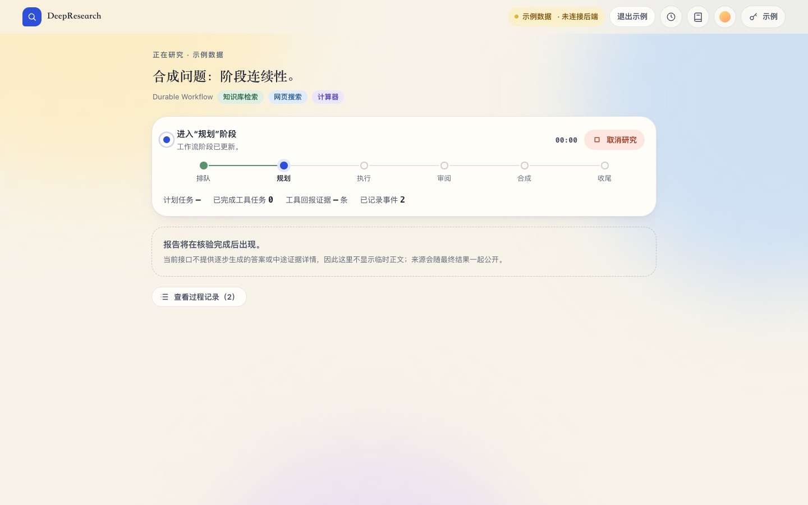 | 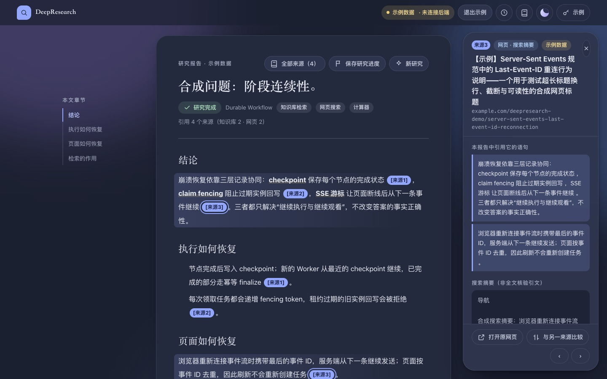 |
| 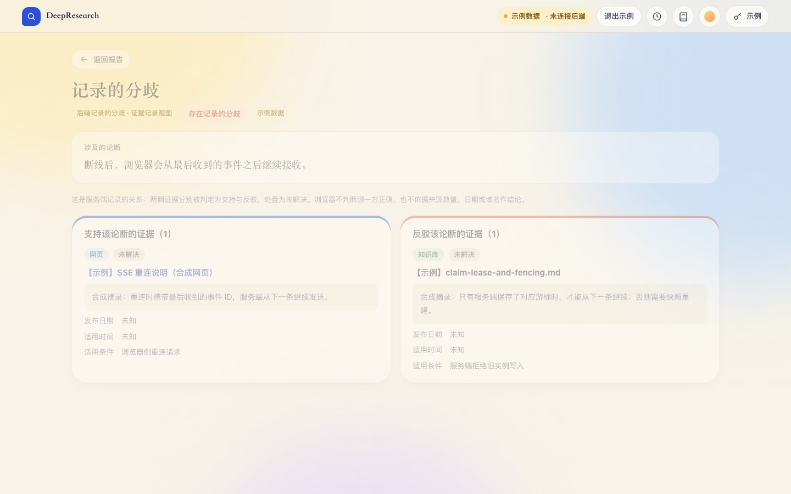 | 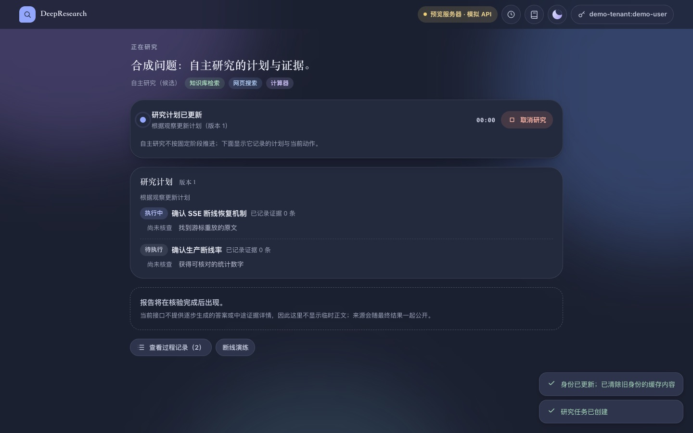 |
| 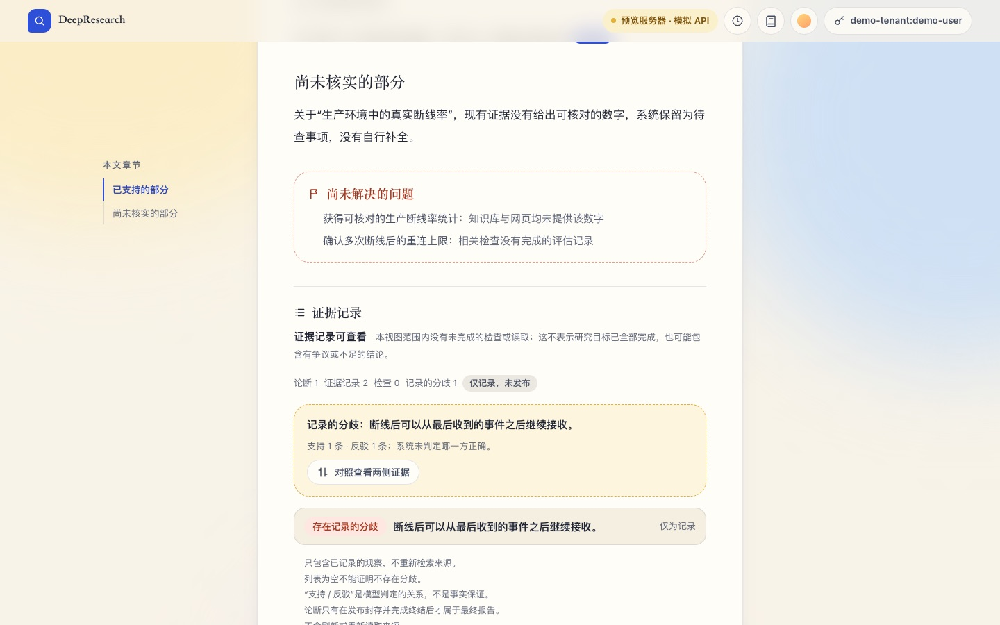 | 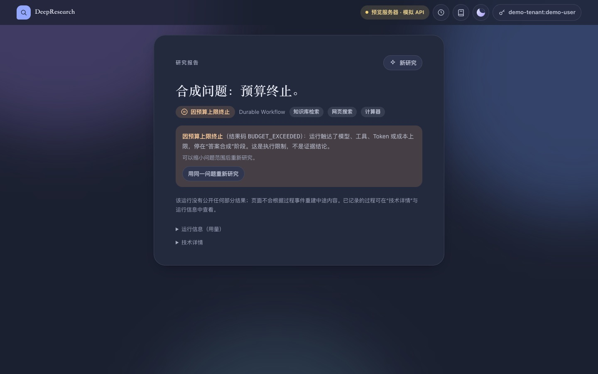 |
| 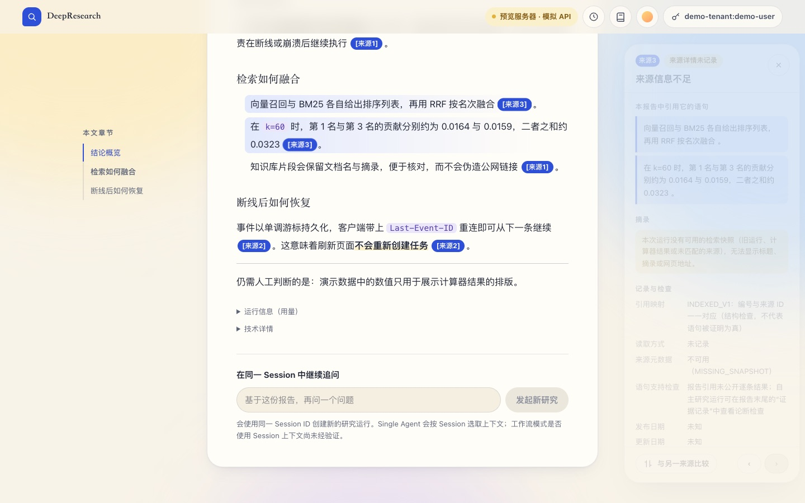 | 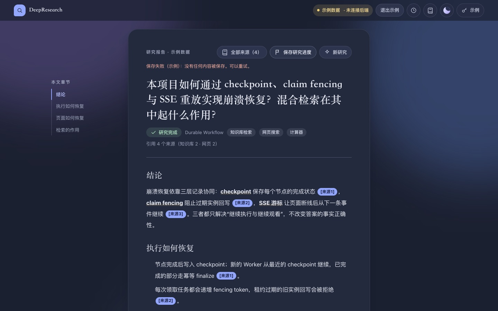 |

| 晴空 · 手机 · 证据视图关闭 | 晴空 · 手机 · 记录的分歧 | 雾夜 · 手机 · 研究笔记 | 雾夜 · 手机 · 引用检查 |
|---|---|---|---|
| 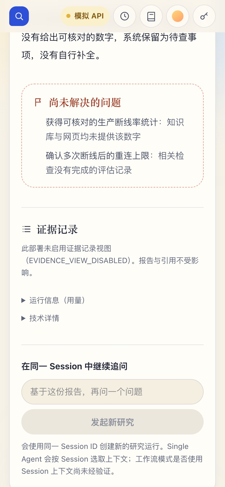 | 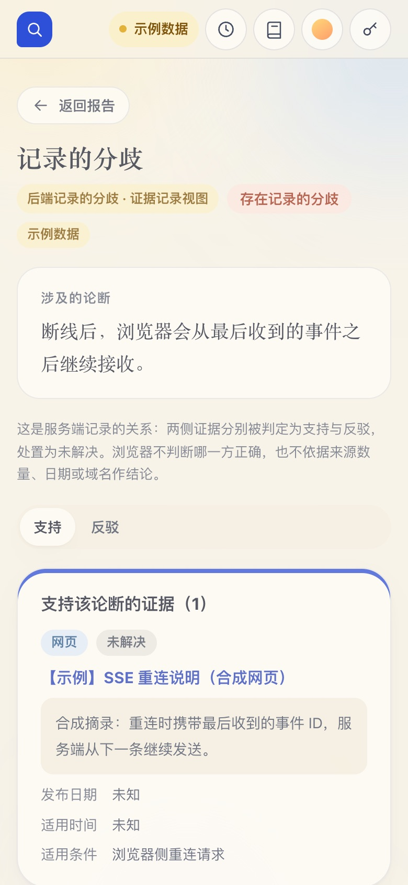 | 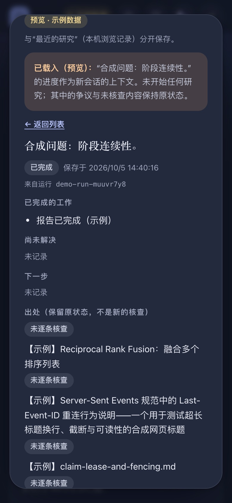 | 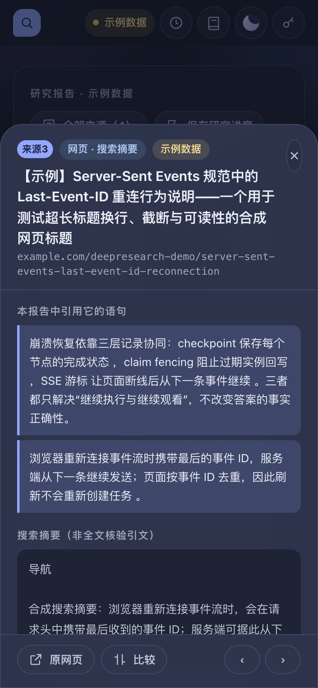 |
