# React 前端重建 · 第 1 阶段（布局与基础）

日期：2026-10-03。范围仅为路线图的 **Milestone 1**：建立 React + TypeScript + Vite 基础，用带标识的示例数据演示入口、运行中、报告、证据检查与来源比较的布局，并验证两种主题与响应式。真实 API 迁移、关系图、GSAP 与 Three.js 均未开始。

## 版本基线

| 版本 | 分支 | 提交 | 说明 |
|---|---|---|---|
| V1（保留） | `claude/deepresearch-frontend-redesign-1bb438` | `fea8363666d994ed3ca8965290b655bfe310460f` | 原生 HTML/CSS/JS 的 `/demo.html` 改版；本地注释标签 `frontend-v1-baseline` 指向该提交（未推送） |
| React（本阶段） | `claude/deepresearch-frontend-react` | 自 `fea8363` 分出 | 新应用位于 `frontend/`，V1 页面与预览工具原样保留 |

V1 的验证限制仍然有效：只在本地合成数据和 Chrome 中验证，**尚未与 8080 上的真实 Java 后端联调**（详见 [V1 文档](REDESIGN_2026-10-02.md#仍未验证的后端交互)）。React 版本目前同样只使用示例数据。

## 能力矩阵（依据当前公开响应）

“公开”指浏览器经 `/api/**` 可读取的字段。`/internal/agent/evidence/*` 是执行面内部接口，前端不调用，也不持有委派凭据。

| 能力 | Durable Workflow · LangGraph（默认） | Durable Workflow · Dify（可选） | 自主研究（候选，`/agents`） | Single Agent（`/agent`） | 本阶段前端 |
|---|---|---|---|---|---|
| 引用映射 | `citations` + `citationContract`（`INDEXED_V1`/`NONE`） | 同左 | 同左 | 同左 | 已实现规范化（按 sourceId 精确匹配），用示例数据演示 |
| 来源元数据（标题/URL/摘录/类型） | **未提供** `citationDetails` → 显示“来源信息不足” | `citationDetails`（网页摘要、知识库片段） | `citationDetails` | DTO 中**无** `citationDetails` 字段 | 已实现；缺失时如实标注 |
| 结构化论断与证据关系 | 无 | 无 | `claims`（形状待在 M2/M3 映射） | 无 | 未显示论断级指标，仅引用级 |
| 报告完整性与未完成目标 | `insufficientEvidence` 布尔 | 同左 + 安全故障 `diagnostics` | `report_status`、`unfinished_goals`、`semantic_truth_guaranteed` | `finished` + `status` | 已实现未完成目标区块与限制说明 |
| 检查结果 | 引用映射结构检查 | 同左 | 发布前服务端核查（`AGENT_PUBLICATION_VALIDATED` 事件） | 引用校验结果码 | 只说明“结构检查”，不升级为事实保证 |
| 分歧与裁决 | 无公开字段 | 无 | 无公开字段 | 无 | 仅以“未来契约示例”标注演示版式 |
| 计划修订与可重放事件 | 持久事件 + SSE 游标 | 同左（`DIFY_STAGE`） | `AGENT_PLAN_*`、`AGENT_OBSERVATION` 等 | 同步响应内 `steps`/`events` | 过程记录与阶段条；基于事件计数，不伪造进度 |
| 来源日期（发布/更新/检索/适用） | 无 | 无 | 无 | 无 | 一律显示“未记录” |
| 记忆上下文 | 无 | 无 | 无 | `memoryContext`：已选摘要/近期对话/记忆条数；`modelUseVerification: "unknown"` | 未展示；后续只能表述为“已选取的上下文” |
| 多 Agent 协作 | 阶段角色不构成协作记录 | 同左 | 无参与者/交接记录 | 无 | 不展示为可用能力 |
| 用量 | `usage`（可能为未知） | 仅 `totalTokens` | `usage` | `usage`（含 `estimated` 标志，默认值可能全为 0） | “未知/未记录”与明确的 0 区分显示 |

### 缺少的公开投影（最小只读需求）

1. **LangGraph 工作流的 `citationDetails`**：默认路径的引用卡片目前只能显示 ID。需要与 Dify 路径相同的 `{sourceId, kind, title, url, excerpt}`。
2. **分歧与裁决**：经认证、只读的 `GET /api/research/workflows/{runId}/disagreements`（或并入 `finalResponse`），包含涉及语句、两侧 sourceId、关系类型、裁决摘要与检查记录引用。
3. **来源日期与读取状态**：在 `citationDetails` 中增加可选 `publishedAt`、`updatedAt`、`retrievedAt`、`applicableAt` 与读取方式；缺失时保持未知。
4. **论断级支持结果**（工作流模式）：论断文本、对应 sourceId 与检查结果码。自主研究模式已有 `claims`，需确认形状后复用。
5. **运行中的证据详情**：当前事件只给出数量；若要“证据随到随显”，需要按事件公开已脱敏的来源元数据。
6. **服务端研究历史**：“最近研究”目前只能是浏览器本地记录。

## 设计与结构

- **按阶段改变构图，没有固定列数**：入口居中，只有问题与紧凑的范围控制；运行中问题收为摘要，显示活动条、阶段与“已记录”计数；完成后报告成为主阅读面，章节导航在宽屏左侧留白中跟随；入口阶段不出现任何证据侧栏。
- **唯一的证据交互**：点击 `[来源N]` 打开检查面板——宽屏停靠在报告右侧留白（不覆盖、不推动正文），中等宽度为浮层，手机为底部抽屉（模态并困住焦点）。Esc 或关闭按钮返回触发它的引用，阅读位置不变；被检查的语句同时淡色高亮。悬停/聚焦预览只是增强。
- **来源比较**是带“返回报告”的临时全宽视图；返回时恢复滚动位置并重新打开原来源。“你选择的比较”与“后端记录的分歧（未来契约示例）”使用不同标签，浏览器从不判定哪一方正确。
- **示例模式标识一致**：顶栏、报告元数据、检查面板与比较视图都显示“示例数据 · 未连接后端”，修正了 V1 预览中“横幅说模拟、顶栏说在线”的矛盾。
- **令牌**：沿用 V1 的 Airy/Mist 调色，补齐 focus、selection、disabled、success/warning/error/info 与来源类型语义色，以及 4px 间距、圆角和 150/240/320ms 动效刻度（`frontend/src/styles/tokens.css`）。主题存储键与 V1 相同。
- **模块**：`domain/`（契约类型、引用规范化、安全 Markdown、事件 reducer，均为纯函数并有单测）、`demo/`（确定性示例与回放）、`features/`（shell / composer / running / report / evidence）、`ui/`、`styles/`。示例回放与将来的真实 SSE 适配器共用同一个 reducer，保证单一运行状态。

## 预览

```bash
# V1（保留版本）：本地模拟 API，端口 8090
python3 scripts/frontend-preview/mock_server.py
#   http://127.0.0.1:8090/demo.html?scenario=success

# React（本阶段）：示例数据，端口 5173
npm --prefix frontend ci
npm --prefix frontend run dev
#   http://127.0.0.1:5173/
#   确定性状态：/?state=running | report | partial | cancelled | inspect | compare | compare-recorded
```

生产构建：`npm --prefix frontend run build`，再用 `npm --prefix frontend run preview` 在 `http://127.0.0.1:4173/` 查看。尚未接入 Spring Boot 打包，`/demo.html` 仍是 V1 页面。

## 验证（2026-10-03，本机 Chrome + Playwright，仅示例数据）

- `tsc -b`（strict）、`oxlint` 无警告，`vitest` 10 项通过：引用 ID 精确匹配与顺序、缺失/重复/错配详情、无契约不生成链接、不安全 URL、知识库包裹标记只在预览中去除、`[来源N]` 规范标记、Markdown 文本安全、重复事件忽略、游标不回退、失败停止阶段与证据计数。
- 两种主题 × 1440×900、1024×768、390×844、320×700 × 8 个状态，共 64 项：横向溢出 0（以可视视口宽度计算），顶栏与检查面板控件全部在视口内，控制台错误 0。
- 1440×900 时入口主按钮底部位于 469px；1024×768 时为 448px。
- 键盘：Enter 打开检查面板并聚焦标题；Esc 关闭后焦点回到同一个引用、滚动不变；从深处引用进入比较再返回，滚动位置 651→651，并重新打开原来源；关闭后焦点回到 `[来源4]`。
- 取消：运行中点击“取消研究”进入“已取消”报告状态。
- 减少动态效果：过渡被压缩为 0.01ms；主题选择刷新后保持（与 V1 共用存储键）。唯一的控制台提示是 Motion 在减少动态效果时的说明性警告。
- 截图与检查脚本：`scripts/frontend-preview/capture-react.mjs`。

## 延后到后续阶段

- **M2**：真实 API、身份、幂等创建与未知结果重试、SSE 游标与重连、取消、各模式差异、TanStack Query、同源开发代理、Spring Boot 打包与 `/demo.html` 切换策略。
- **M3**：双向引用导航、真实分歧/裁决（依赖新的公开投影）、时间线或关系视图（React Flow）。
- **M4**：GSAP、Three.js 等可选展示效果。
- 示例回放目前对三种执行方式都使用工作流脚本；模式差异只体现在说明文字与标签上。Safari 与 Firefox 未测试。

## 截图

均为示例数据。

| 晴空 Airy | 雾夜 Mist |
|---|---|
| 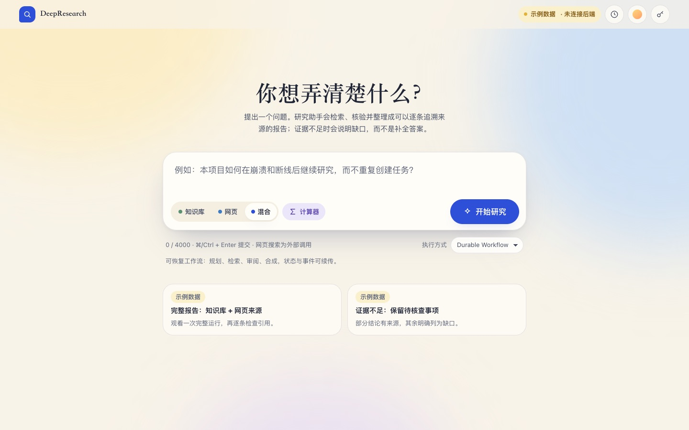 | 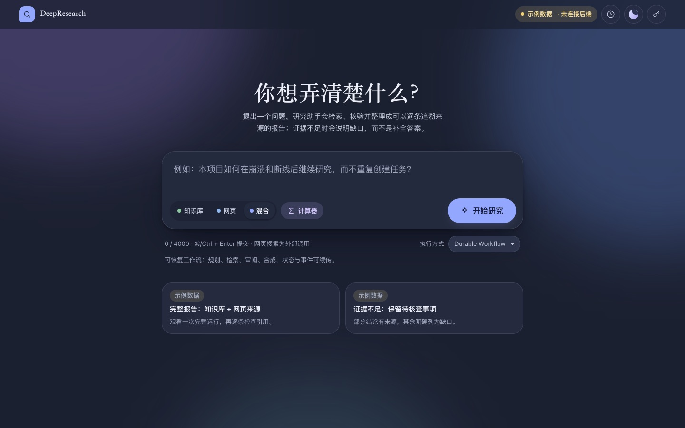 |
| 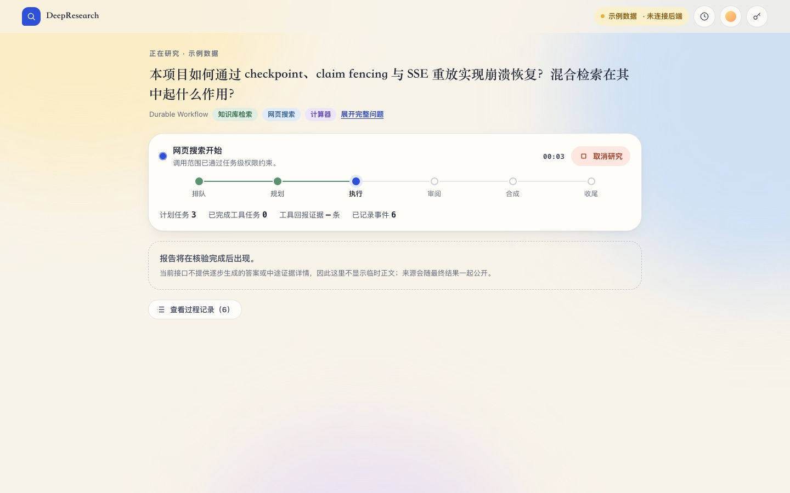 | 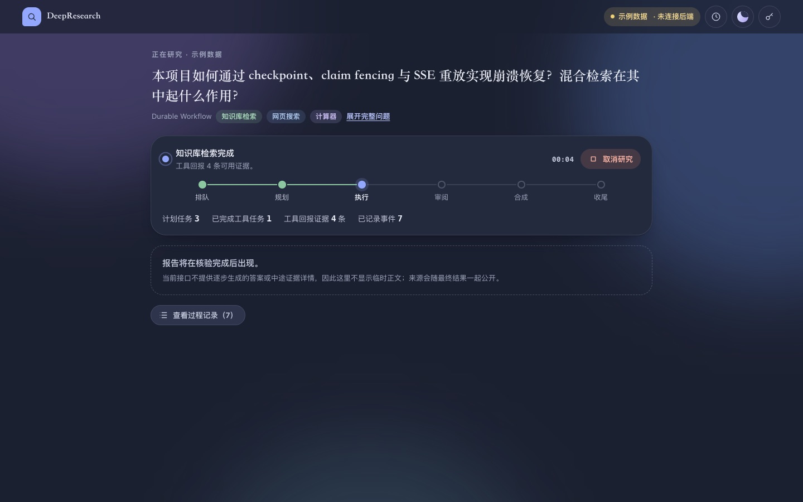 |
| 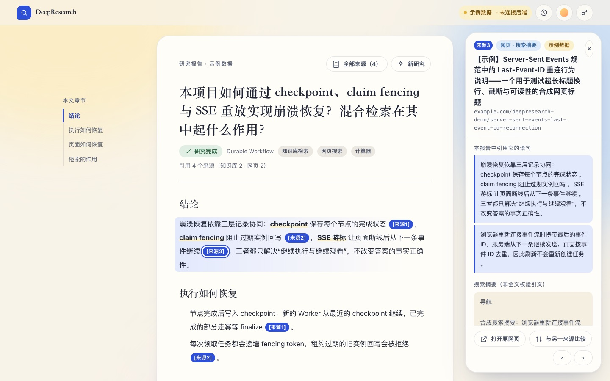 | 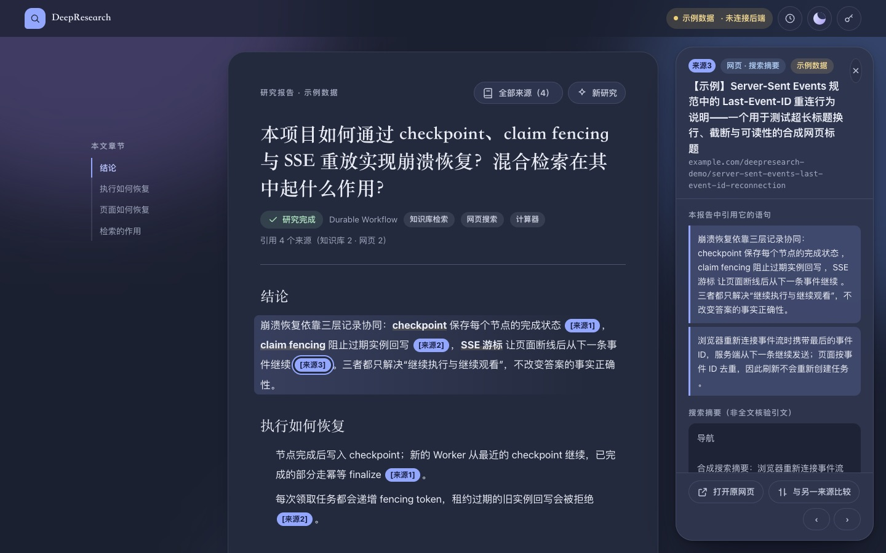 |
| 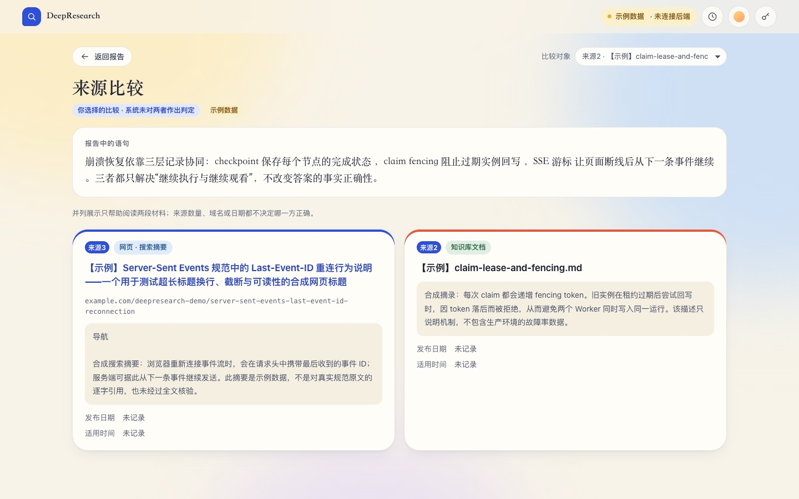 | 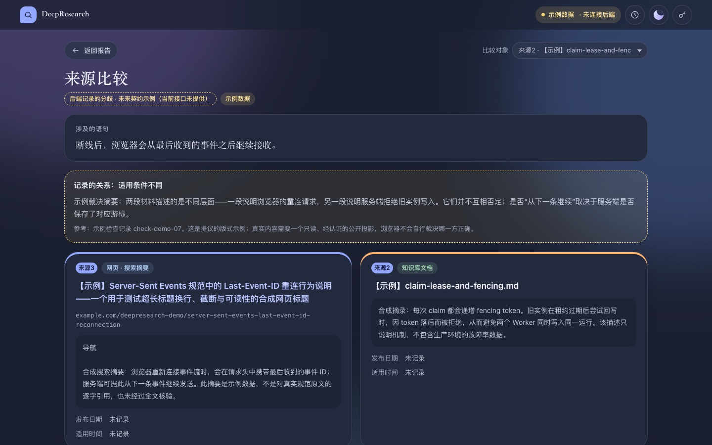 |
| 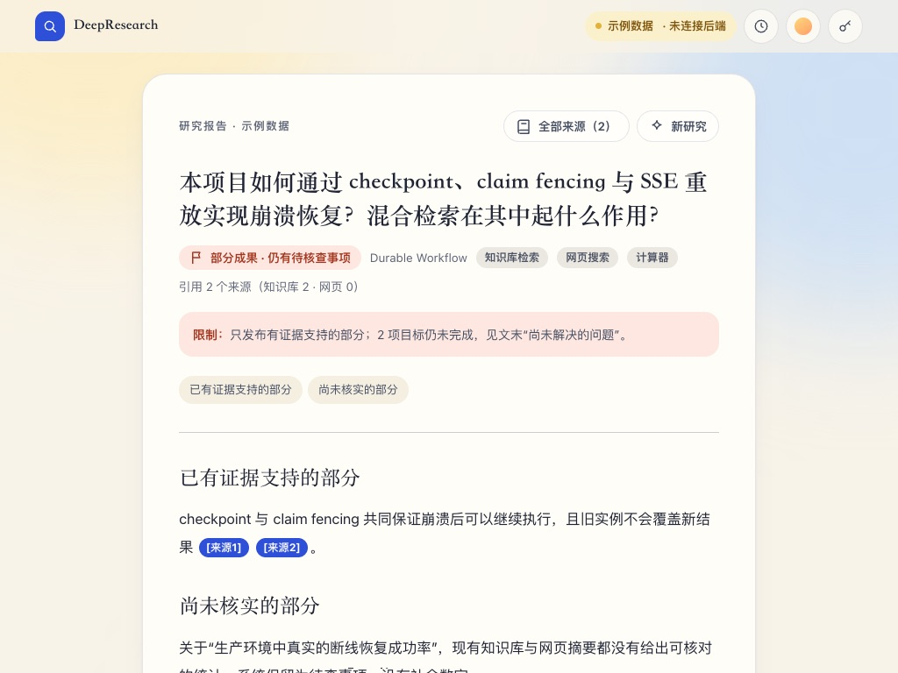 | 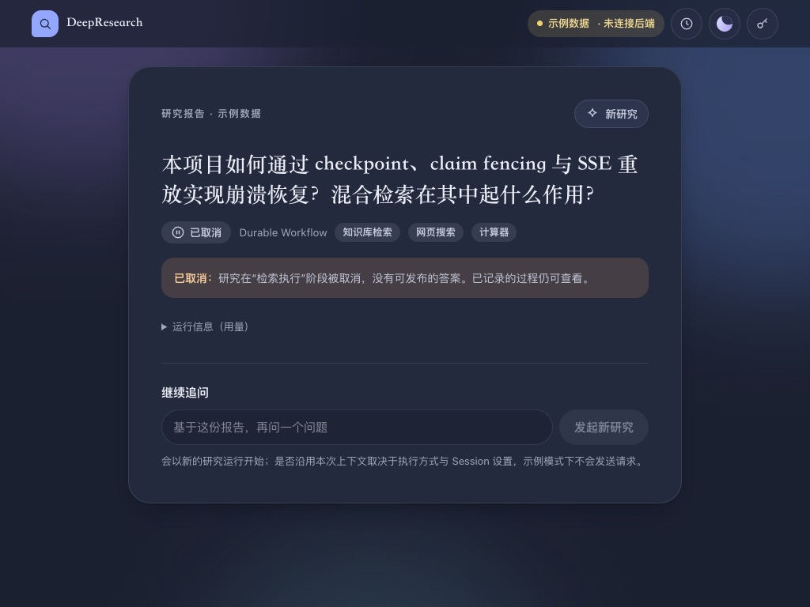 |

| 晴空 · 入口 | 晴空 · 运行中 | 晴空 · 证据抽屉 | 雾夜 · 报告 | 雾夜 · 比较 | 雾夜 · 320px |
|---|---|---|---|---|---|
| 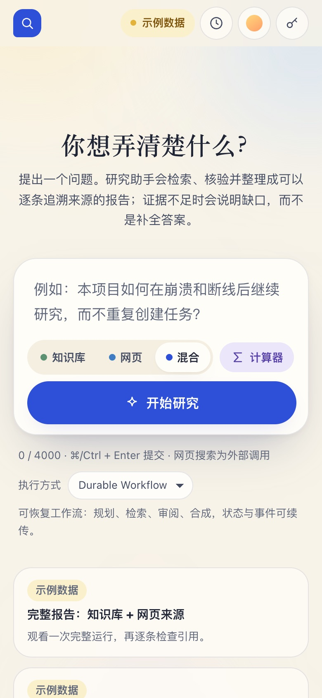 | 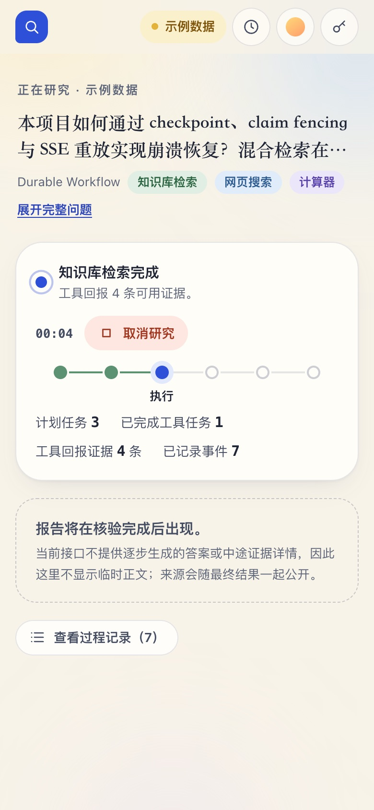 | 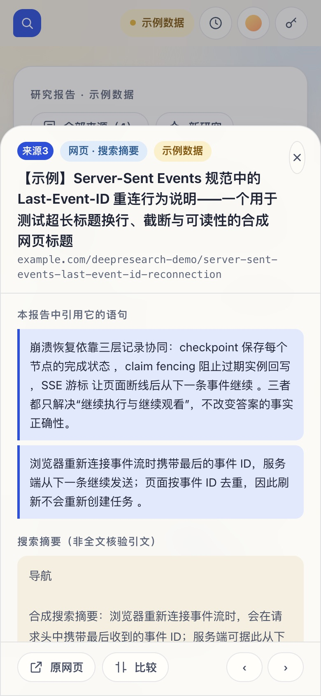 | 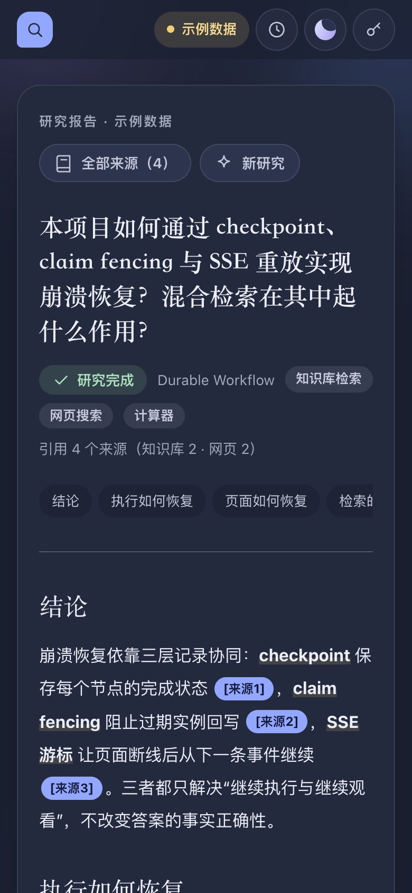 | 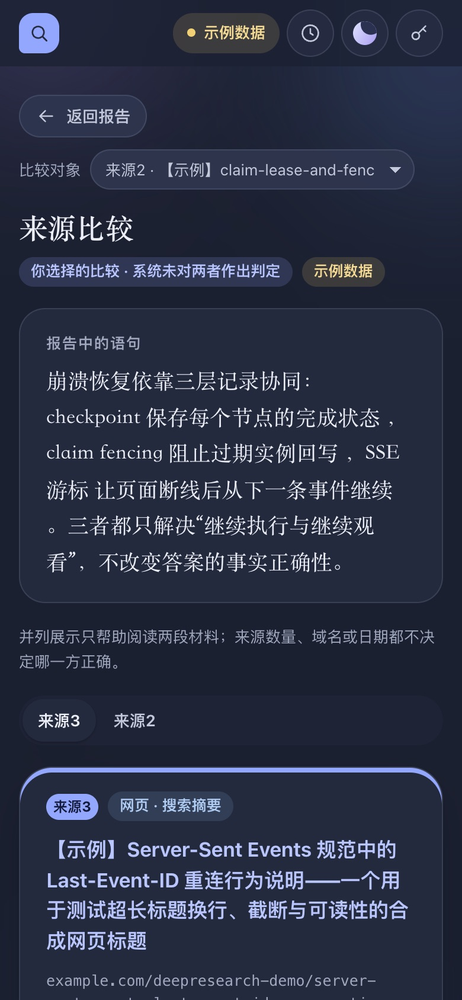 | 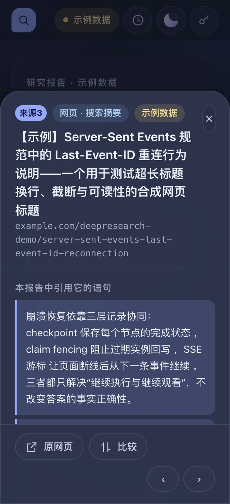 |
