# React 前端重建 · 第 2 阶段（真实行为迁移，前端部分）

日期：2026-10-03。分支 `claude/deepresearch-frontend-react`。本阶段把 V1 页面已有的 API、身份、创建、取消、引用与 SSE 行为迁移到 React 的类型化适配器中，并接入各执行方式的真实公开响应形状。后端打包、路由、公开投影与 CI 由 Codex 负责，见 [集成交接](M2_INTEGRATION_HANDOFF.md)。

## 运行方式

| 模式 | 进入方式 | 网络 | 顶栏标识 |
|---|---|---|---|
| 真实（默认） | `/app/` | 只访问同源 `/api/**` | “Java API 在线” / “API 未连接” / 连接预览模拟服务时为“预览服务器 · 模拟 API” |
| 示例 | 入口的示例卡片、`/app/?demo`、`/app/?state=…` | 无任何请求（单元测试与浏览器旅程均验证） | “示例数据 · 未连接后端” + “退出示例” |

真实 API 出错时不会回退到示例结果。

## 结构

| 位置 | 职责 |
|---|---|
| `src/api/http.ts` | 同源校验、Bearer 头、错误映射、结果未知判定（V1 规则） |
| `src/api/identity.ts` | 身份、作用域指纹、缓存分区键；与 V1 共用存储键与格式 |
| `src/api/pending.ts` | 幂等创建记录；只能以相同 origin/租户/用户/凭据指纹重放 |
| `src/api/endpoints.ts` | 现有公开路由的类型化调用（可注入 fetch 便于测试） |
| `src/api/sse.ts`、`eventStream.ts` | 增量 SSE 解析；按游标续传、退避 1→8 秒、致命状态停止；停止事件流不取消运行 |
| `src/live/useLiveResearch.ts` | 真实控制器：TanStack Query 中每个身份作用域一个权威运行条目，快照与事件经同一 reducer 合并 |
| `src/domain/runState.ts`、`failures.ts` | 增加 Single Agent 映射、失败码说明；保留示例与真实共用的纯函数 |

### 保留的行为
- **幂等创建与结果未知**：提交前先持久化请求；网络错误、超时或 5xx（503 除外）显示“创建结果未知”，刷新后仍在，只能用相同的键与请求体安全重试，身份或 origin 变化时拒绝重放。
- **不重复创建**：只有用户操作会创建运行；刷新、重新挂载、视图切换和重连只读取快照与事件流。React 开发模式的 StrictMode 双重执行下，浏览器旅程仍测得每次提交恰好一个 POST。
- **SSE**：fetch 携带 Bearer；按 `Last-Event-ID` 续传；重复事件按 ID 忽略；流结束后以快照判定是否终止；断线演练只断开事件流。
- **取消**：调用服务端 `/cancel`，等服务端报告 `CANCELLED` 才改变状态；Single Agent 显示“不支持取消”。
- **身份隔离**：切换身份清空查询缓存并断开事件流；用新身份重新读取当前运行，无权访问时只显示“任务不存在或无权访问”。
- **Token**：只在内存，或在用户勾选后存入当前会话；从不写入 URL 或 localStorage。旧的跨源设置会连同会话凭据一起清除。
- **引用**：沿用 V1 的 `INDEXED_V1` 规则、按 sourceId 精确匹配与安全 URL；LangGraph 运行没有 `citationDetails` 时如实显示“详情未记录”，不推测链接。

### 各执行方式
- **Durable Workflow**：LangGraph（无来源详情）与 Dify（有 `citationDetails`、安全故障 `diagnostics`）都按实际字段呈现；`insufficientEvidence` 映射为证据不足。
- **自主研究（候选）**：路由到 `/agents`，读取 `report_status`、`unfinished_goals`、`citationDetails`；`claims` 已保留在状态中但形状未定义，暂不显示论断级指标。
- **Single Agent**：同步调用，无阶段与事件流；`estimated` 用量标注为估算；`memoryContext` 只描述“已选取的上下文”，并明确“模型是否实际使用：未知”。

### 其他改进
- 失败报告显示具体结果码、说明、停止阶段与恢复动作（预填问题，提交时才新建运行）；失败或取消后不提供“继续追问”。
- “继续追问”在有 Session 时说明 Single Agent 会按 Session 选取上下文，而工作流模式是否使用尚未验证。
- 运行中的计时：示例为本地提交时间；真实运行从首条记录事件起计；结束后显示记录时长。
- 技术详情（Run ID、Session、Last-Event-ID、状态码）默认折叠。

## 预览

```bash
# 1) 预览模拟 API（V1 页面也由它提供）：http://127.0.0.1:8090/demo.html
python3 scripts/frontend-preview/mock_server.py

# 2) React，经同源代理连接模拟 API：http://127.0.0.1:5173/app/?scenario=success
DEEPRESEARCH_API_PROXY=http://127.0.0.1:8090 npm --prefix frontend run dev
#    场景：success | insufficient | failed | slow | disconnect | unknown | noweb | langgraph
#    示例模式：http://127.0.0.1:5173/app/?demo

# 连接真实 Java 服务时改为 DEEPRESEARCH_API_PROXY=http://127.0.0.1:8080（本阶段未执行）
# 生产构建预览：npm --prefix frontend run build && npm --prefix frontend run preview → http://127.0.0.1:4173/app/
```

## 验证（2026-10-03，本机 Chrome + Playwright，仅合成数据）

- `oxlint`、`tsc -b`（strict）、`vitest` 32 项全部通过；`npm ci` 后可复现构建。
- 浏览器旅程 31/31（`scripts/frontend-preview/journey-react-live.mjs`）：见交接文档第 6 节。
- 版式回归 68 项无问题（`capture-react.mjs`）。
- 生产构建在 `vite preview` 的 `/app/` 下资源路径正确。

**未验证**：真实 Java 服务（8080 未运行）、Spring 打包与 `/demo.html` 路由（Codex 负责）、Safari 与 Firefox。JS 产物约 544 kB（gzip 178 kB），后续可做代码分割。

## 截图

均为预览模拟服务器或示例模式的合成数据。

| 晴空 | 雾夜 |
|---|---|
| 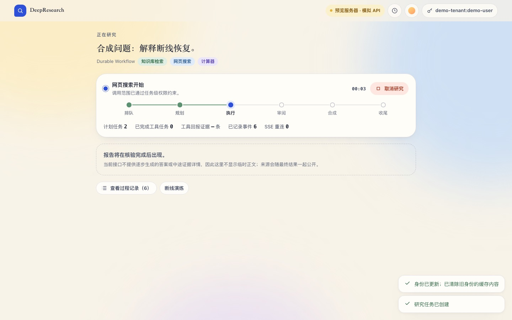 | 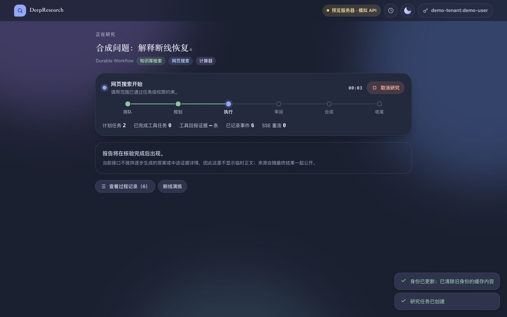 |
| 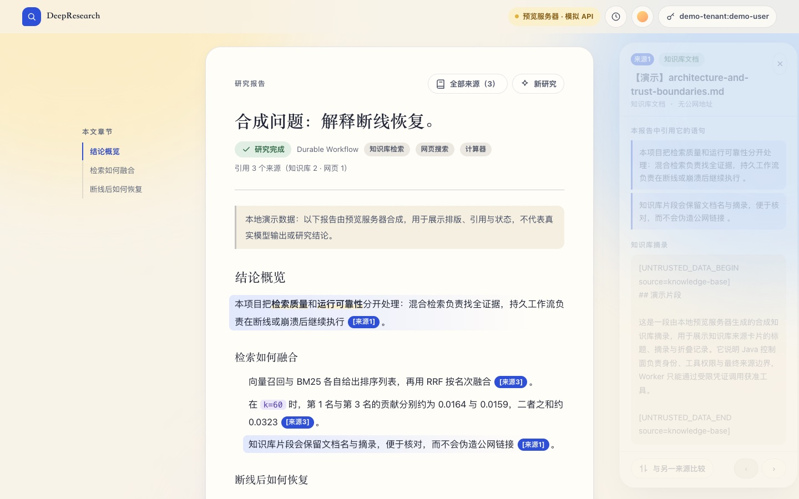 | 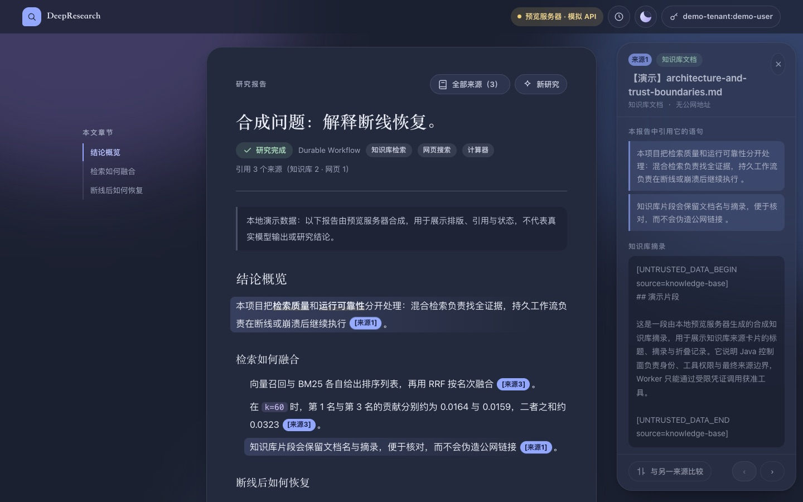 |
| 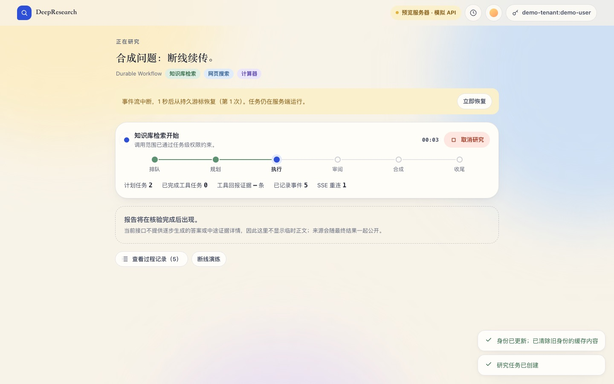 | 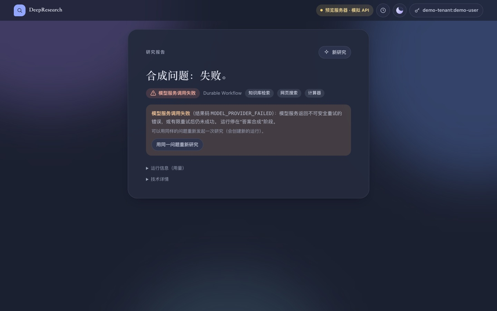 |
| 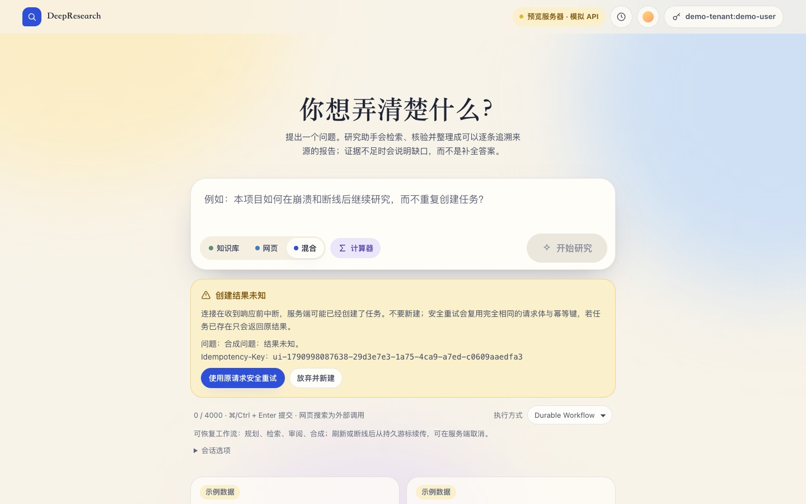 | 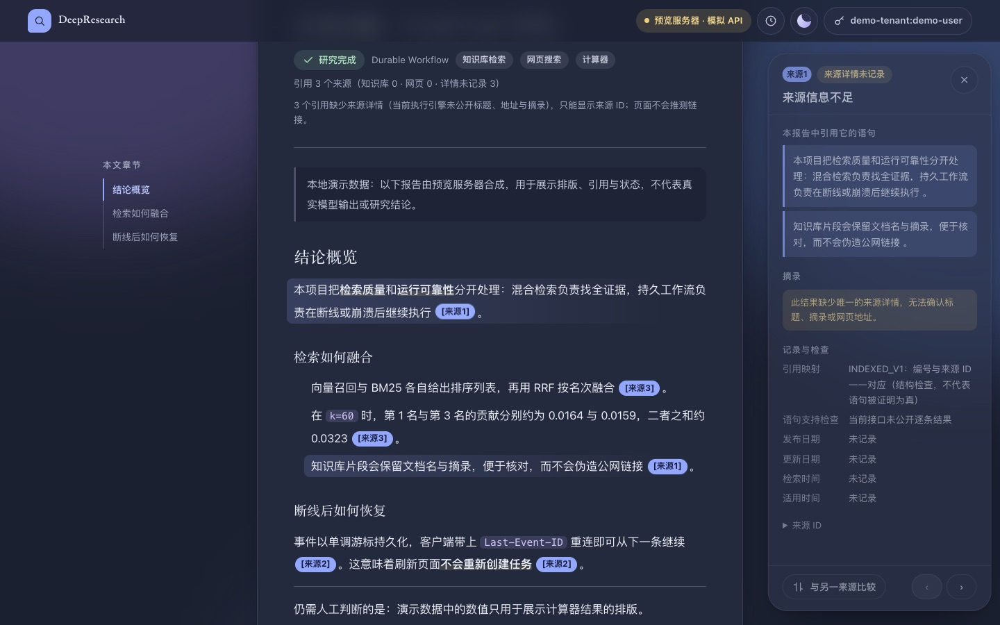 |
| 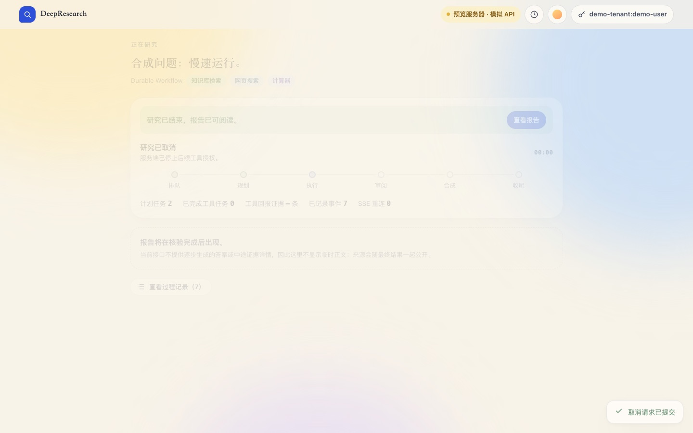 | 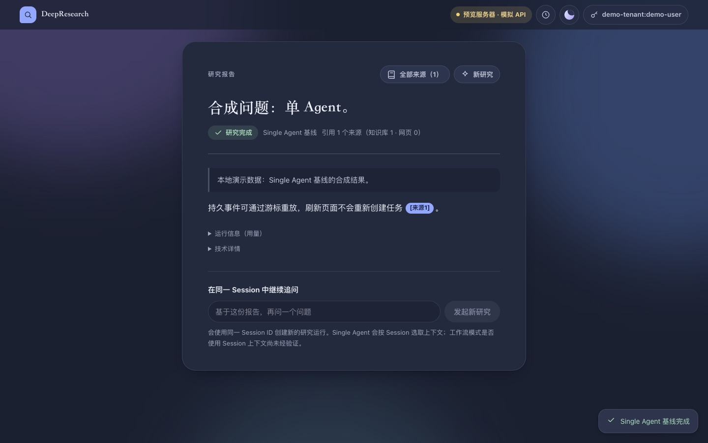 |
| 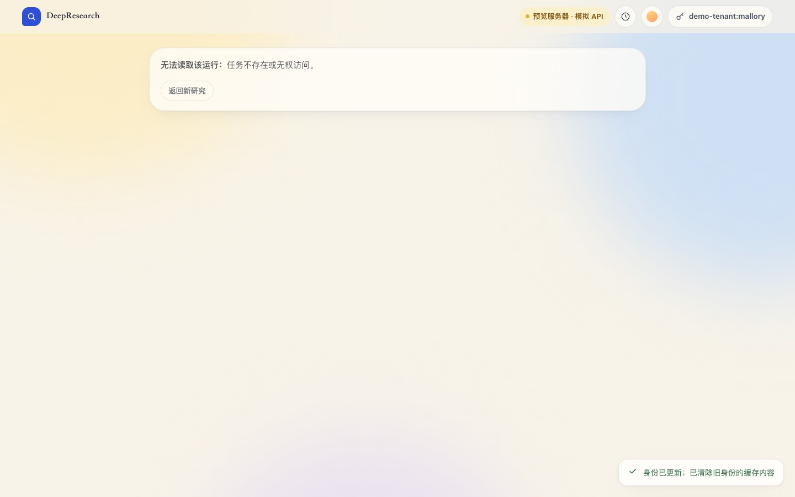 | |

| 晴空 · 手机 · 结果未知 | 雾夜 · 手机 · 失败 |
|---|---|
| 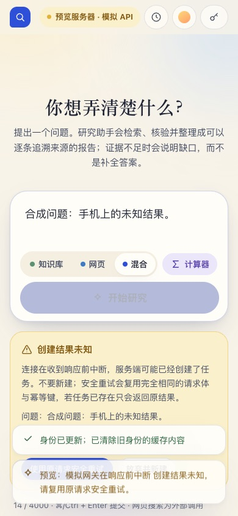 | 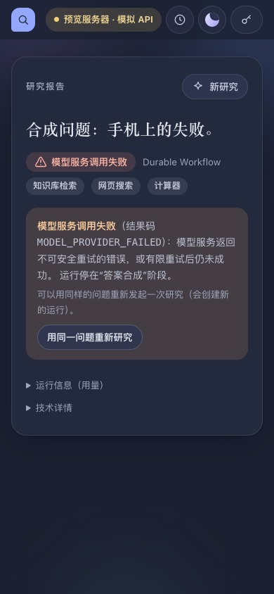 |
