# 研究工作台前端改版（第一版）

日期：2026-10-02。入口仍为 `/demo.html`；API 契约、认证、SSE、取消、恢复、幂等创建与引用映射逻辑保持不变。本轮只改前端页面与本地预览工具，未修改后端、数据库、模型配置或凭据，也没有发起真实模型或检索调用。

## 旧页面的主要问题

1. **主次不清**：控制栏、结果、事件流三栏等权；提交后问题只留在左侧输入框，首屏被“让研究过程可见”和 `READY`、`MODE LANGGRAPH` 等内部码占据。
2. **证据离结论太远**：引用位于答案下方第四个区块，阅读时需要来回滚动；未完成目标只显示数量。
3. **工程信息前置**：Idempotency-Key、Last-Event-ID、断线演练、英文指标名与研究问题同级出现。
4. **可读性**：大量 8–10px 文字，浅灰 `#96a2b4` 在白底对比度约 2.6:1；只有固定浅色主题。
5. **状态混同**：取消与失败同为红色错误；断线、证据不足、创建未知没有统一的视觉语言。
6. **移动端**：先堆控制栏，报告在数屏之后，阶段名被隐藏。

## 视觉方向：纸与天空

- **Light / Airy**：暖象牙色书桌，粉蓝、黄油与薰衣草色雾在背景缓慢晕开；面板为半透明玻璃，报告是一张不倾斜、不漂浮的“纸”。
- **Dark / Mist**：黄昏的石板靛蓝底色与薰衣草雾气；面板更加扩散，钴蓝转为长春花蓝，亮度与对比显著区别于浅色主题。
- **强对比只用于少数位置**：钴蓝用于主操作、运行中状态、已验证引用和选中标签（深色实心底块）；珊瑚色用于证据缺口与失败；鼠尾草绿用于已完成与知识库来源。
- **字体**：研究问题、报告标题用中文衬线（宋体系），界面用系统无衬线，ID 与游标用等宽字体。

## 信息架构

| 区域 | 内容 |
|---|---|
| 主列 ① 研究问题 | 问题输入、示例、检索范围（知识库 / 网页 / 计算器，可组合成混合检索）、开始/取消；执行方式与会话选项降为底部次级区域。运行中收起为紧凑条。 |
| 主列 ② 研究路径 | 状态透镜、状态标签（中文 + 原始码）、引用问题、检索范围、进度与七个阶段；非成功终态停在实际到达的阶段。运行标识默认折叠。 |
| 主列 ③ 研究报告 | 结果横幅、**尚未解决的证据缺口**（`unfinished_goals`）、Markdown 正文与 `[来源N]`。 |
| 证据台（右侧粘性抽屉，可收起；移动端位于报告下方） | 来源 / 事件 / 安全轨迹 / 用量 / 原始 JSON。 |
| 顶栏 | 服务状态、最近研究（对话框）、主题切换、连接与身份。 |

“自主研究（候选）”始终带“候选功能 · 验收中”标记；页面没有展示长期记忆或多 Agent 协商能力。工作流中的 Planner / Worker / Reviewer / Synthesizer 仅作为既有阶段角色显示。

## 交互与动效

- 按钮悬停上浮、按下回弹；面板跟随指针的柔光描边（只改变透明度与渐变位置，不移动内容）；空状态插画与状态透镜有不超过 8° 的指针倾斜，报告与来源卡不倾斜。
- 主题切换：支持 View Transition 的浏览器从按钮位置圆形晕染，否则统一颜色淡入；首帧前按系统偏好或已保存选择设定主题，避免闪烁；跟随系统变化，显式选择写入 `localStorage`。
- 标签切换：深色底块以 `transform` 平移，面板淡入；方向键 / Home / End 在两个 tablist 内移动。
- 阶段推进：已完成连线以背景位置填充，当前阶段光晕呼吸；终态颜色区分成功、证据不足、失败与取消。
- 引用：正文 `[来源N]` 悬停/聚焦时预览来源类型、标题和地址；点击后展开证据台、定位卡片并以光环闪烁一次。来源卡按知识库（绿）/ 网页（蓝）/ 信息不足（黄）区分。
- 提交后证据台自动切到“事件”；若是页面自动切换，运行结束且有引用时切回“来源”，用户主动选择的标签不受影响。
- `prefers-reduced-motion` 时压缩全部动画与过渡，跳过倾斜与圆形晕染，引用定位改为即时滚动。

## 实现约束与取舍

- **保持单文件内联**：`SecurityConfig` 只放行 `/`、`/demo.html` 并以 `anyRequest().denyAll()` 结尾，新增 `/demo/*.css|js` 会在 8080 返回 403；拆分文件需要改后端，因此本轮把 CSS/JS 按区块组织在同一文件中。
- 不依赖外部字体或 CDN；图标为内联 SVG `<symbol>`。
- 保留所有既有 DOM ID、`.citation-*` 类名及“Single Agent”“原始 JSON”“开始研究”“运行基线”等可访问名称，原有引用浏览器回归无需修改。
- 新增的客户端状态：运行记录（`sessionStorage`）增加问题文本，以便刷新后在“研究路径”中显示；“最近研究”（`localStorage`）只保存问题前 80 字；主题与抽屉开合各一个 `localStorage` 键。工作流 `View` 本身不返回问题文本。
- 行为修正：取消改用中性色而非错误红；非成功终态的阶段条停在最后一次 `STAGE_CHANGED`；无答案终态不再在横幅与正文重复同一句原因。

## 预览

```bash
python3 scripts/frontend-preview/mock_server.py
# http://127.0.0.1:8090/demo.html?scenario=success|insufficient|failed|slow|disconnect|unknown|noweb
```

完整应用仍为 `http://127.0.0.1:8080/demo.html`。场景说明与截图脚本见 [scripts/frontend-preview/README.md](../../scripts/frontend-preview/README.md)。

## 本轮验证（仅合成数据，Chrome）

- 两种主题 × 1440×900 / 390×844：空态、运行中、成功、证据不足、失败、取消、断线续传、创建未知→安全重试，共 39 项检查，控制台错误 0、横向溢出 0；断线场景各尺寸均以 1 次重连恢复至成功。
- 既有 [`integrations/dify/check_citation_ui.js`](../../integrations/dify/check_citation_ui.js) 的 22 个离线场景全部通过（API 全部 stub）。
- 键盘：跳转链接 → 顶栏 → 问题 → 示例 → 范围 → 开始 → 执行方式的顺序；两个 tablist 方向键循环；主题按钮 Enter 切换且 `aria-pressed` 同步；对话框 Esc 关闭并归还焦点；抽屉按钮更新 `aria-expanded`。
- 对比度：两套主题全部文字令牌在实际（含半透明合成后）背景上 ≥ 4.5:1。
- 减少动态效果：动画与过渡时长被压缩为 0.01ms；主题选择在刷新后保持。
- 粘性证据台在 700/900/1200px 高度、滚动到底时均不被顶栏遮挡。

## 仍未验证的后端交互

以下只用预览服务器或既有 fixture 验证了页面呈现，**未在真实 Java 服务上复核**：

1. 真实 `POST /api/research/workflows`、`GET /{runId}`、`/events` SSE、`/cancel` 的完整往返，以及运行中真实断线、进程崩溃或远端 stop 后的恢复。
2. `POST /api/research/agents`（自主研究候选）在真实运行中产生的 `AGENT_*` 事件与 `finalResponse` 形状；预览中的形状来自前端既有解析代码。
3. 真实 `unfinished_goals` 内容（字段按 `EvidenceService` 源码推断为 `text / criterion_id / task_id / reason`）。
4. `View.requestedTools` 在真实响应中的取值（用于“研究路径”的范围标签）。
5. `POST /api/research/agent`（Single Agent）真实响应、`/api/auth/dev-token` 真实签发、`/api/research/tools/capabilities` 的真实 Tavily 配置判断。
6. 真实 401 / 403 / 404 / 409 / 503 错误文案在新布局中的显示（逻辑未改，未逐一触发）。
7. 由 Spring Boot 在 8080 提供的新页面响应头与缓存行为（页面仍为单文件，未新增路径）。
8. Safari 与 Firefox 未测试；页面使用了 `:has()`、`color-mix()`、`backdrop-filter`，View Transition 不可用时会降级为颜色淡入。

## 截图

均为本地合成数据，页面底部带“本地演示数据”标识。

| 浅色 · 桌面 | 雾夜 · 桌面 |
|---|---|
| 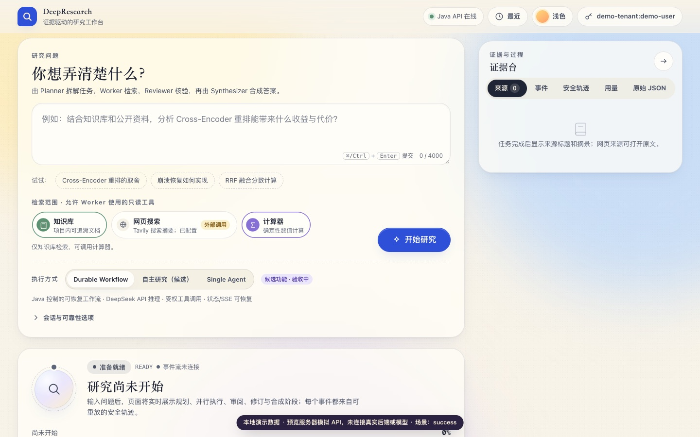 | 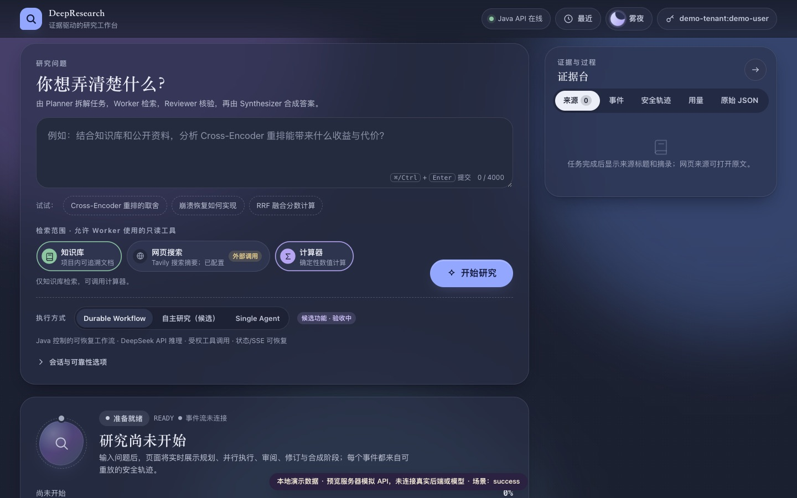 |
| 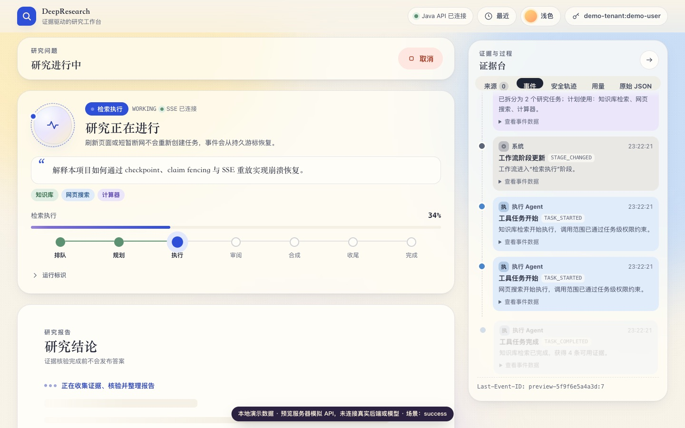 | 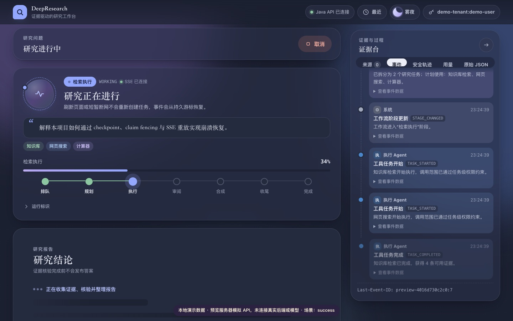 |
| 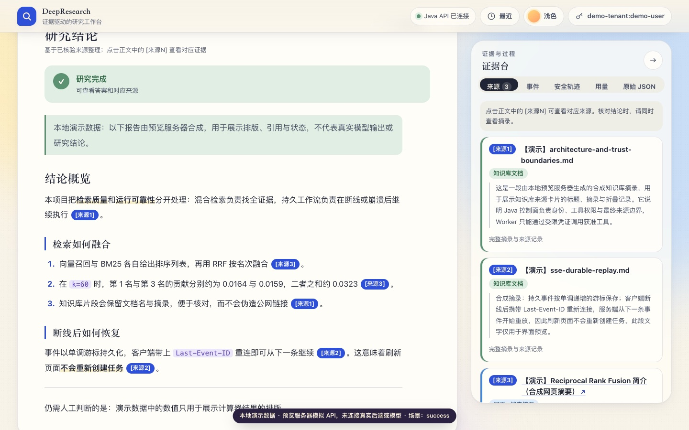 | 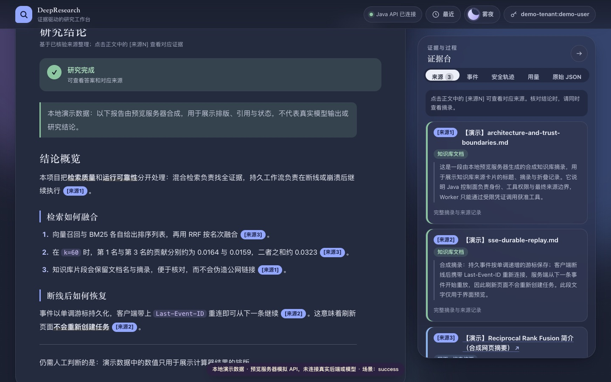 |
| 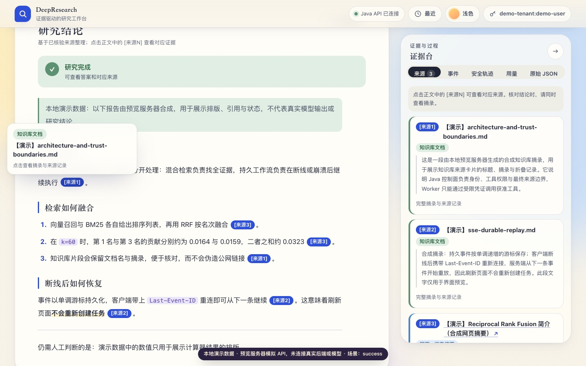 | 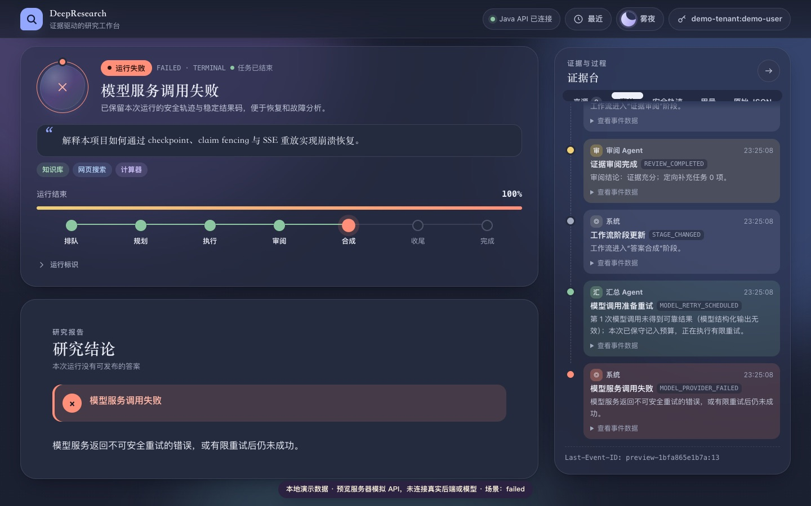 |
| 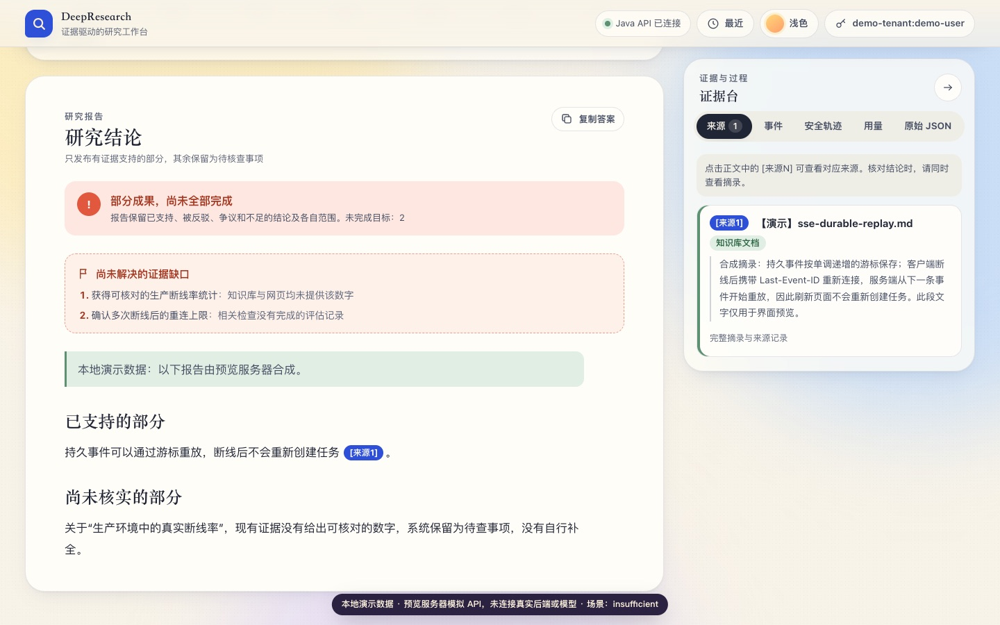 | 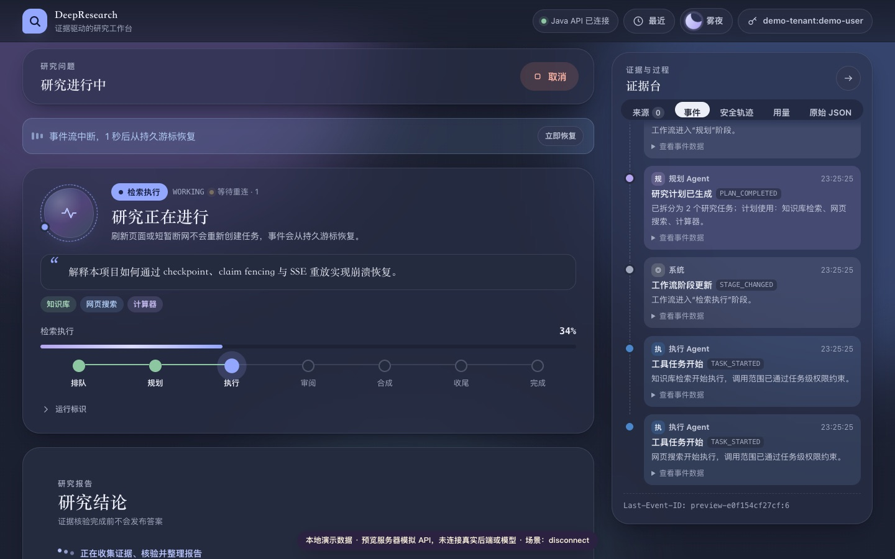 |
| 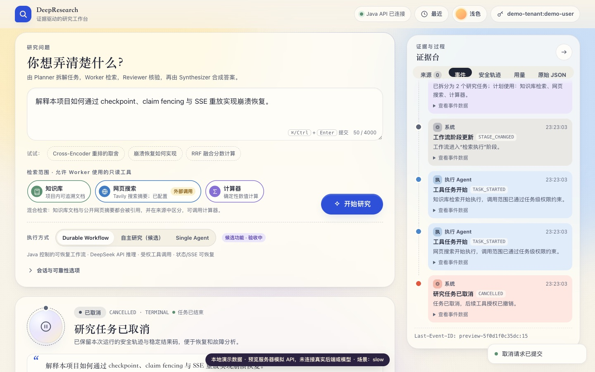 | 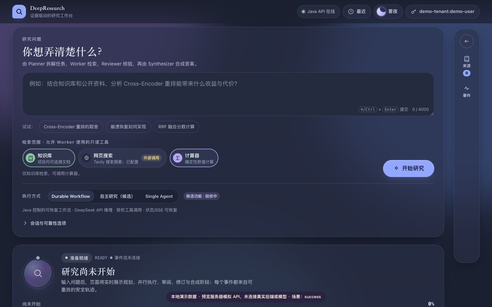 |
| 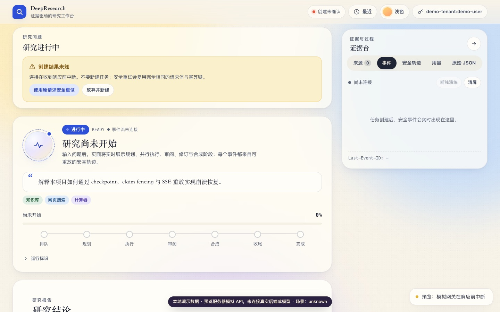 | |

| 浅色 · 移动运行中 | 浅色 · 移动完成 | 雾夜 · 移动空态 | 雾夜 · 移动证据不足 |
|---|---|---|---|
| 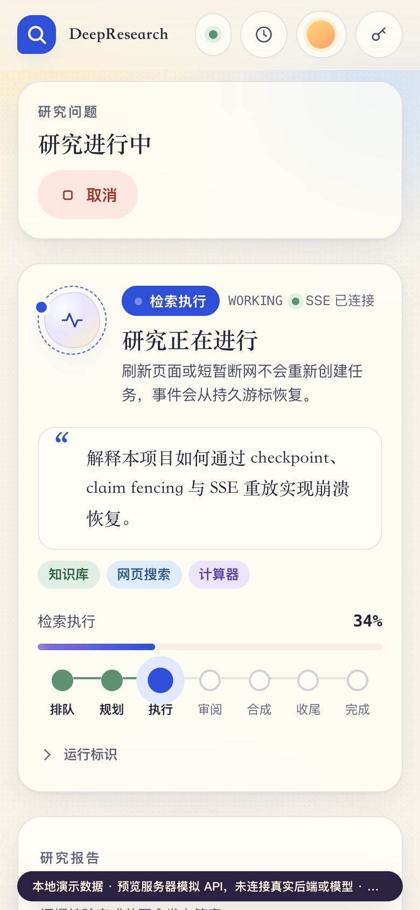 | 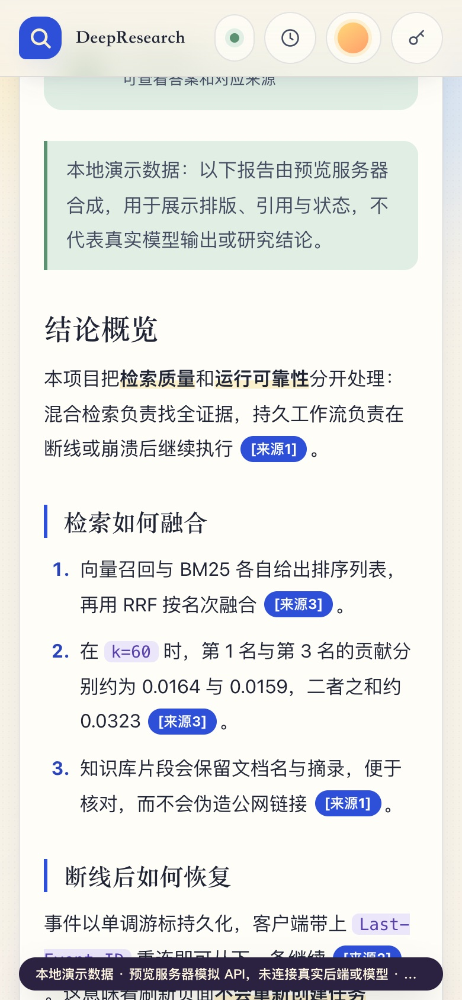 | 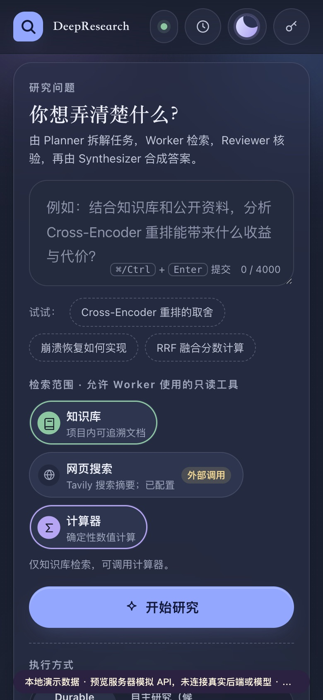 | 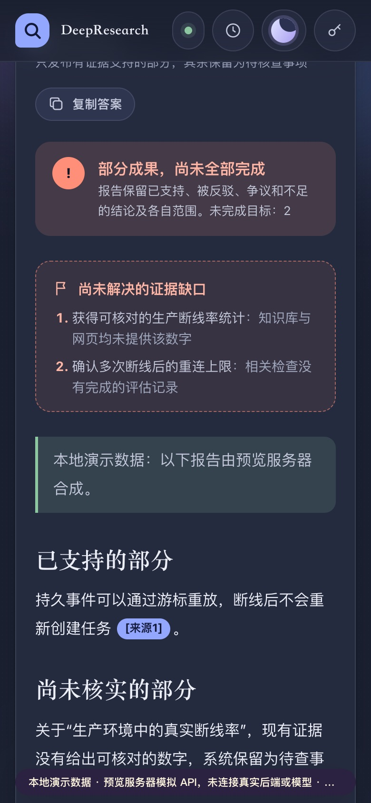 |
