# 研究档案式界面重设计（参考 RhineLabUI）

日期：2026-10-05。依据 `CLAUDE_RHINELAB_FRONTEND_REDESIGN_HANDOFF_2026-10-05.md`。只修改 `frontend/`、`scripts/frontend-preview/` 与 `docs/frontend/`；不改后端、契约、数据库、认证、部署或 CI。

## Stage 0：基线与实施图

### 基线

| 项目 | 值 |
|---|---|
| 基线提交 | `952b472`（研究笔记接入研究进度契约），分支 `claude/deepresearch-frontend-react`，保持不变 |
| 新分支 | `claude/deepresearch-rhinelab-redesign`，从 `952b472` 创建 |
| 返回保留版本 | `git switch claude/deepresearch-frontend-react`（或 `git checkout 952b472`） |
| 基线验证 | `check-r1r2` 63/63、`journey-react-live` 31/31、`check-notebook` 36/36（均为**模拟 API**）；vitest 49 |
| 真实后端验收 | 仍待完成（本机没有运行包含研究进度分支的 Java 服务） |

### 需要保留的契约与行为

- 真实 / 示例模式分离：示例只在 `?demo` 或 `?state=` 下出现，不联网，处处标注。
- 身份隔离：查询键按身份作用域分区；切换身份清除旧内容。
- 创建 / SSE / 取消 / 刷新续传；Durable Workflow、自主研究、Single Agent 的差异说明。
- 引用安全：只渲染契约内的引用编号；不推测链接。
- 研究进度契约：以 `(project_id, source_run_id)` 标识；列表只在打开时请求、最多 20 条候选、空列表不代表没有更早的记录；没有保存日期、文件夹或分页；载入只新建会话并返回上下文（“尚未传入模型；未开始研究”），POST 防重、刷新后只用 GET 恢复；删除两步确认。

### 参考的空间表达（只借用原则，不复制代码、素材或字体）

RhineLabUI：倾斜透视中的卡带阵列（列为类别）；选中时浅抬起，详情时向镜头抽出（左侧物体、右侧文字）；HUD 式细线、角标、位置刻度；粗体几何字标配细线副标；描边强调按钮；淡同心圆背景。

### 实施图

| 区域 | 变更 |
|---|---|
| `styles/tokens.css` | Ivory / Smoked 两种外观；对比度逐项测算；细线、小圆角、平面阴影；时长分级 |
| `app/theme.ts`、`index.html` | 外观名改为 `ivory` / `smoked`；存储键与取值（`light` / `dark`）不变，既有选择延续 |
| `shell/TopBar.tsx` | 字标 + 细线副标；“档案”与“最近运行（本机）”分开入口 |
| `composer/EntryView.tsx` | 问题框即时可用；右侧装饰性卷宗堆叠；研究档案与本机记录两条明确路径；新用户空状态 |
| `archive/ArchiveView.tsx`（新） | 档案全视图：CSS 透视卷宗阵列（原型）+ 同步的可访问列表、搜索、状态筛选、选中面板、阅读层 |
| `archive/RecordParts.tsx`（由 `memory/Notebook.tsx` 迁移） | 快照章节、载入 / 删除、已载入面板；原研究笔记对话框由档案视图取代 |
| `app/App.tsx` | 新增 `archive` 视图与 `?state=archive` / `?state=record`；列表只在档案打开时请求 |
| 报告 | 无衬线标题、17px 正文、编号章节、细线 |
| 检查脚本 | 新增 `check-archive.mjs`；既有脚本改用档案流程 |

### 改动前截图

| 晴空 · 入口 | 雾夜 · 入口 | 晴空 · 研究笔记详情 |
|---|---|---|
| 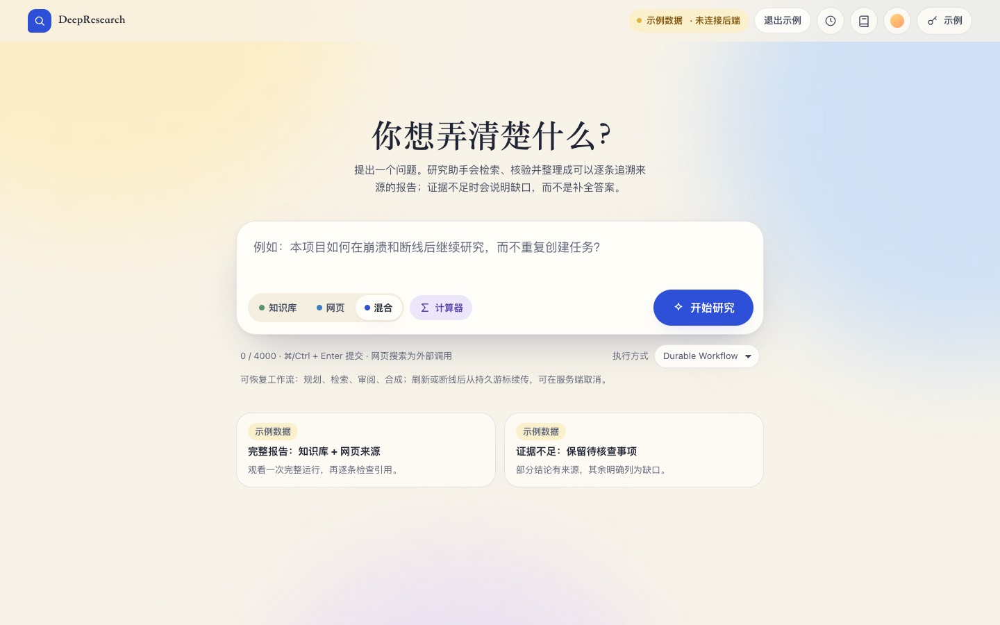 | 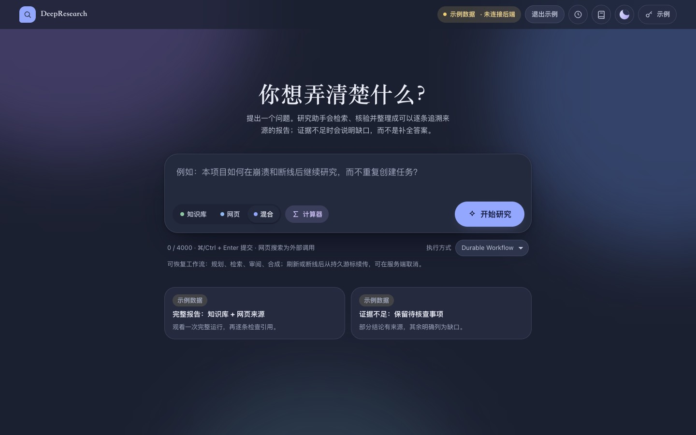 | 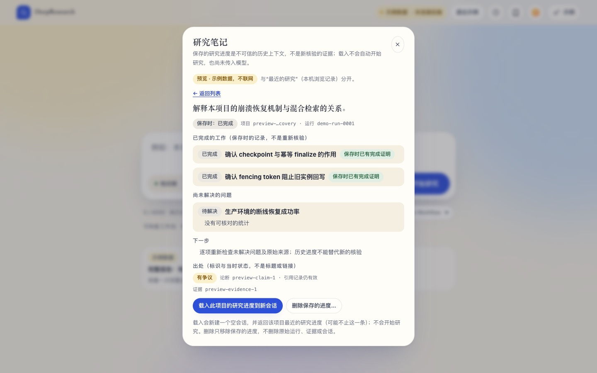 |

| 雾夜 · 报告 | 手机 · 入口 | 手机 · 研究笔记详情 |
|---|---|---|
| 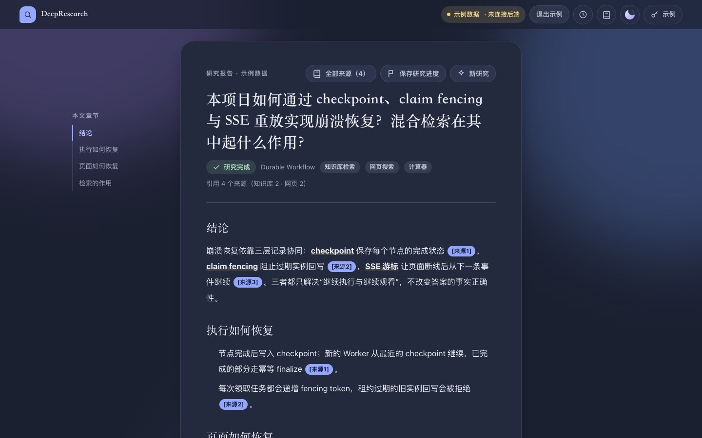 | 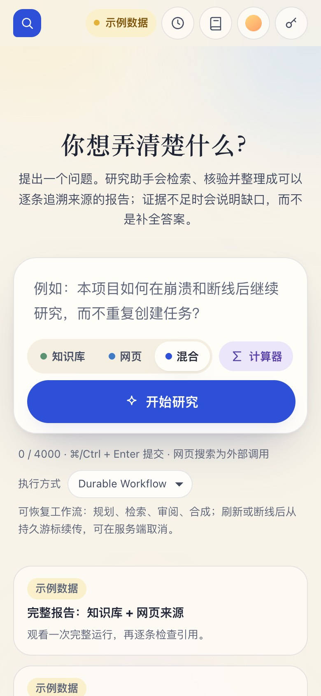 | 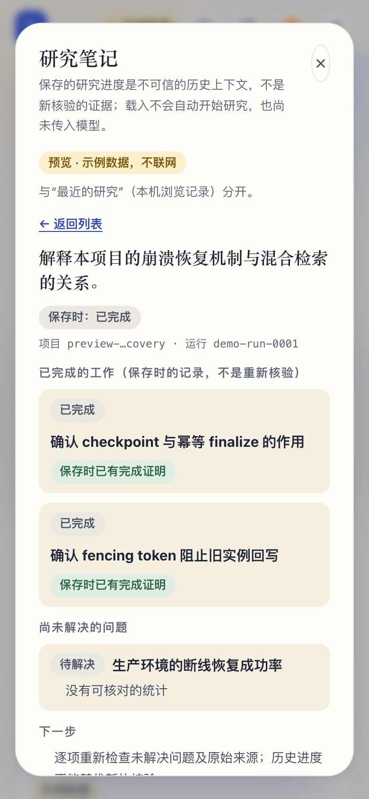 |

## Stage 1：一条连贯的旅程

**入口 → 选中一条记录 → 打开 → 返回。** 示例：`/app/?demo` → 右侧“研究档案” → 方向键或点击选择 → Enter / 再次点击 / “打开档案” → Esc 或“返回档案”。评审深链：`?demo&state=archive`、`?state=record`（直接打开第一条记录）。

### 改了什么

| 区域 | 内容 |
|---|---|
| 外观 | Ivory（`#ECE8E1` / `#F7F4EE` / `#22251F` / `#60645C` / 细线 `#C9C7BC` / 强调 `#AD682F`）与 Smoked（`#252824` / `#30342F` / `#EEEDE5` / `#B8BCAF` / `#555C50` / `#E3B579`）。去掉大面积渐变；细线、2–8px 圆角；系统字体，标题为粗体无衬线，编号与标识用等宽 |
| 对比度 | Ivory：正文 12.7、次要 4.95（画布）/ 5.5（纸面）。`#AD682F` 在画布上只有 3.6，因此**只用于标记、细线与大字**；强调文字与实心按钮用加深的 `#8A5020`（5.3 / 5.9，按钮上文字 5.9）。Smoked：正文 12.7、次要 7.7、强调 7.9。控件边框 ≥ 2.9 |
| 顶栏 | 竖条 + 两行字标 + 细线副标“研究工作台”；“档案”（研究档案）与“最近的研究（本机）”是两个独立入口；外观切换 |
| 入口 | 问题框首屏即可输入，无启动动画、无声音、无等待。右侧是装饰性卷宗堆叠（`aria-hidden`，不承载数据）与两条路径：A 研究档案（服务端，打开时才读取）、B 最近运行（本机）。新用户看到“本机还没有运行记录”，不伪造档案 |
| 档案 | 左：搜索（原始问题、目标、下一步、ID）、按保存时运行状态筛选、可访问列表（`listbox`，↑↓ / Home / End 选择，Enter 打开）。中：CSS 透视卷宗阵列，4 × 5 = 20 个候选位，与契约的 20 条候选上限对应；空位画成虚线，筛选只淡化不重排。右：选中面板（编号、问题、保存时状态、项目 / 运行标识、计数、“打开档案”）。手机上面板变为底部常驻条 |
| 阅读层 | 左侧“卷宗封面”（编号、状态、标识、计数、载入 / 两步删除），右侧按 01–04 编号的快照正文（16.5px）。背景档案在阅读时为 `inert`，Esc 返回 |
| 报告 | 粗体无衬线标题，正文 17px / 1.88，h2 自动编号并以细线分隔，引用标记为方角深强调色 |

### 交互与动效

| 步骤 | 实现 | 时长 |
|---|---|---|
| 悬停 | 卷宗沿 Z 轴升起 8px（`@property --lift`） | 150ms |
| 选中 | 升起 26px，强调色边与投影；列表与面板同步 | 260ms |
| 打开（抽出） | 封面从该卷宗在屏幕上的矩形飞向阅读位置，同时由倾斜转平；正文延后 160ms 淡入 | 520ms |
| 返回 | 正文先淡出，封面飞回当前卷宗位置后移除 | 380ms |
| 筛选切换 / 外观切换 | 下划线与颜色过渡 / 圆形揭示或淡变 | 180ms / 260–280ms |

- **动画从不阻塞状态**：打开时阅读层与焦点立即就位，返回时背景立即可用、焦点立即回到选中记录；动画只是装饰（检查脚本在按键后不等待即断言）。
- **快速输入可重定向**：打开 / 关闭 / 再打开连续发生时，旧动画取消，最终只留一个阅读层。
- **卸载清理**：所有 Web Animations 在卸载时取消；退出动画有 700ms 兜底。
- **减少动态效果**：没有位移、没有升起过渡、没有入场动画，只有短淡入淡出；状态以边框和颜色表达。
- 空间视图是 **CSS 透视原型**，页面上有明确标注；真正的 Three.js 场景仍在计划中。没有使用 canvas，因此不需要 canvas 不可用时的回退。

### 保留的功能

真实 / 示例分离、身份隔离、创建 / SSE / 取消 / 刷新续传、三种执行方式的说明、引用检查与比较、证据记录与记录的分歧、预算终止与失败说明、研究进度的保存 / 浏览 / 载入 / 恢复 / 删除。原“研究笔记”对话框的全部能力迁入档案视图；对话框本身已移除，按钮与提示改称“研究档案”。研究进度的所有请求与之前完全相同：列表只在档案打开时请求，载入 POST 防重、刷新后用 GET 恢复，从不自动开始研究。

### 验证（2026-10-06，本机 Chrome + Playwright，仅 Chromium）

| 检查 | 结果 | 数据来源 |
|---|---|---|
| `oxlint`、`tsc -b`（strict）、生产构建 | 通过 | — |
| `vitest` | 49/49 | 录制的合成契约示例 |
| `check-archive.mjs`（新） | 219/219 | 示例数据（不联网）+ **模拟 API** |
| `check-notebook.mjs` | 38/38（新增“删除后焦点回到档案”） | **模拟 API** |
| `check-r1r2.mjs` | 63/63 | 示例数据 + **模拟 API** |
| `journey-react-live.mjs`（M2） | 31/31 | **模拟 API** |
| `capture-react.mjs`（M1 版式） | 68 个状态无横向溢出、无控制台错误 | 示例数据 |

`check-archive` 覆盖 1440×900、1024×768、390×844、320×640 × 两种外观：入口立即可输入、两条路径、空状态；列表与阵列同步（记录 + 空位 = 20）；方向键选择与升起；打开即时、背景 `inert`、正文字号 16–18px；Esc 返回焦点与选中、滚动位置不变；快速连按收敛为一个阅读层；搜索与状态筛选；桌面上点击卷宗选择 / 再点打开；减少动态效果下封面无位移；深链；真实适配器（模拟 API）下未连接身份不请求、入口不请求列表、打开档案才请求一次、空列表说明“不代表没有更早的记录”。

`capture-react.mjs` 与 `check-*` 中的外观标签同步改为 ivory / smoked；`capture-react` 的取消状态选择器原本就会匹配到证据记录中的状态标签（R1/R2 之后已失效），本次一并改为只取报告结论标签。

**未测试**：真实 Java 服务（真实后端验收仍待完成）、Safari、Firefox、屏幕阅读器实机朗读。

### 资源体积（`npm run build`）

| 文件 | 大小 | gzip |
|---|---|---|
| `index-*.js` | 618 kB | 197 kB |
| `index-*.css` | 56 kB | 12.6 kB |

没有新增依赖、字体、图片或 3D 库；JS 超过 Vite 的 500 kB 提示阈值（基线时已如此），按需拆分留给后续阶段。

### 仍待处理

- 真实后端验收：研究进度接口与档案视图需在包含 `feat/research-progress-memory-mvp-20261005` 的 Java 服务上复核（见 [NOTEBOOK_INTEGRATION_2026-10-05.md](NOTEBOOK_INTEGRATION_2026-10-05.md) 的清单）。
- 契约没有保存时间与分页：档案无法按时间排序或显示更早的记录；若需要，需后端提供字段或接口。
- Three.js 场景、阵列的触屏拖动浏览、运行中视图与比较视图的进一步空间化。
- 代码拆分。

### 改动后截图（示例数据；最后一张为模拟 API）

| Ivory · 入口 | Ivory · 档案（选中 02） | Ivory · 阅读层 |
|---|---|---|
| 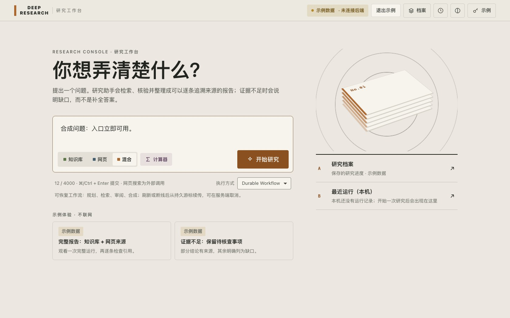 | 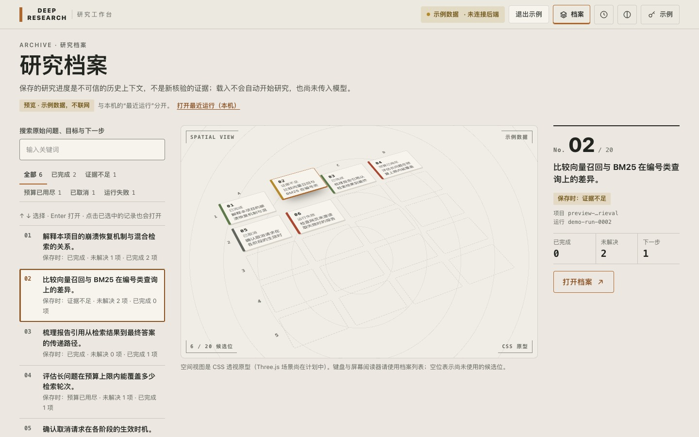 | 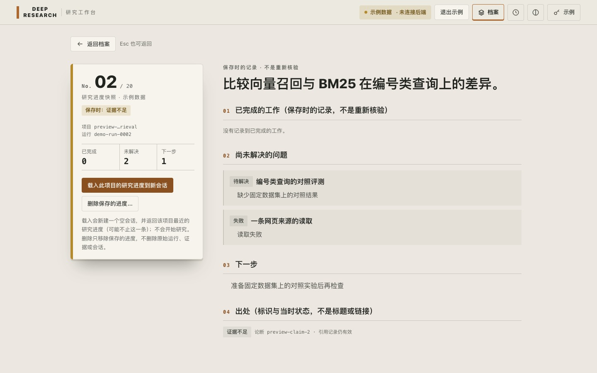 |

| Smoked · 入口 | Smoked · 档案 | Smoked · 抽出过程中（250ms） |
|---|---|---|
| 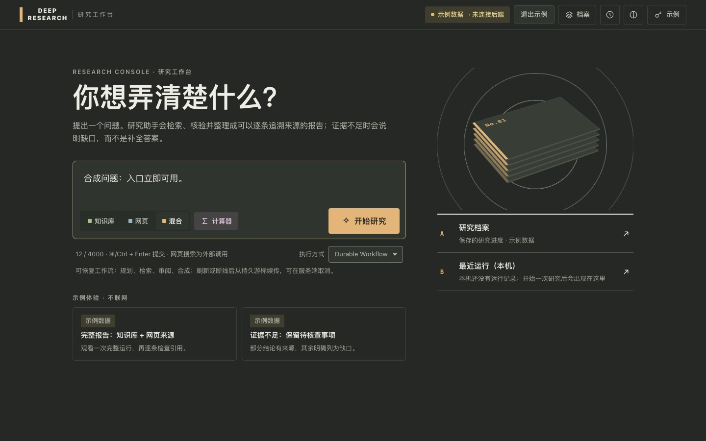 | 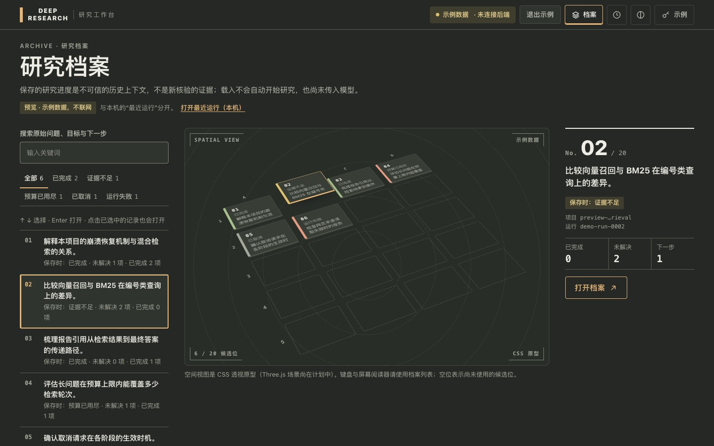 | 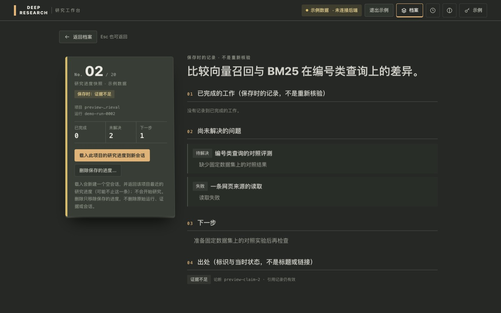 |

| Smoked · 阅读层 | Ivory · 报告 | Ivory · 真实适配器空档案（模拟 API） |
|---|---|---|
| 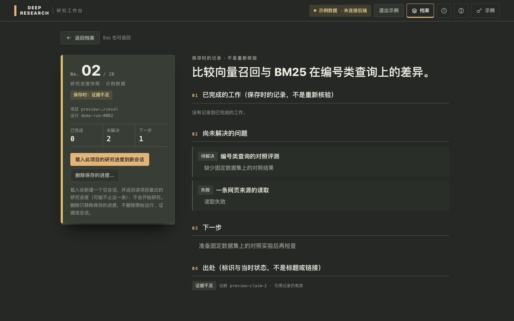 | 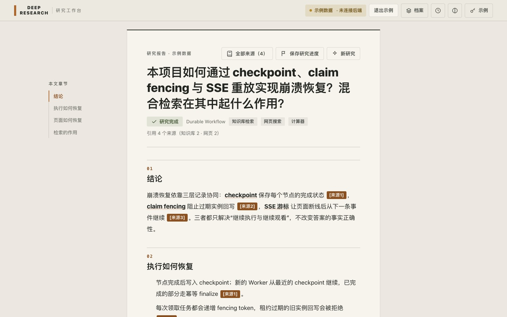 | 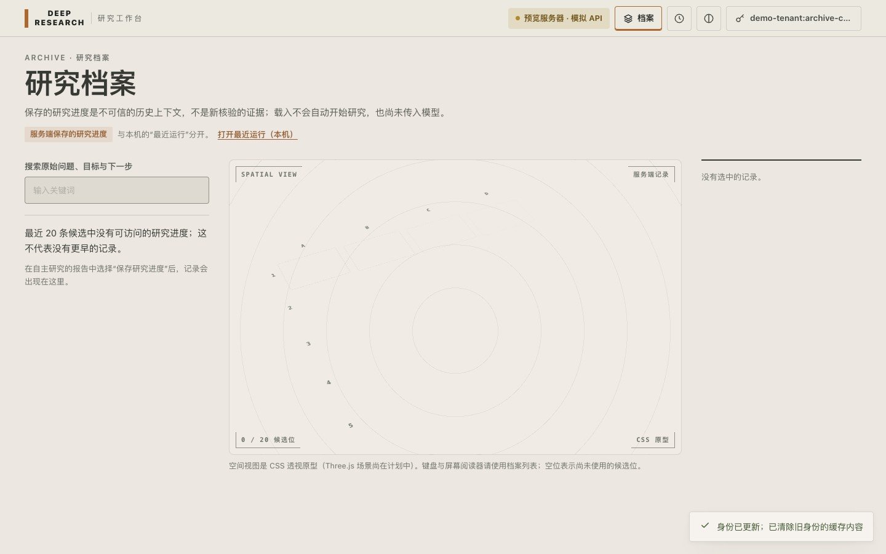 |

| Ivory · 390 档案 | Smoked · 390 阅读层 | Ivory · 320 档案 |
|---|---|---|
| 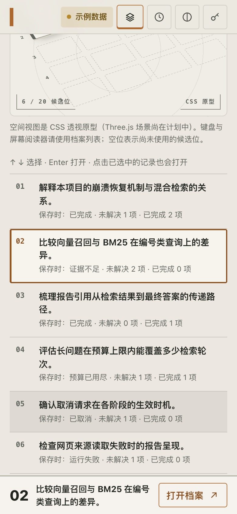 | 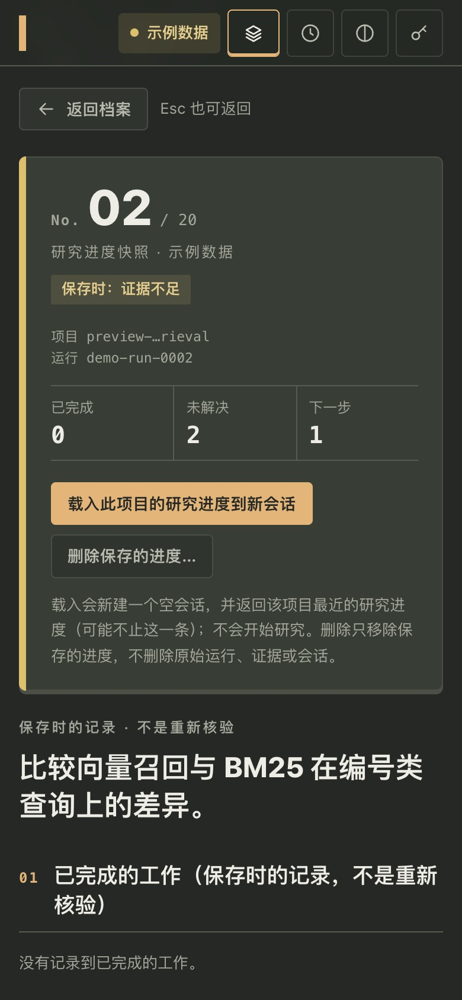 | 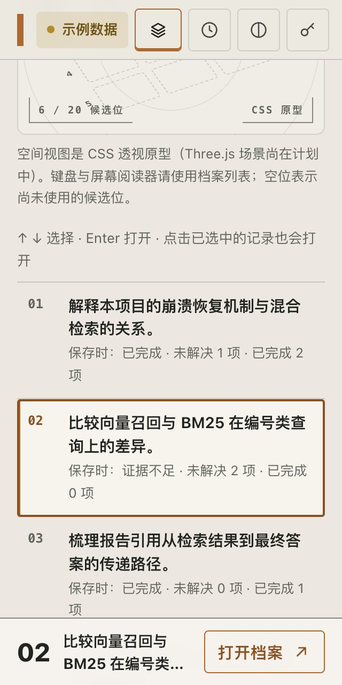 |
