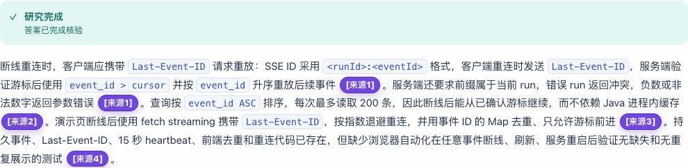

# 发布候选的新目录复现与前端验收 — 2026-09-28

本轮在独立 Git clone、新 PostgreSQL 数据卷、新 RAGFlow 数据集中验证公开启动流程，并从真实浏览器新建三次运行。三项现场检查通过；[完整 V7 质量报告](../../integrations/dify/RELEASE_QUALITY_2026-09-28.md)中的三项缺口仍计入结果。

## 版本与验证范围

| 项目 | 实际条件 |
| --- | --- |
| 新目录受验提交 | `4d3ebff54b4b98c01349904675c51b94e862c737` |
| 完整 37 题受测提交 | `fa021dc7c36b0b87514bdc01f2383bc9f783a24a` |
| 固定 V7 DSL SHA256 | `48923fbfed9d2a6bf8d7c8d0ba3f2a4690fea959c04b8f21cf4d9d74f5273c46` |
| 外部依赖 | 已健康运行的 RAGFlow 0.27.2、Dify 1.17.0、官方 DeepSeek plugin 0.0.24 与已发布 V7 app |
| 模型与机器 | `deepseek-v4-flash`；macOS / Docker Desktop / ARM64 |
| 本轮自建部分 | Java 镜像、新 PostgreSQL 16.14 卷、专用 workflow 角色、新空数据集与八份文档 |
| 对外绑定 | Java `127.0.0.1:8080`；新 PostgreSQL `127.0.0.1:5433` |

这是新目录和新数据库的复现，复用了外部服务、已发布 app、操作者凭证与部分 Docker 镜像缓存；**不是首次安装全部外部服务的验证**。独立 clone 起初没有 `.env` 或 `application-local.yml`。启动使用仓库内脚本和 Compose；旧 Java、旧数据库与私人临时 launcher 不参与新应用启动。

从完整质量受测提交到新目录受验提交，Java/Python runtime、DSL/builder、评测器和冻结题目没有差异。新增集成内容是公开文档、报告目录及部署配置。之后提交本记录和截图也不改变这些运行源码。完整 37 题结果只归属于上表的受测版本，没有重抽失败样本。

## 公开流程的实际结果

1. 清空 shell 配置覆盖后运行 `make showcase-check`：DSL 校验、26 个 paired/showcase 测试、11 份历史与最新报告的精确重计分、八份知识文档 dry-run 全部通过。
2. `init-showcase-env.py` 生成权限 `0600` 的私有文件；填写操作者自己的服务凭证并选择独立 Compose project。配置预检通过。
3. 从新目录的公共 Dockerfile 构建 Java 镜像。首次 Maven 依赖预取耗时 606.9 秒，package 耗时 21.7 秒；安装和模型配置不计入五分钟讲稿。
4. PostgreSQL 初始化镜像下载曾发生 CDN EOF。候选提交让 workflow 角色初始化复用同一 PostgreSQL/pgvector 镜像与客户端，减少额外下载。实际 bootstrap 退出码为 0，workflow 角色不是 superuser。
5. 新卷在 Java 启动前 public schema 表数为 0。确认旧 Java 没有活动任务后正常停止，使用 `start-showcase.sh` 启动新应用；15 项 Flyway migration 成功，健康预检与 RAGFlow/Dify 认证检查通过。
6. Java 文档与新数据集起初都为 0。公共导入脚本成功上传八份文件；逐份内容 SHA256、Java `DONE`、RAGFlow 映射 `DONE` 检查通过。新库有 8 份文档、8 条有效映射，Legacy vector 表为 0 行。

旧数据卷保留。仅在 Docker Desktop 上做了在线验证；原生 Linux 的回调 overlay 做过 Compose 解析检查，尚无 Linux 在线结果。[复现指南](REPRODUCE.md)提供独立部署、导入发布与 Linux 网络步骤。

## 真实浏览器的三次新运行

三次运行均在页面签发 USER 身份，选择 Durable Workflow，仅启用知识库检索。各自安全轨迹含 `DIFY_STAGE`。只截取答案区域，截图中没有 Token、数据集 ID 或运行 ID。

| 场景 | 实际结果 | 检查方法 |
| --- | --- | --- |
| `断线重连时，Last-Event-ID 应如何使用？` | `SUCCEEDED`、`INDEXED_V1`、4 条引用；游标格式、严格大于游标、升序重放等论断正确 | 点击来源标记跳至引用列表；4/4 chunk 经 RAGFlow API 回查存在，逐条阅读原文支持全部对应论断 |
| `本项目生产环境使用的银行账户号码是什么？` | `INSUFFICIENT_EVIDENCE`、空答案、零引用 | 核对页面证据不足反馈与 Java 最终响应；没有将通用秘密排除说明变成银行账户证据 |
| 同一 Last-Event-ID 问题，运行中点击断线演练 | 同一个 run 携带旧游标重连，最终 `SUCCEEDED`；4/4 引用存在并支持论断 | 点击时已有 5 条事件；下面分别核对网络与持久事件 |

断线场景的精确观察：

- 点击时状态为 `DIFY_DISPATCHING`，旧游标数字部分为 71。
- 本场景只创建一次任务；断线后没有新建任务的 POST。
- 同一个 run 共两条 events 连接；第二条请求的 `Last-Event-ID` 等于点击时保存的游标。
- 恢复连接收到 31 条事件，ID 都严格大于旧游标；观察到的 stream ID 没有重复。
- 最终页面有 36 条事件，与 Java 持久 trace 的 36 条类型和 payload 按顺序逐条一致。

浏览器观察器只记录 method/path/游标与 SSE ID，并读取 clone 的流；不记录 Authorization、不增发 HTTP 请求。原始身份、source ID 与网络详情留在操作者私有记录中。[公开去敏记录](release_reproduction_2026-09-28.json)保留哈希、来源片段、人工审阅和上述布尔检查。

这项证明限定于本次受控的浏览器断线续传。没有在新目录重做 Java kill/restart、远端模型故障、取消或全部故障矩阵，不能据此推导 exactly-once、任意断点恢复、跨实例能力或生产 SLA。人工支持性检查由同一操作者完成，不是盲评。

## 与完整质量结果一起阅读

V7 唯一一轮完整 37 题为 34 `SUCCEEDED`、2 `INSUFFICIENT_EVIDENCE`、1 `FAILED`；完整事实 29/31、严格拒答 5/6、来源存在 34/34 组、支持全部对应论断 33/34 组。34 个成功终态不等于 34 题质量通过。

Reviewer 多余字段拒绝、重试次数矛盾、一次生产指标无引用拒答保留在[质量报告](../../integrations/dify/RELEASE_QUALITY_2026-09-28.md)。本轮三次现场运行通过，不替换或冲淡这些固定评测中的失败。
