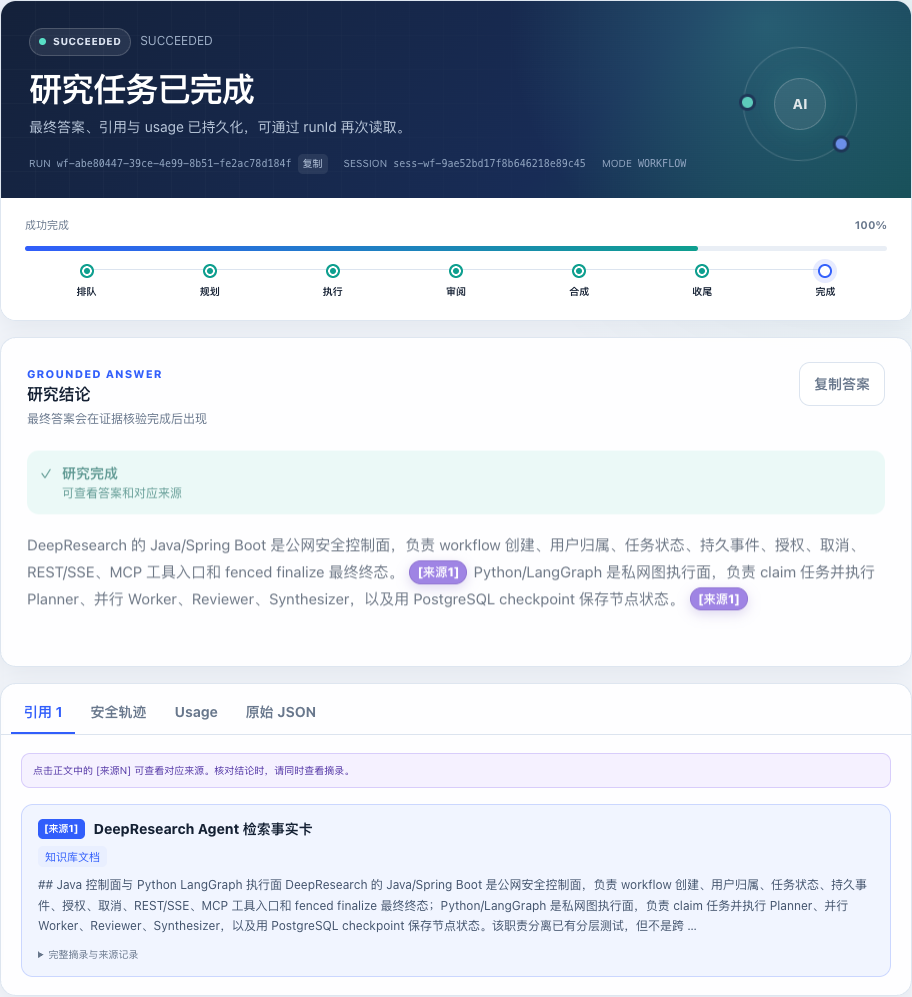
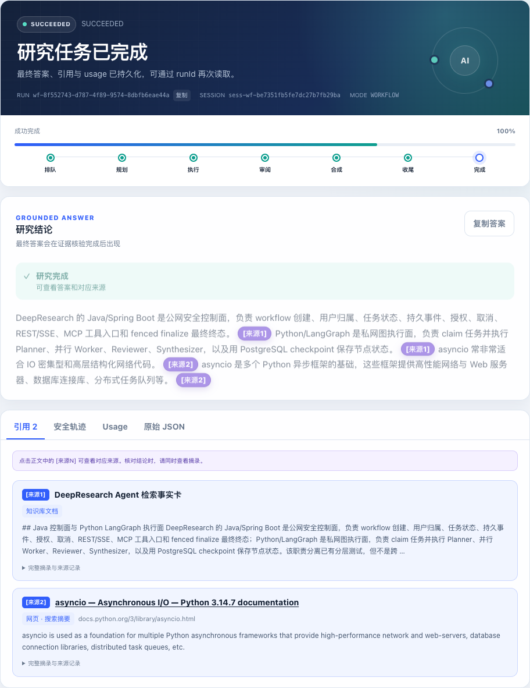
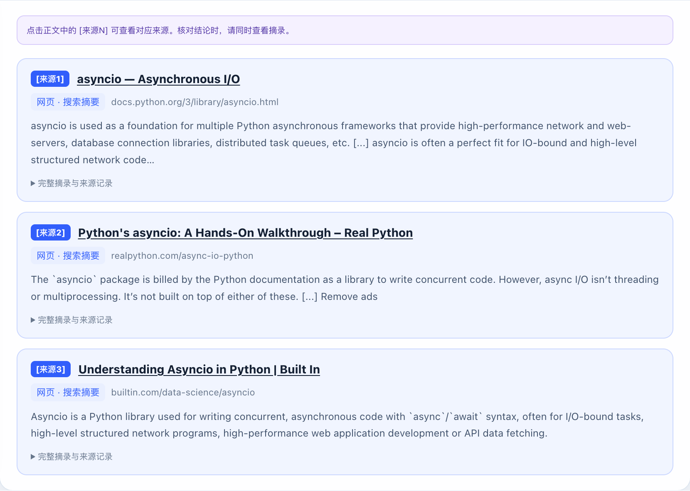
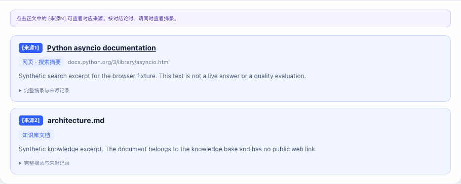
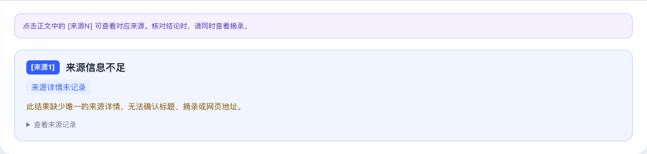

# 引用标题、网页跳转与恢复呈现验收

## 改动与复现

旧页面的正常网页结果在有 `WEB_SEARCH_SNAPSHOT` 元数据时已经有链接；但缺少详情时直接显示内部来源 ID，知识库来源没有标题/摘录，Single Agent 分支也未传递详情。三个已保存网页运行均含可信详情，不能据此断定用户当时看到的页面一定是缓存或一定缺少元数据。

新版卡片主视图展示 `[来源N] 标题`、网页地址和最多 280 字的摘录预览。网页标题在新标签页打开原始 HTTP(S) 地址，正文编号定位对应卡片。知识库显示“知识库文档”、实际文档名与摘录，不伪造公网链接。完整保存摘录和内部 ID 只出现在折叠的来源记录或原始 JSON 中。

详情只按 `citations` 中的来源 ID 精确匹配，保留原编号顺序；缺失、重复、未知类型或 ID 不匹配时显示“来源信息不足”，不按数组位置或模型文字猜链接。只允许绝对 HTTP(S) URL，拒绝其他协议、相对地址、控制字符与内嵌凭据。卡片标题使用 `target=_blank` 和 `rel="noopener noreferrer"`。所有标题、摘录和 ID 以 DOM 文本渲染。

正文定位另修复了一个闭包问题：同段多个引用或引用后还有 Markdown 标记时，旧回调可能读取最后一次循环编号，跳到错误来源或无法定位。现在点击时读取该元素自身的固定目标，再滚动到对应卡片。只有符合后端 `INDEXED_V1` 的 `[来源N]` 标记可标为已验证；英文或插空格的历史标记保持未验证展示。

摘录预览会选择首个较长的原始段落并截短，中文段落采用较短的显示门槛，便于跳过短导航段落。知识库的外层技术包裹标记只在预览中去除；折叠详情中的完整摘录保持原样。这些显示规则没有语义审阅作用。网页标记“搜索摘要”，普通网页跳转不承诺定位到摘要对应的原句。

## 准备阶段验证

- 最新离线受测 HTML SHA256：`c5965c8563d59734fe4e5173623f707a432f59b6dc0e98cc0336367e7f8828ac`。真实保存结果的初次呈现受测 HTML 为 `a8176f0879c87731f7cf452a5cf87c7650fb62f16b6074750b20a1ceaf4d28a6`；后续增加六类安全故障提示、正文定位修复及摘录预览清理，来源 ID/标题/链接/完整摘录的对应契约未变。
- 后端沿用真实验收版本 `182962f9d9be7e30b1188da39b7250c2f212a05e`。新版 HTML 仅在隔离浏览器中替换，未改变应用服务、DSL、凭据或知识库。
- [22 个离线浏览器场景](citation-ui-browser-check-2026-09-28.json)全部通过：单网页、多网页、同段多引用定位、非契约标记、KB、知识库技术包裹预览、中文网页导航预览、混合、缺详情、错 ID、重复详情、不安全 URL、无验证契约的历史记录、文本转义、Single Agent 详情、SSE 重连及六类安全故障提示。
- 两个新增预览场景同时验证主视图清理与完整原始摘录保留，刷新后两者均一致。
- metadata 故意逆序时编号和标题仍对应正确 ID。知识库不生成外链；不安全地址不生成可点击元素。刷新前后的标题、链接、编号、折叠 ID 记录一致。
- 浏览器记录 `scrollIntoView` 的实际目标，逐个点击正文标记，确认其目标等于自己的卡片 ID；同段两条引用加后续粗体文字的回归在修复前失败、修复后通过，检查不止是引用面板可见。
- 截断、最终输出为空、JSON/字段格式错误、模型服务错误、论断引句无法对应及支持不足均显示中文原因；失败 fixture 空答零引用，刷新保持原因且不再 POST。原因只来自正式安全码，不展示模型思维链或 provider 原文。
- 离线 SSE 场景两次流请求，第二次携带已保存游标，刷新与恢复后来源不变，仅一次 **fixture** 创建 POST。全部 API 都被 stub，未调用模型、网页 provider 或真实创建接口；不是新增真实断线故障注入。
- [三个真实保存运行](citation-ui-saved-check-2026-09-28.json)共 7 条引用：页面标题、URL、编号、内部 ID 与后端 `finalResponse` 精确对应，刷新后保持一致，正文编号可以打开引用面板。本次呈现验证只有 GET，没有新建真实 workflow。
- 实际点击 Python 官方文档卡片，浏览器新标签加载 `https://docs.python.org/3/library/asyncio.html`，并确认 `window.opener === null`。这证明普通网页跳转，不证明历史答案全部正确。

这些准备检查是呈现与恢复验证。答案支持和偶发模型空输出的修复结果由另一个固定版本报告记录；历史 4/5、V7 full37 与原失败保留。统一服务后的独立检查如下。

## 2026-09-29 统一源码部署与真实页面验收

合并已审阅的 Dify 最终证据提交 `e9a3b470437907a82d935d82b44b30aaaa2c9040` 与前端改动，首个源构建提交为 `e263bc1f71f309f41a377eebceb715fc0bf7d179`，最终构建为 `a53c940ef2e8fc263353907f2c8306ab9959d8e2`。Dify 实现实测为 `3c77d31c3bed4662369ab8622cc9133788972975`，发布 **Evidence v15 Query**，源 DSL SHA256 `87a3e241456c34dbf5dcb772fd0667b08e527650f586ee097411676b0fc05033`，发布 API 读回精确匹配 40 节点/37 边。本次没有重派模型或网页搜索，使用该版本已完成的五类保存结果，质量审阅仍见[固定 16 场景报告](WEB_QUALITY_REPAIR_2026-09-28.md)。

独立检出目录先保留旧未跟踪截图，再核对准确 HEAD，从正常 Dockerfile 编译源码。一次切换被旧截图阻止；随之误启动的旧检出构建已主动中止、未部署，失败与私有备份记录保留。成功构建沿用[已记录的 Maven 缓存](build-cache-provenance-2026-09-28.json)，不是无缓存新机安装。新镜像 ID `sha256:db2567d3b57aca9e1811f8507b6231f2baa357d4638565304a1f60592bc1bb3e`，manifest `b3b9bcb15a9c7ec9b4df54ec529a3bde232efc49502d74e9011110443553e93d`，config `9d33674c8c89188ad33ad49816a0af9d3a3eda7389d7938a5dedd6825f4c1ecb`。两个时间点确认无活动 workflow 后，只更新 app；已有 `.env`、数据库、八文档和外部服务数据卷保留。

第一次公开档案检查在 `4a3c74c` 被两条虚构凭据 URL 的邮箱形状拦住。测试源改成等价 Unicode 写法，实际 JSON 输入保持相同；6 项 Tavily 单测通过。最终版本再次从源码构建并只更新 app，完整五类只读页面、普通外链及截图核对通过；源码 `src/main` 与首个部署完全相同。首次文档合计误写 9 条来源，实际原始各例为 3+2+1+2+0=8；逐例记录未修改，汇总已更正。失败记录保留，扫描规则未放宽。

真实服务 `/demo.html` 返回 200，SHA256 为 `c5965c8563d59734fe4e5173623f707a432f59b6dc0e98cc0336367e7f8828ac`，与受测前端相同。本次浏览器移除了客户端替换，直接读取部署 jar 的页面，使用原 QA USER 身份只读已有结果。[脱敏机器记录](citation-ui-served-check-2026-09-29.json)在原始精确匹配完成后才哈希 run/source ID。

| 保存结果 | 终态 | 来源数 | 逐个正文目标 | 刷新后匹配 |
|---|---|---:|---:|---|
| 原问题网页 | SUCCEEDED | 3 | 4 | 是 |
| 项目知识库 + 官方网页 | SUCCEEDED | 2 | 4 | 是 |
| Java 与 Python 职责 | SUCCEEDED | 1 | 2 | 是 |
| JWT 公开资料边界 | SUCCEEDED | 2 | 2 | 是 |
| 银行信息缺乏支持 | INSUFFICIENT_EVIDENCE | 0 | 0 | 是 |

全部 8 条来源的编号、唯一 ID、实际标题、完整原摘录与 `finalResponse` 匹配；内部 ID 默认折叠。逐个点击全部 12 个正文标记，记录真实 `scrollIntoView` 目标均为各自卡片；刷新保持同一映射。知识库没有虚构 URL，无证据结果为空答零引用。银行场景有相关知识库检索行，但不支持所问值，不把它称为字面零检索。

实际点击官方卡片，新标签页加载 `https://docs.python.org/3/library/asyncio.html`，观察标题为 Python 3.14.7 documentation 且 `window.opener === null`。这仅验证普通外链，不承诺定位原句，不补证旧版存档、原摘要或省略内容。闭合 run 的真实持久 SSE 共 48 条：读取前 5 条后按游标恢复 43 条，JSON payload 与完整基线逐条一致，包含 `DIFY_STAGE`；全过程新建 workflow POST 为 0。这是已完成记录的游标回放，**不是运行中断线、进程崩溃、取消或远端 stop 的新故障注入**。

集成提交通过 44 项相关 Java 单元、4 项真实 PostgreSQL 检查、实际 DSL 契约、26 项评测测试、11 份历史 score 精确复算、8 文档 dry-run 和两个 Compose 配置。在线配置/Java/RAGFlow dataset/Dify App Key 预检通过；配置中的 ADMIN 令牌用于 corpus HTTP 时返回 401，未独立确认原因、未重签或修改 `.env`。部署后改用只读 PostgreSQL 核对，8 份本地文件/Java/同步映射 hash 相等且均 DONE；这与 Dify 交接前八份 file/Java/RAGFlow 检查分列，**不当作新的 RAGFlow API 内容抓取**。最终公开档案/完整历史和同一 Draft PR 的 CI 按最终 HEAD 另执行。

### 统一服务的实际页面

项目知识库完整覆盖 Java 与 Python 的职责，一条真实来源支持两句：



项目职责与 asyncio 的 I/O 用途，分别对应知识库和官方网页：



### 较早的准备截图

真实保存网页结果的新客户端预览：



合成混合来源 fixture（网页可打开，知识库无公网链接）：



缺元数据 fixture（不推测 URL，内部 ID 默认折叠）：



## 重跑离线浏览器验证

需要 Node/npm、Playwright CLI 和浏览器。从仓库根目录执行，使用独立 session：

```bash
PWCLI="${CODEX_HOME:-$HOME/.codex}/skills/playwright/scripts/playwright_cli.sh"
"$PWCLI" --session citation-ui open about:blank
"$PWCLI" --session citation-ui run-code --filename integrations/dify/check_citation_ui.js
"$PWCLI" --session citation-ui eval '() => window.citationUiReport'
"$PWCLI" --session citation-ui close
```

脚本拦截所有 API，来源与运行均为合成 fixture。生成截图只写入被忽略的 `output/playwright/`。不要把 fixture 成功当作真实 provider 或模型质量结果。

## 既有页面与历史记录

升级服务后，在原演示标签页用 `Cmd+Shift+R`（macOS）或 `Ctrl+Shift+R` 强制刷新，再打开最近运行。`/demo.html` 当前响应已有 `no-cache, no-store`；已打开标签中的旧脚本仍需重新加载。Token 不应复制到聊天或公开记录中。

旧结果若只保存内部 ID，新页面会明确显示信息不足；刷新不会补造历史元数据。恢复读取仍须使用拥有该运行权限的身份。原始 JSON 保留有序来源 ID，供技术核对，不作为默认引用主视图。
