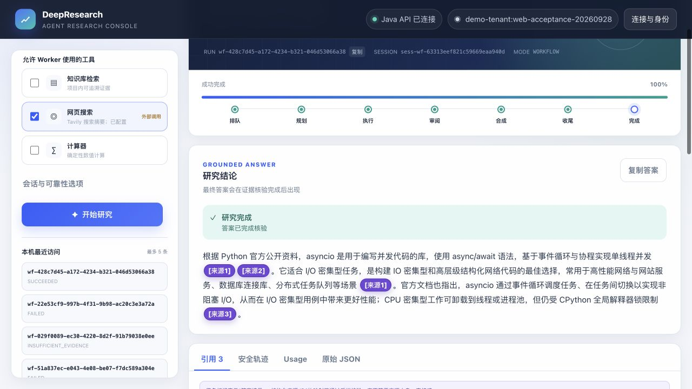
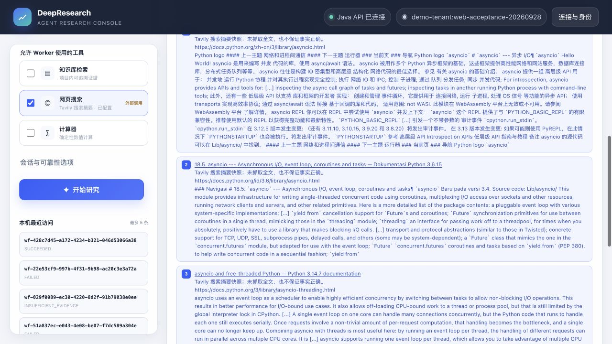

# Dify 网页搜索闭环 — 2026-09-28

## 现场问题与真实原因

演示页只选择网页搜索时，旧运行 `wf-51a837ec-e043-4e08-be07-f7dc589a304e`、`wf-c6e7d136-90c3-4f28-80b1-55cb4b7683a0` 返回 `FAILED/DIFY_OUTPUT_INVALID`，实际 `web_search` 回执为 `TOOL_UNAVAILABLE` 且证据为空。当时运行容器没有加载 Tavily Key；同时 v7 工具层丢弃网页来源、DSL 仅承认 KB 证据、发布验证与数据库约束仅允许 `kb:ragflow`。因此即使补 Key，纯网页路径仍不能发布有引用的答案。这两次故障不被记作已证实的 LLM JSON 错误。

用户随后在私有 `.env` 提供 Tavily 配置；值未写入仓库或报告。修复基线为 `ab9465e0a985882194ad9b40b67c1abd540e40b8`。当前实现验收与历史 v7 全量 37 题使用不同运行代码，不将历史统计冒充新版本全量结果。

## 改动

- 直接使用 Tavily typed `SearchHit` 的 URL、标题、摘要，经 URL 校验与内容脱敏后生成 `web:tavily:<sha256>` 快照标识。哈希覆盖三个字段；精确重复快照去重，同一 URL 的不同摘要保留不同快照。
- 工具回执与 run 级来源表持久保存身份。发布前只接受本 run 已授权且成功完成的网页回执，重新计算快照身份；KB 继续复查当前文档/chunk。V16 新迁移扩展来源约束，保留已有 V12/数据。
- DSL 允许纯网页与 KB+Web 证据，统一去重、编号与最终引用白名单。仍最多 3 个 LLM 节点、4 个 Worker HTTP 节点，工具/模型不新增重试；空证据仍空答零引用。
- 缺配置、上游不可用、凭据拒绝、限流、搜索超时、无可用结果与模型格式/字段错误分别保存安全原因码。Java 终态、持久 SSE 事件和页面中文说明保留原因；不暴露原始上游报错。
- 页面不默认勾选网页搜索；选择后先检查服务端配置。引用展示实际 URL/摘要，并明确是搜索返回快照，不是已抓取全文或事实正确性证明。最终发布不访问任意引用 URL。
- 同容器实测 Tavily TLS 握手为 5.618 秒，初版 3 秒连接限制使多个真实回执在约 3.0 秒失败。修订为连接 10 秒、请求 15 秒上限，保留 Dify Worker 30 秒 read 上限，不增加重试或调用次数。合成器旧的“网页值不可引用”提示同时被改为允许已提供的摘要快照，并限制其论断范围。

## 离线验证

`mvn test`：252 个 Java 单测、58 suites，零 failures/errors/skips。
`mvn -Pintegration -Dit.test=DifyWebSourcesIT ... verify`：独立 PostgreSQL Testcontainers 应用 V1–V16，2 个 DB 测试通过，覆盖完成回执/跨 run 拒绝、非法来源、取消、截止时间与错误原因持久化。没有启动额外 Elasticsearch 或调用 provider。
`make showcase-check`：实际 DSL Code 节点的纯网页、混合、去重、无结果、缺 Key/超时/上游故障、未知来源与 schema 拒绝检查通过；26 个评测测试、历史 11 份 score 精确重计分、八份规范知识文档 dry-run 通过。页面 JavaScript `node --check` 通过。

最终代码 `182962f9d9be7e30b1188da39b7250c2f212a05e` 上重新运行 252 个 Java 单测、2 个 PostgreSQL 测试及 `make showcase-check` 均通过。缺 Key、无结果和 provider 错误主要由单测/实际 DSL Code 节点 fixture 验证；真实上游超时由下面保留的两次初版运行验证。没有把 fixture 记作真实 provider 成功。

## 已发布现场版本

| 项目 | 固定值 |
| --- | --- |
| 测试代码 SHA | `182962f9d9be7e30b1188da39b7250c2f212a05e` |
| Dify 发布名 | `Evidence v8.1 Web` |
| Workflow ID | `b445df5c-709c-46bb-afba-2b3a527f3264` |
| 发布时刻 | `2026-09-28T06:40:54.000Z` |
| DSL SHA256 | `aea1f676326ab9c549e55b28fff0ebb1836895706ae8fcf16897d8b3e5af8a07` |
| Java 镜像 ID | `sha256:69225844d0fc081968137edb4290dd8aece3ab0efa3d959b6ebc417e8a370a56` |
| 模型与上限 | `deepseek-v4-flash`，JSON mode，4096 tokens；最多 3 LLM / 4 Worker HTTP |

发布后的实际图与提交 DSL 完全一致。切换前无活动 run；仅重建 app，已有卷和文档保留。运行容器的 Tavily 配置与用户刚填写的忽略文件一致，值未展示或导出。在线预检通过 Java health、Dify App Key、RAGFlow dataset access，以及八份规范内容哈希/`DONE` 映射。

## 定向实测与逐句审阅

题目在首轮调用前冻结于 [web-search-cases-2026-09-28.json](web-search-cases-2026-09-28.json)。未更换问题或删去失败。首版 `01bee7e / Evidence v8 Web` 的五项 API 运行及一次浏览器运行，全部保留于 [初版记录](evidence-v8-web-initial-live-2026-09-28.json)：纯网页 API 和浏览器因真实超时失败；混合、KB 正例、边界拒答及银行空答达到预期。首版纯网页即使另一个 Worker 成功，也没有将失败任务悄悄替换成部分成功。

修订后的五项 API 各运行一次，另加一次有断线演练的浏览器运行，记录于 [v8.1 实测](evidence-v8.1-web-live-2026-09-28.json)；共保留两个版本的 12 次尝试。

| 冻结项目 | v8.1 终态 | 引用数 | 逐句审阅 |
| --- | --- | ---: | --- |
| 纯网页 asyncio | `SUCCEEDED` | 1 | 所问并发/I/O 事实有支持；额外“单线程”限定不在所引用摘要中，严格论断支持仅部分通过 |
| KB + 网页 | `SUCCEEDED` | 4 | Java/Python 职责对应 KB，asyncio 对应网页摘要，编号与支持通过 |
| KB 职责正例 | `SUCCEEDED` | 4 | 职责及 checkpoint 论断有对应 chunk 支持 |
| 三类 JWT 原文边界 | `SUCCEEDED` | 3 | 用明确排除 JWT 签名密钥的原文拒答，未输出秘密值 |
| 银行零证据 | `INSUFFICIENT_EVIDENCE` / `NO_RELEVANT_EVIDENCE` | 0 | 空答、零引用；未用其他安全说明虚构银行信息 |

五项终态均达到预期，**严格逐句支持为 4/5，另 1 项存在额外限定的引用精度问题**。这与来源验真分开记录：五项加浏览器样本的 15 个引用条目全部完成本 run 回执/来源白名单复查，网页元数据与精确快照哈希一致，KB 仍实时复查文档/chunk。保留的公共知识包描述默认/Legacy Java + Python 架构；这些答案不构成当前 Dify 部署组件清单。

六条 v8.1 运行的真实 Dify 节点记录最多 3 个 LLM、3 个 Worker HTTP，未超 3/4 上限。18 个 LLM 输出经同一实际 Code parser 复查均为精确根 schema，`finish_reason=stop`；最大 completion 为 1250 tokens。没有新增模型/工具重试。采样 `latencyMs` 包括终态轮询后回执复查/幂等探测，不用它生成新的性能 p95，也不借用历史 v7 full37 统计。

## 浏览器与断线恢复

浏览器真实纯网页运行 `wf-428c7d45-a172-4234-b321-046d53066a38` 成功并展示三个 URL、标题、实际摘要和快照边界提示。单线程表述引用了明确包含 `single-threaded concurrent code` 的另一段摘要；来源包含 Python 3.6 与 3.14 的文档，不将它当作指定版本或所有解释器模式的兼容性结论。

手动点击“断线演练”时出现断线提示，随后同一 Run 自动恢复。浏览器网络记录只有 **一次**创建 POST；两次 SSE GET 分别携带游标 `:706` 和 `:717`，最终 UI 游标 `:760`，同一 Run 成功结果可见。五项 API 重放相同幂等键均返回同一 Run，回执数和内容不变。此次现场恢复证明的范围是客户端 SSE 断线续传；取消/截止时间由 PG 测试验证，历史进程崩溃或 remote-stop 验收不被冒充成本轮新实测。

完整离线/在线检查边界见 [gate 记录](evidence-v8.1-web-gates-2026-09-28.json)。快照身份与出处通过不等于已抓取网页全文或保证事实正确；语义审阅中发现的额外限定仍被保留。

## 现场演示顺序

用户倾向几分钟介绍，也可能不现场操作；按介绍为主、实测记录随时可打开准备：

1. 20 秒讲分工：Java 管身份、授权、状态和对外接口；Dify 拆任务、审阅和合成；RAGFlow 提供项目知识检索，Tavily 提供网页摘要。
2. 约 1 分钟讲一条链路：提问 → 受权检索 → 保留证据回执 → 生成带编号的答案；没有证据就空答，公开边界可明确拒答。
3. 约 1 分钟打开上面的实测截图或记录，分别指向“已跑通的结果、可追溯的真实来源、同一 Run 的 SSE 恢复”。说明摘要验真与语义正确性的区别，以及保留的引用精度缺口。

若评审希望现场看，用一次网页或混合运行串起三个能力：提交问题，等待期间触发 SSE 断线演练，恢复后打开引用并核对同一 Run ID。准备时先跑带 `--require-web-search --online --corpus` 的预检；已有截图、终态记录与回执用于解释结果和排查故障。
